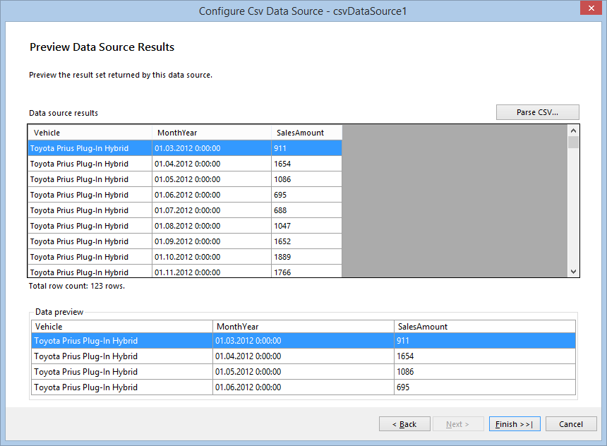

## Environment

<table>
	<tbody>
		<tr>
			<td>Product</td>
			<td>Progress® Telerik® Reporting Graph Report Item</td>
		</tr>
	</tbody>
</table>

## Description

How can I use bindings to control the coordinate system properties in the Grpah?

## Solution 

The suggested solution shows how to set up the axes and scales of the coordinate system at runtime by using bindings. This approach is really useful when your scenario involves nested Graph items and you need to adjust more precisely its properties. For more information about the nested data items subject, refer to the article on [using the `ReportItem.DataObject` property in expressions](). 

The nested Graph data will show the sales of some of the most popular electric vehicles models over the last years. The data will be grouped by vehicle model, presenting the amount of sales for each model in a separate chart. The data sample used to create the charts is taken from [Model 3](http://jpwhitenissanleaf.com/) and you can read the whole article in [March 2013 sets several records for EV Sales](http://jpwhitenissanleaf.com/2013/04/06/march-2013-sets-several-records-for-ev-sales/). 

The suggested solution is valid for both the Telerik Reporting [Standalone Report Designer]() and [Visual Studio Report Designer](), and can also be reproduced with code. 

### 1. Add a Blank Report

1. Open the Telerik Report Designer of your choice and create a new blank report. 
1. Since you will not be using the page header and footer, [remove them]().

### 2. Connect to Data 

1. Expand the `DataSource` property of the report and click the __Add new DataSource...__ link at the bottom. 

1. Select the [**CSV Data Source**]() icon to add a new DataSource. Name it __dsEVSalesData__. This data source will contain information about the vehicles and the amount of their sales for a particular month. 

1. Download the [`EVSalesData.csv` file](http://blogs.telerik.com/docs/default-source/reporting/evsalesinus.csv?sfvrsn=2), save it locally, and insert its path into the **Select a file to import** textbox. 

1. Click __Next__ until you get to the __Configure the separators__ page. The `CSV` file uses a semicolon `(;)` as a field separator and you need to check the respective checkbox and uncheck the other ones. 

1. Click __Next__ until you get to the __CSV Headers__ page. Note that the `CSV` file has headers and you need to check the **The CSV has headers** checkbox. 

1. On the __Map columns to type__ page, set the type of `MonthYear` field to __DateTime__ and the `SalesAmount` columns to __Integer__. Apply the __"MMM-yy"__ format to the **Date Format** field. 

1. When you click __Parse CSV...__ on the next page, you will see the result of the parsed file: 

	

	Click __Finish__ when you are ready.

### 3. Configure the Groupings 

1. Define the groupings for a data item by using the [**GroupExplorer** tool window](). If it is not visible, activate it with the __Telerik Reporting menu__ in Visual Studio or the __View tab__ in the Standalone Report Designer. 

1. Select the report, right-click the __Detail__ group, displayed in the __Group Explorer__, and select **Add Parent Group** from the context menu. This will show the __Edit Grouping__ dialog. 

1. Add a new group by using the field __Vehicle__ as a grouping member. 

1. Add ascending sorting by the same field by using the button at the end of the **Grouping** column in __Group Explorer__. 

### 4. Configure the Group Header 

1. The group header will contain all the items used to display all the information and you can make the details and group footer sections invisible by setting their `Visible` property to `false`. 

1. Add a new TextBox to the group header, set its `Font.Size` to 18pt and its value to `=Fields.Vehicle`. 

1. Add a Graph item to the group header.

1. (For the Standalone Report Designer) Click the __Insert__ menu, select __Line__, and __Line with Markers__. 

	

	(For the Visual Studio Report Designer) Drag the Graph Wizard from the __Visual Studio toolbox__. Select __Line__ and __Line with Markers__, and click __OK__. This will start the Graph Wizard. 

	You will later on set the Graph data source through __Bindings__ but still it is more convenient to use the wizard to configure its series, category groups, and values. 

1. On the first page, select the previously created __dsEVSalesData__ data source. 

1. On the __Arrange graph fields__ page, select the fields that will be used to build the chart. Since the report will display aggregated sums of the vehicle sales by month/year, you need the __MonthYear__ and __SalesAmount__ fields.

1. Select the __MonthYear__ field and drag it to the **Categories** box. 

1. Select the __SalesAmount__ field and drag it to the **Values** box. It will be shown as __Sum(SalesAmount)__ because __Sum__ is the default aggregate function. 

1. Click __Finish__ once you are ready. 

1. To change the scale type, select the X-axis by clicking it or its labels, and, in the **Property Browser** window, select __DateTime Scale__ for the __Scale__ property: 

	

1. For better rendering, set the X-axis [`LabelFormat`](/reporting/api/Telerik.Reporting.GraphAxis#Telerik_Reporting_GraphAxis_LabelFormat) property to `={0:MMM-yy}`. You can add some additional styling to its data points as well, for example, hide the graph legend, edit its title, and set the [`MarkerType`](/reporting/api/Telerik.Reporting.LineSeries#Telerik_Reporting_LineSeries_MarkerType) to __Circle__, and increase its [`MarkerSize`](/reporting/api/Telerik.Reporting.LineSeries#Telerik_Reporting_LineSeries_MarkerSize) to 10px. 

1. Currently, the Graph displays data for all the vehicle models, but according to the suggested scenario, it needs to display the data only for the current group. To do this, add a __Binding__ to the Graph item, setting `DataSource` as a __PropertyPath__ and `=ReportItem.DataObject` as an __Expression__. You can delete its current data source if you wish. 

### 5. Fix Issues 

Your report now displays a label and a graph for each vehicle in the data source. However, the layout of the second graph that shows the **Cadillac ELR** data needs some improvements. 

The datapoint marker on __August'14__ is cut, because the Y axis scale maximum value is automatically calculated as 200, which is exactly the value that this data point represents. In this case, it will be useful to gain control over the minimum and maximum values of the scale according to the current data. 

The labels on the X axis scale are too close to each other and that makes the chart unreadable. For this case you have to dynamically set the [`LabelStep`](/reporting/api/Telerik.Reporting.DateTimeScale#Telerik_Reporting_DateTimeScale_LabelStep) property for a particular set of data. Otherwise, it may be unnecessarily applied. 

To solve the issues, use the [Bindings](/reporting/api/Telerik.Reporting.GraphCoordinateSystem#Telerik_Reporting_GraphCoordinateSystem_Bindings) of the coordinate system: 

1. Expand the coordinate system properties in the __PropertyGrid__ and show the **Bindings** dialog by clicking the button on the right side of the __Bindings__ property.

	

1. Add a new binding and select `YAxis.Scale.Maximum` as a __Property path__. Since you want to bind the scale maximum with the current graph data, raise the maximum by 10% by setting the following expression on the right: `=CDbl(Max(Fields.SalesAmount) + Max(Fields.SalesAmount) * 0.1)`

	>The expression result will be of the same type as the property which it applies to. In this case, the [`Maximum`](/reporting/api/Telerik.Reporting.NumericalScaleBase#Telerik_Reporting_NumericalScaleBase_Maximum) is of type  `double` and you need to cast the expression result to `double`. Otherwise, it won't be applied. 

1. Add another binding and select `XAxis.Scale.LabelStep` as a __Property path__. The expression will set the [`LabelStep`](/reporting/api/Telerik.Reporting.DateTimeScale#Telerik_Reporting_DateTimeScale_LabelStep) to __3__ if there are more than 10 data points to be displayed: `=IIF(CountDistinct(Fields.MonthYear) > 10, 3, 1)`. 

	However, the `LabelStep` property will not be applied if the [`LabelUnit`](/reporting/api/Telerik.Reporting.DateTimeScale#Telerik_Reporting_DateTimeScale_LabelUnit) is set to `Auto`, so you need to change it dynamically to `Months` with the following expression: `=IIF(CountDistinct(Fields.MonthYear) > 10, 'Months', 'Auto')`. 

	When you preview the report with the bindings applied, the graph that shows the **Cadillac ELR** data looks similar to the following: 

	
