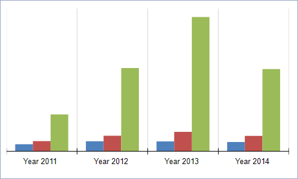
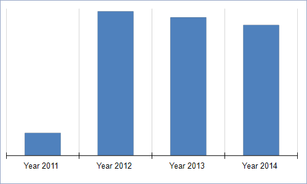
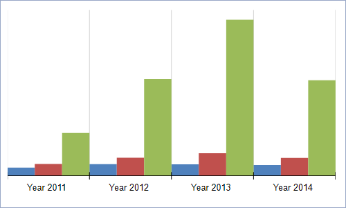
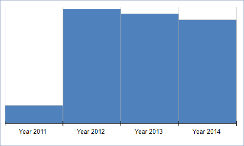
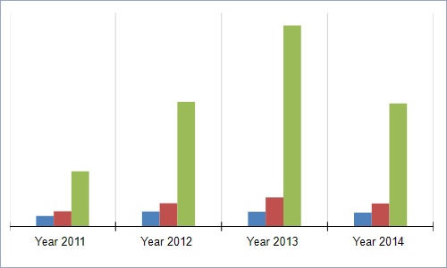
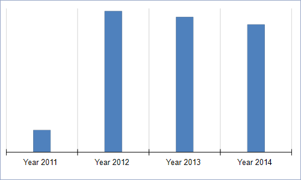
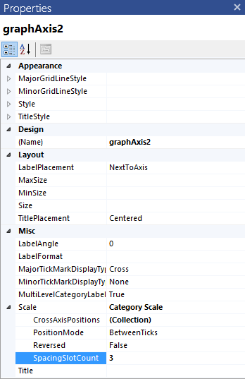

## Environment

<table>
	<tbody>
		<tr>
			<td>Product</td>
			<td>Progress® Telerik® Reporting Graph Report Item</td>
		</tr>
	</tbody>
</table>

## Description

The gap in my Graph is automatically calculated based on the data and chart area and if the chart area is fixed and there are many series, the space between two data points is very narrow. How can I manually change the gap width?

## Solution 

The property that defines the amount of blank space between two adjacent data slots is the [`SpacingSlotCount`](/reporting/api/Telerik.Reporting.Scale#Telerik_Reporting_Scale_SpacingSlotCount) property of the [`Scale`](/reporting/api/Telerik.Reporting.Scale) class. 

`SpacingSlotCount` defines the ratio between the empty space per single data slot and the space that the data points will occupy when placed in it. The processing engine calculates how many data slots will be created on the axis depending on the used scale and groupings. 

Then, using the formula `Empty Space = SpacingSlotCount * DataPoint_SlotWidth` (where the `DataPoint_SlotWidth` is the width of a single data point), the engine calculates the empty space for each slot. Half of the empty space is placed at the beginning of the slot, the other half is placed at the end and the data points are arranged in the remaining space, adjacent to each other. 

The following pictures show a column chart with different values for its [`SpacingSlotCount`](/reporting/api/Telerik.Reporting.Scale#Telerik_Reporting_Scale_SpacingSlotCount) property. 

>caption A column chart with a default value of `1` produces an empty space which size is equal to the width of a single data point.

	

>caption A column chart with a value of `0` causes the data points to occupy all the available slot width.

	

>caption A column chart with a value of `3` leaves more empty space around the data points, making them thinner.

	

### Setting SpacingSlotCount

To change the `Scale.SpacingSlotCoun` property: 

1. On the design surface, select the target axis. 

1. In the __Misc__ section, select the `Scale.SpacingSlotCount` property. 

1. Modify the property according to your requirements. For example, to increase the empty space, increase the `SpacingSlotCount` value. 

   

