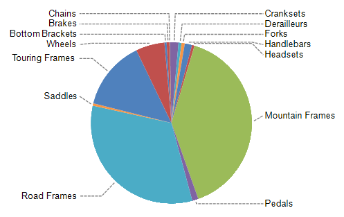

## Environment

<table>
	<tbody>
		<tr>
			<td>Product</td>
			<td>Progress® Telerik® Reporting Graph Report Item</td>
		</tr>
	</tbody>
</table>

## Description

How can I avoid the overlapping of the labels that represent data points with relatively small values and adjacent to each other in a Pie Chart? 

## Solution 

By default, the layout engine will try to arrange the data labels so they do not overlap. When the bounds of two or more labels overlap, the engine will move them and their adjacent labels vertically, trying to find them a proper non-overlapping positions. 

During this rearrangement, a label can be moved aside from its original location, which may produce a hard to read chart. Additionally, if the plot area doesn't provide enough space and there are a lot of data points, the labels will overlap. 

The Pie Chart uses [`BarSeries`](/reporting/api/Telerik.Reporting.BarSeries) to represent the "pie slices". These series make use of the `OutsideColumn` value of the [`DataPointLabelAlignment`](/reporting/api/Telerik.Reporting.BarSeries#Telerik_Reporting_BarSeries_DataPointLabelAlignment) property. 

When the alignment is set to `OutsideColumn`, the data point labels are aligned in two columns around the pie and their offset is controlled by the [`DataPointLabelOffset`](/reporting/api/Telerik.Reporting.BarSeries#Telerik_Reporting_BarSeries_DataPointLabelOffset) property. If the labels needs to be adjusted so they do not overlap, their position might not be aligned against the corresponding data point. In this case, the data point connectors can be set up to provide visual aid to determine the relation between the label and a data point. 

To avoid label overlapping: 

1. In the **Design** view, click the chart series. The __Properties Window__ will load the selected series properties. 

1. Change the [`DataPointLabelAlignment`](/reporting/api/Telerik.Reporting.BarSeries#Telerik_Reporting_BarSeries_DataPointLabelAlignment) property to `OutsideColumn`. 

1. Set the value of the [`DataPointLabelOffset`](/reporting/api/Telerik.Reporting.BarSeries#Telerik_Reporting_BarSeries_DataPointLabelOffset) property to a value, providing enough offset from the pie, depending on the chart size (for example, `30px`). 

1. Make sure the [`DataPointLabelConnectorStyle`](/reporting/api/Telerik.Reporting.BarSeries#Telerik_Reporting_BarSeries_DataPointLabelConnectorStyle) has its `Visible` property set to `true`. 

  Also, for better design experience, the connector is drawn only when the distance between the data point and the label is more than one [line spacing](https://msdn.microsoft.com/en-us/library/system.windows.media.fontfamily.linespacing(v=vs.110).aspx), measured by its label font. 
  
  If needed, you can also adjust the connector offset by using the __Padding__ property. The __Bottom__ represents the offset from the pie, and the __Top__ represents the offset from the label. The __Left__ and __Right__ values are not respected. 
  
  Additionally, you can set the __LineColor__ and __LineStyle__ according to your needs. 

> The `OutsideColumn` value of the `DataPointLabelAlignment` property is respected only when applied to BarSeries with a Polar coordinate system. When applied to another series type or a Cartesian coordinate system, the engine falls back to the `OutsideEnd` value. 
>
> The algorithm that moves the data point labels, preventing them from overlapping, is activated only when the labels have their [`DataPointLabelAngle`](/reporting/api/Telerik.Reporting.GraphSeriesBase#Telerik_Reporting_GraphSeriesBase_DataPointLabelAngle) set to a multiple of 360 degrees, that is, `0`, `360`, and so on. 

The image below shows how a Pie Chart after the suggested solution has been implemented.

