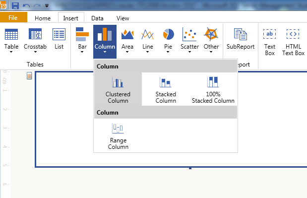
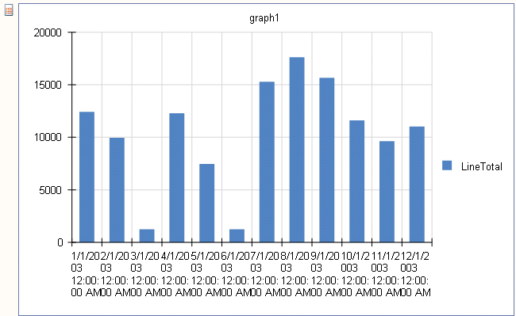
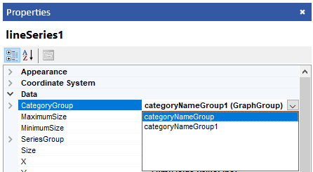
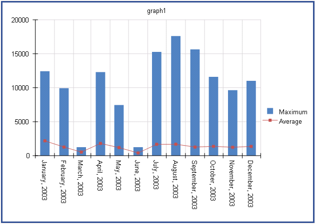

## Environment

<table>
	<tbody>
		<tr>
			<td>Product</td>
			<td>Progress® Telerik® Reporting Graph Report Item</td>
		</tr>
	</tbody>
</table>


## Description

How can I create a Graph with Column and Line series?

## Solution

The suggested approach demonstrates how to create a Graph with both column and line series and displaying the maximum and the average amount of sales on a monthly basis based on the __AdventureWorks__ sample database.

The sample scenario is valid when you are working with the Telerik Reporting [Standalone Report Designer]() and [Visual Studio Report Designer]().

1. Start the Graph Wizard:

	+ (For the Standalone Telerik Report Designer) From the __Insert__ menu, select __Column__ > __Clustered Column__. As a result, the Graph Wizard starts.

		

	+ (For the Visual Studio Report Designer) Initiate the Graph Wizard from the __Visual Studio toolbox__. Then, select the __Clustered Column__ chart type and click __OK__. As a result, the Graph Wizard starts.

1. Click the __Add New Data Source...__ button and select __[SQL Data Source]()__:

	1. Set the connection string to the demo AdventureWorks database.
	1. Set the query to the following one:

		````SQL
SELECT SOD.LineTotal, SOH.OrderDate
		FROM
			Sales.SalesPerson S
		INNER JOIN Sales.SalesOrderHeader SOH ON SOH.SalesPersonID = S.SalesPersonID
		INNER JOIN Sales.SalesOrderDetail SOD ON SOH.SalesOrderID = SOD.SalesOrderID
		WHERE SOH.OrderDate between cast('2003-01-01' as datetime) and cast('2003-12-31' as datetime)
			and S.SalesPersonId = 283
````


	1. Click __Execute Query...__ to check if everything is fine with the database connection. Click __Finish__ when you are ready.

1. From the **Available data sources** list,  select the data source you've already created and click __Next__.
1. On the next page, select the fields which will be used to build the chart.

	Since the report will display aggregated sums of the order lines by month, you need the __LineTotal__ and __OrderDate__ fields. Select the __OrderDate__ field and drag it to the **Categories** box. Select the __LineTotal__ field and drag it to the **Values** box. It will be shown as __Sum(LineTotal)__ because the __Sum__ is the default aggregate function.

	However, for the purposes of this example, you will display the maximum amount of sales in the column series and the average amount of sales in the line series. Therefore, choose the __Max__ function from the drop-down menu. Click __Next__ once you are ready.

1. The Wizard has detected that the field used as a category is of type `DateTime` and this page will let you configure the scale for the graph. In most cases, the `Auto` option will work fine, so you will leave it as is. Complete the Wizard process by clicking __Finish__.

	Now the graph displays the column series:

	

1. The graph is displaying the date-time values on its X-axis, and the `Auto` scale option divides each column into one column per month.

	To make the label for the X-axis easier to read, first select the X-axis, and in the **Property Browser**, set the [`LabelFormat`](/reporting/api/Telerik.Reporting.GraphAxis#Telerik_Reporting_GraphAxis_LabelFormat) to `{0:Y}`) and [`LabelAngle`](/reporting/api/Telerik.Reporting.GraphAxis#Telerik_Reporting_GraphAxis_LabelAngle) to `90º`.

1. To add another series to the graph, right-click the graph and select **Add Graph Series…** from the context menu.

	As a result, a dialog with all chart types will appear. Select __Line__ > **Line with Markers** and click __OK__. The Graph Wizard will be displayed again.

	Repeat __Step 4__ for choosing and dragging the data source fields to **Categories** and **Values** boxes, but this time choose __Avg__ as an aggregate function for the __LineTotal__ field. Click __Next__ and __Finish__ when you are ready.

	> When adding a new Series, a new Category group will also be created. This solution uses a field of type `DateTime` for the category which will set the scale of the X-axis to a `DateTime Scale` and will correctly display the two series on top of each other.
	>
	> With any other type, like `Numerical Scale`, `Logarithmic Scale`, or `Category Scale`, the two Series will be displayed next to each other and not overlapping correctly. To fix this, select the newly-created series and change the `CategoryGroup` to the group used by the first series.

	

1. Name the legend items of the series accordingly by using the [`Value`](/reporting/api/Telerik.Reporting.LegendItem#Telerik_Reporting_LegendItem_Value) propety of `LegendItem` for both of your series.

The following image shows the final look of your Graph.


