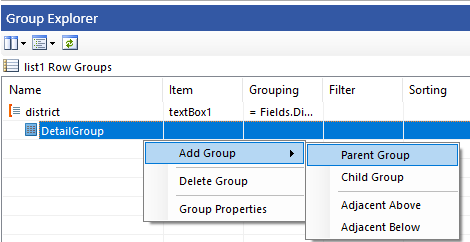
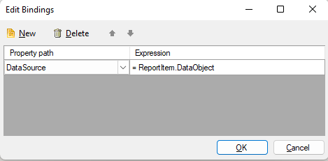
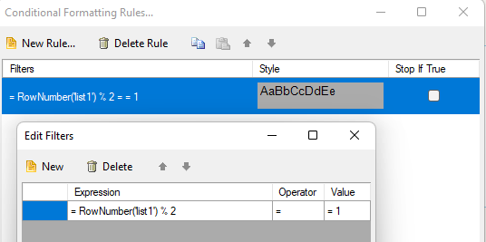

## Environment

<table>
  <tbody>
    <tr>
      <td>Product</td>
        <td>Progress® Telerik® Reporting</td>
          </tr>
          <tr>
        <td>Version</td>
      <td>15.1.21.616</td>
    </tr>
  </tbody>
</table>

## Description

Creating a report with grouped data according to a specific column, including conditional formatting and total calculations, is required. This knowledge-base article also answers the following questions:

* How to use a single DataSource to group data in a Telerik Report?
* How to add a Crosstab with row grouping by a specific criterion in a Telerik Report?
* How to apply conditional formatting for alternating rows in a Telerik Report?

## Solution

To achieve a report with data grouped by a specific column, including conditional formatting for alternating groups and total calculations, follow these steps:

1. Add a [List]() item to the Detail section of the report and set its _DataSource_ to the _DataSource_ containing the fields to group by.
1. Add a new parent row group to the _List_, setting the expression of the group to the field(s) you wish to group by. Ensure the _"Add Header"_ option is checked.

  

1. In the _List_ header section, make it visible through the _"Style.Visible"_ property. This section will display the grouped content.
1. Insert a [Panel]() item in the header section of the _List_.
1. Add a [TextBox]() item to the _Panel_ and set its value to the field(s) the _List_ is grouped by.
1. Add a [Table]() item to the _Panel_ (below the TextBox) and set its _DataSource_ to the DataObject of the _List_ through a [Binding]().

   

1. For [conditional formatting](), select the _Panel_ item and apply a background colour alternation between groups using the [expression]() `= RowNumber('name-of-the-list-item') % 2`.

  

1. To add totals, use a Crosstab item with row grouping by the criterion (e.g., Gender) and add a Total outside the gender groups to display the Sum of both genders.
1. Apply _conditional formatting_ to the Crosstab for alternating district backgrounds using the same modulo operation as in step 7.

This approach eliminates the need for multiple _DataSource_ calls and allows for efficient grouping, total calculations, and conditional formatting within a single report.

## Sample Report

* [ReportGroupDataWithinDataSource.trdx](https://github.com/telerik/reporting-samples/blob/master/Sample%20Reports/ReportGroupDataWithinDataSource/ReportGroupDataWithinDataSource.trdx)

## See Also

* [How to Use the ReportItem.DataObject Property in Expressions]()
* [Using Expressions in Telerik Reporting]()
* [How to Display Alternating Style Rows in Telerik Reporting]()
