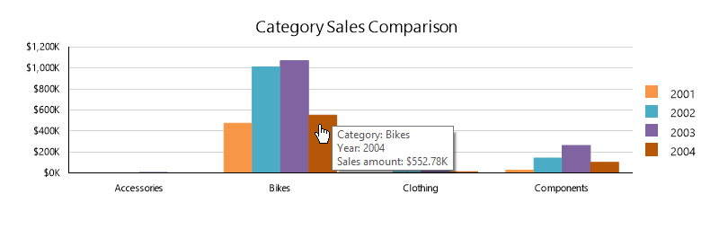
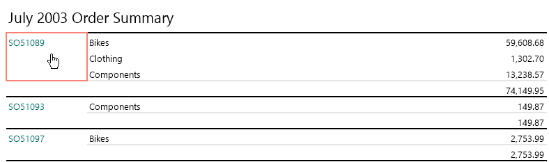

## Environment

<table>
	<tbody>
		<tr>
			<td>Product</td>
			<td>Progress® Telerik® Reporting</td>
		</tr>
	</tbody>
		<tbody>
		<tr>
			<td>Report Viewer</td>
			<td>WinForms Report Viewer</td>
		</tr>
	</tbody>
</table>

## Desciption

The report viewers provide handlers for three types of events that are associated with interactive actions – `Executing`, `Enter` and `Leave`.

In this article, we will showcase how to use these events to add more interactivity and allow further customization for your reports.

We will use the `CSharp.NetFramework.WinFormsIntegrationDemo` project that is shipped with your Telerik Reporting installation and is part of the `CSharp.ReportExamples.VSxxxx` solution that can be found at the by default in `C:\Program Files (x86)\Progress\\<Version\>\Examples\CSharp`.

The report we chose for the demo is part of our `ReportLibrary` and is called `EmployeeSalesSummary`. It consists of two graph items, showing yearly and category sales, and a crosstab, showing a list of orders during the selected period.

We will show how to add a tooltip with relevant information to the bar chart, using a [Custom]() action dialog.

Additionally, we will show you how to cancel a [NavigateToReport]() action before it is executed, depending on a confirmation dialog.

## Solution

- Start Visual Studio, open the solution file and locate the `CSharp.ReportLibrary project`. Navigate to `EmployeeSales/EmployeeSalesSummary.cs` file and open it. Add the following code snippet in the report _constructor_ right after the `InitializeComponent()` call:

  ```C#
  var customAction = new Telerik.Reporting.CustomAction();
  customAction.Parameters.Add("category", "=Fields.Category");
  customAction.Parameters.Add("year", "=Fields.OrderDate.Year");
  customAction.Parameters.Add("sales", "=Format('{0:C}', Sum(Fields.LineTotal)/1000.0)");
  barSeries1.SeriesGroup.Action = customAction;
  ```

  The above code modifies the report definition, adding `CustomAction` instance with three parameters to the `BarSeries` series group, which means that every data point will trigger a custom action.

  Please note that modifying the report definition programmatically is not recommended and we use it here for demonstration purpose - otherwise we strongly advise to use the Report Designer for such tasks.

- Open the `CSharp.NetFramework.WinFormsIntegrationDemo` project and locate `MainForm.cs` file. Add the following two private fields to MainForm body (we will explain about them later):

  ```C#
  ToolTip toolTip = new ToolTip();
  System.Drawing.Rectangle borderBounds = System.Drawing.Rectangle.Empty;
  ```

- Add the following code snippet in the report viewer _constructor_ after `InitializeComponent()` line:

  ```C#
  // This code block sets the report viewer's ReportSource property and creates the handlers to the interactive action and viewer area paint events.
  this.reportViewer1.ReportSource = new TypeReportSource() { TypeName = typeof(CSharp.EmployeeSalesSummary).AssemblyQualifiedName };
  this.reportViewer1.InteractiveActionExecuting += reportViewer1_ActionExecuting;
  this.reportViewer1.InteractiveActionEnter += reportViewer1_ActionEnter;
  this.reportViewer1.InteractiveActionLeave += reportViewer1_ActionLeave;
  this.reportViewer1.ViewerAreaPaint += reportViewer1_ViewerAreaPaint;
  ```

- To create the method for the `reportViewer1_ActionEnter` handler, add the following code snippet to the `.cs` file:

  ```C#
  void reportViewer1_ActionEnter(object sender, ReportViewer.Common.InteractiveActionEventArgs args)
  {
  	var customAction = args.Action as Telerik.Reporting.Processing.CustomAction;
  	if (null != customAction)
  	{
  		var p = this.PointToClient(Cursor.Position);
  		p.Offset(Cursor.Current.Size.Width, Cursor.Current.Size.Height);
  		this.toolTip.Show(this.GetCategoryInfo(customAction.Parameters), this, p, 5000);
  	}
  	else
  	{
  		var reportAction = args.Action as Telerik.Reporting.Processing.NavigateToReportAction;
  		if (null != reportAction)
  		{
  			this.borderBounds = System.Drawing.Rectangle.Round(args.Bounds);
  		}
  	}
  }

  string GetCategoryInfo(System.Collections.Generic.IDictionary<string, object> paramValues)
  {
  	var strB = new System.Text.StringBuilder();
  	strB.AppendFormat("Category: {0}{1}", paramValues["category"], System.Environment.NewLine);
  	strB.AppendFormat("Year: {0}{1}", paramValues["year"], System.Environment.NewLine);
  	strB.AppendFormat("Sales amount: {0}", paramValues["sales"]);
  	return strB.ToString();
  }
  ```

  The above code is executed when the mouse enters the interactive action area. Since it is fired for every action, we need to be able to tell which action triggered the event so our code will react accordingly.

  We can do it by checking the `ReportItemName` field, but in this case we will type check the Action instance. If we're hovering over the bar series, the arguments will contain a `CustomAction` instance. In this case, the tooltip we created earlier will be shown, displaying the evaluated `CustomAction` parameter values.

  In any other case the action that triggered the event will be a `NavigateToReportAction` instance. Since we want to draw a border around it, we will persist the action item bounds and use them later when `ViewerAreaPaint` event is raised.

- To create the method for the `reportViewer1_ActionLeave` handler, add the following code snippet to the `.cs` file:

  ```C#
  // The code here just hides the tooltip, if it is still shown and clears the stored action bounds.
  void reportViewer1_ActionLeave(object sender, ReportViewer.Common.InteractiveActionEventArgs args)
  {
  	this.toolTip.Hide(this);
  	this.borderBounds = System.Drawing.Rectangle.Empty;
  }
  ```

  If you run the report now, you should see the tooltip appearing when you hover over the bars of Category Sales Comparison chart:

  

- To create the method for the `reportViewer1_ActionExecuting` handler, add the following code snippet to the `.cs` file:

  ```C#
  void reportViewer1_ActionExecuting(object sender, ReportViewer.Common.InteractiveActionCancelEventArgs args)
  {
  	var reportAction = args.Action as Telerik.Reporting.Processing.NavigateToReportAction;
  	if (null == reportAction)
  	{
  		return;
  	}
  	var msg = string.Format("Would you like to open the external report for order number {0}?", reportAction.ReportSource.Parameters["OrderNumber"]);
  	args.Cancel = MessageBox.Show(msg, "Confirm", MessageBoxButtons.OKCancel) != System.Windows.Forms.DialogResult.OK;
  	this.borderBounds = System.Drawing.Rectangle.Empty;
  	this.reportViewer1.Refresh();
  }
  ```

  Since we want to process only `NavigateToReportAction` instances, we need to type check again and display a confirmation dialog box that asks if the drill-through action will be performed, setting the arguments' **Cancel** field. After that the current action bounds are cleared and the report viewer area is repainted.

- WinForms report viewer renders its content on a image, so in order to actually draw the borders around the action, we need to use a report viewer event called `ViewerAreaPaint`, which is called every time the viewer needs to be repainted. To create the method, add the following code snippet to the `.cs` file:

  ```C#
  // This code just draws the stored action bounds onto the report viewer area. Note that this event is raised often, so it is not a good idea to use computation-heavy code within.
  void reportViewer1_ViewerAreaPaint(object sender, PaintEventArgs e)
  {
  	if (this.borderBounds != Rectangle.Empty)
  	{
  		using (var p = new Pen(Brushes.Salmon, 2f))
  		{
  			e.Graphics.DrawRectangle(p, this.borderBounds);
  		}
  	}
  }
  ```

- Run the project and you should see the report loaded in report viewer.

When you hover over the bars of the **Category Sales Comparison** graph, an informational tooltip should appear.

When you move your mouse over the **SalesOrder** textbox in the crosstab below, you should see a small border appearing around the textbox bounds as shown here:



## Notes

In this article we demonstrated how to add interactivity and customizations to a report with a few lines of code.

This approach can be used in all the current report viewers with slight modifications due to rendering technology.

## See Also

- [Designing Reports - Actions]()
- [Custom Action]()
- [Add Interactivity to Report in WPF Viewer]()
- [Add Interactivity to Report in HTML5-based Viewers]()
