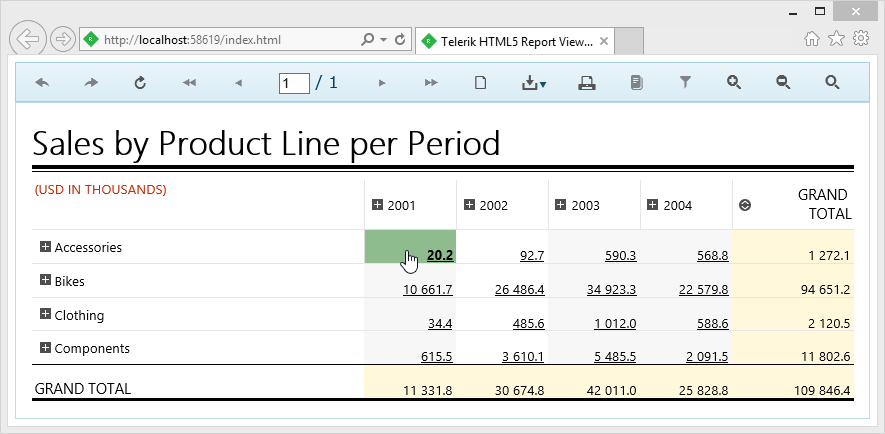

## Environment

<table>
	<tbody>
		<tr>
			<td>Product</td>
			<td>Progress® Telerik® Reporting</td>
		</tr>
	</tbody>
		<tbody>
		<tr>
			<td>Report Viewer</td>
			<td>HTML5 Report Viewers</td>
		</tr>
	</tbody>
</table>

## Desciption

The report viewers provide handlers for three types of events that are associated with interactive actions – `Executing`, `Enter` and `Leave`. In this article, we will show how to use these events to add more interactivity and allow further customization for your reports. We will use the demo projects that are shipped with your Telerik Reporting installation and is part of the `CSharp.ReportExamples.VSxxxx` solution that can be found by default in `%PROGRAMFILES(X86)%\Telerik\Reporting <Version>\Examples\{CSharp or VB}\` folder.

The report we chose for the demo is part of our `ReportLibrary` and is called [ProductSales](https://demos.telerik.com/reporting/product-sales). It shows a crosstab, grouped by *product categories* for rows and *years* for columns. We will show how to change the look of the HTML element under the mouse cursor and how to cancel a [NavigateToReport]() action before it is executed, depending on a confirmation dialog.

## Solution

### HTML5 Report Viewer

Open the project and navigate to the `Index.html` file. Add the following code snippet to the [report viewer initialization script]():


````JavaScript
interactiveActionExecuting: function (e, args) {
	if (args.action.Type === 'navigateToReport') {
		args.cancel = !confirm("You are about to navigate to report " + args.action.Value.Report + ".\r\n\nContinue?");
	}
},
interactiveActionEnter: function (e, args) {
	if (args.action.Type === 'navigateToReport') {
		$(args.element).css({ 'font-weight': 'bolder', 'background-color': 'darkSeaGreen' });
	}
},
interactiveActionLeave: function (e, args) {
	if (args.action.Type === 'navigateToReport') {
		$(args.element).css({ 'font-weight': 'normal', 'background-color': 'white' });
	}
}
````

This code block adds three handlers to the interactive action events.

1. [interactiveActionExecuting]() - is triggered when the mouse cursor is over the HTML element, associated with an interactive action. In this case we check the type of the action and if it equals "*navigateToReport*", a confirmation message is displayed, asking if you want to leave the page, navigating to another report. The dialog result is assigned to the cancel argument and will be processed by the engine, determining if we decided to cancel navigation or not.
1. The other two handlers - [interactiveActionEnter]() and [interactiveActionLeave]() are raised when the mouse cursor enters or leaves the bounds of the HTML element, associated with an interactive action. We check the type of the action again (which could be unnecessary in case you only have one type of actions in your report) and change or restore the CSS style, applied on the element.

The same approach can be used in all the HTML5-based report viewers with slight modifications, as shown below.

### HTML5 ASP.NET MVC Report Viewer

When using MVC Report Viewer, you need to add the handler using the [ClientEvents]() tag. For example:

````CSharp
.ClientEvents(e =>
{
	e.InteractiveActionExecuting("function (e, args) {"+
					"if (args.action.Type === 'navigateToReport') {" +
						"args.cancel = !confirm('You are about to navigate to report ' + args.action.Value.Report + '.\r\n\nContinue?');"+
						"}"+
					"}");
	e.InteractiveActionEnter("function (e, args) {" +
					"if (args.action.Type === 'navigateToReport') {" +
						"$(args.element).css({ 'font-weight': 'bolder', 'background-color': 'darkSeaGreen' });" +
						"}" +
					"}");
	e.InteractiveActionLeave("function (e, args) {" +
					"if (args.action.Type === 'navigateToReport') {" +
						"$(args.element).css({ 'font-weight': 'normal', 'background-color': 'white' });" +
						"}" +
					"}");
}
````

The JavaScript code here is written directly in method bodies for brevity - however, it is recommended to separate it in a script block or consider using external files depending on your client logic.

### HTML5 ASP.NET WebForms Report Viewer

Here we will use the same approach - attach the event handlers using [ClientEvents]() section of the web forms viewer:

````HTML
<telerik:ReportViewer
	ID="reportViewer1"
	runat="server">
	<ReportSource
		IdentifierType="TypeReportSource"
		Identifier="Telerik.Reporting.Examples.CSharp.ProductSales, CSharp.ReportLibrary, Version=1.0.0.0, Culture=neutral, PublicKeyToken=null">
	</ReportSource>
	<ClientEvents
		InteractiveActionExecuting="onInteractiveActionExecuting"
		InteractiveActionEnter="onInteractiveActionEnter"
		InteractiveActionLeave="onInteractiveActionLeave">
	</ClientEvents>
</telerik:ReportViewer>
<script>
	function onInteractiveActionExecuting(e, args) {
		if (args.action.Type === 'navigateToReport') {
			args.cancel = !confirm('You are about to navigate to report ' + args.action.Value.Report + '.\r\n\nContinue?');
		}
	}
	function onInteractiveActionEnter(e, args) {
		if (args.action.Type === 'navigateToReport') {
			$(args.element).css({ 'font-weight': 'bolder', 'background-color': 'darkSeaGreen' });
		}
	}
	function onInteractiveActionLeave(e, args) {
		if (args.action.Type === 'navigateToReport') {
			$(args.element).css({ 'font-weight': 'normal', 'background-color': 'white' });
		}
	}
</script>
````

When you're done, start the project and hover your mouse over the crosstab detail cells. You will see how the HTML-element under the mouse cursor has its background color changed as shown below:



## See Also

* [Designing Reports - Actions]()
* [Custom Action]()
* [Add Interactivity to Report in WinForms Viewer]()
* [Add Interactivity to Report in WPF Viewer]()
