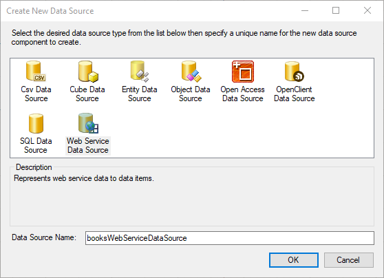

## Environment

<table>
	<tbody>
		<tr>
			<td>Product</td>
			<td>Progress® Telerik® Reporting</td>
		</tr>
		<tr>
			<td>Version</td>
			<td>Q2 2012 and later</td>
		</tr>
		<tr>
			<td>Report Viewers</td>
			<td>WinForms, WPF, ASP.NET</td>
		</tr>
	</tbody>
</table>

## Description

How can I create a report which retrieves data from the [Google Books APIs](https://developers.google.com/books/) by using the `WebServiceDataSource` component?

## Solution

To create a report and retrieve data from the Google Books APIs:

1. Get access to the API by acquiring and using an API key according to the [official Google documentation on using the API](https://developers.google.com/books/docs/v1/using).

	

1. After the API key is acquired, enable the Google Books API inside the **Library** menu or follow the direct [Google Books API](https://console.developers.google.com/apis/library/books.googleapis.com) link.
1. Create a new report by using the report designer of your choice. For the purposes of this guide, you will use the Standalone Report Designer.
1. Select the `DataSource` property of the report and click the **Add New Data Source...** link. Choose the `WebServiceDataSource` component.

	

1. Set up the web service HTTP request properties. For the purposes of this guide, you will retrieve books data from the APIs according to the search terms that are input as parameters in the report. Use the [GET https://www.googleapis.com/books/v1/volumes?q={search terms}](https://developers.google.com/books/docs/v1/reference/volumes/list) endpoint. You need to enter the exact service URL in the wizard page and select the appropriate HTTP request method. Since you will be using an API key, no authentication type is required at this point.

	

1. Configure the HTTP request parameters. You need to send the API key with the query parameters, so add a `key` parameter with type `Query` and enter its `Value` from the first step.

	The `Design-Time Value` in this case will be the same key. It is used to retrieve the data schema and for the live preview of some data items during design-time. In addition, you will add a `q` and a `maxResults` query parameter according to the API reference which will be used to send the search terms and max number of results to the API.

	These API parameters will be connected to corresponding report parameters which you can control at run-time. To do that select `<New Report Parameter>` in the drop-down for the `Value` of the query parameter and follow the wizard to configure it.

	

1. Preview the data source results. Click the __Download__ button to retrieve the data according to the current settings and design-time parameters. The preview shows raw JSON data returned from the service. When the service returns a JSON array, the preview displays multiple rows of raw data. The Google Books API returns a single JSON object containing the `items`, `kind`, and `totalItems` properties. Note the `items` property which contains an array of the returned books filtered by the search terms.

	

1. The data source of the report is now set and you can display the total count of books in the query result by dragging the `totalItems` data field from the Data Explorer to the **Detail** section on the report design surface. To create a more sophisticated message, use the following embedded expression:

	`Found {Fields.totalItems} books related to "{Parameters.q.Value}".`

1. Since the data for the actual books is inside the `items` data field, you need to use a nested data item to display the inner book objects. Insert a new `Table` item into the **Detail** section of the report. Instead of creating a new data source for this table, reuse the already retrieved data from the data source of the report by adding a new `Binding` to the `Table` item:

	

1. Now that the binding for the data source is set, you can start writing expressions in the table cells to display the books data. Note that for the book authors, this scenario uses a `Join()`built-in function. The `authors` value is an array of strings and you can render all of the contained strings concatenated by a comma.

	>When using `Bindings` for the data source, the data schema will not be available at design-time. You are required to manually write the data fields in expressions according to the used web service API.

	

1. Preview the report to see the results.

	
