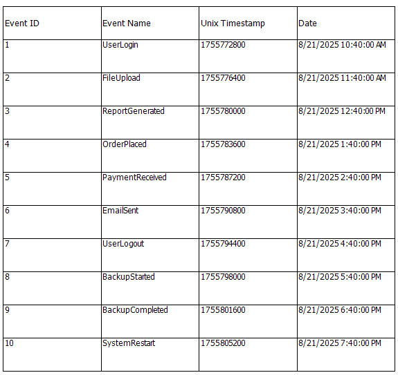

## Environment
| Version | Product | Author | 
| ---- | ---- | ---- | 
| 20.2.26.812 | Telerik Reporting |[Desislava Yordanova](https://www.telerik.com/blogs/author/desislava-yordanova)| 

## Description

Unix epoch timestamps represent a date and time as the number of seconds elapsed since January 1, 1970, UTC. This article demonstrates how to convert Unix epoch timestamps stored as numeric values in a CSV file to `DateTime` values in Telerik Reporting.

The example uses 10-digit timestamp values such as `1755772800`. These values are Unix timestamps in seconds, so the calculated field uses the `AddSeconds` expression function.

## Solution

### Create the CSV file

Use the following CSV content. The first row contains the field names, and the `UnixTimestamp` field contains the Unix timestamp in seconds.

```csv
EventID,EventName,UnixTimestamp
1,UserLogin,1755772800
2,FileUpload,1755776400
3,ReportGenerated,1755780000
4,OrderPlaced,1755783600
5,PaymentReceived,1755787200
6,EmailSent,1755790800
7,UserLogout,1755794400
8,BackupStarted,1755798000
9,BackupCompleted,1755801600
10,SystemRestart,1755805200
```

### Add a CsvDataSource

1. Add a [CsvDataSource](slug:telerikreporting/designing-reports/connecting-to-data/data-source-components/csvdatasource-component/overview) component to the report.
1. Enable **Has headers** so that the first row is used for the field names.
1. Verify that the `EventID`, `EventName`, and `UnixTimestamp` fields are available in the Data Explorer.

### Add the calculated field

1. Select the `CsvDataSource` component in the Report Designer.
1. Open its **Properties** window.
1. Find the **CalculatedFields** property and click its ellipsis button.
1. Add a [calculated field](slug:telerikreporting/designing-reports/connecting-to-data/data-source-components/calculated-fields) with the following settings:

   | Property | Value |
   | --- | --- |
   | Name | `EventDateTime` |
   | DataType | `DateTime` |
   | Expression | `=Date(1970, 1, 1).AddSeconds(CDbl(Fields.UnixTimestamp))` |

1. Confirm the calculated field.

The calculated field expression performs these operations:

- `Date(1970, 1, 1)` creates the Unix epoch start date.
- `Fields.UnixTimestamp` reads the timestamp from the current CSV record.
- `CDbl(...)` converts the field to a numeric value accepted by the date function.
- `AddSeconds(...)` adds the elapsed seconds to the epoch start date.

The `DateTime` calculated-field type makes the converted value available as a date and time value to report items. 

### Display the converted value

Add a Table using the wizard. The `CsvDataSource` automatically reads the CSV records and exposes their values as report fields. The calculated field performs the date conversion after the data source has read the numeric timestamp.

The report displays the event name, original timestamp, and converted date and time for each CSV record:



## Important: verify the timestamp unit

The expression in this article is for the supplied 10-digit values, which are seconds. Do not use `AddMilliseconds` with this CSV because it would interpret the values as milliseconds and produce dates near the Unix epoch instead of the intended dates.

If your source system uses a different unit, identify that unit before creating the calculated field and use the corresponding date conversion logic. The number of digits alone is not a complete substitute for the source system's timestamp definition.

## See Also

* [Calculated Fields](slug:telerikreporting/designing-reports/connecting-to-data/data-source-components/calculated-fields)
* [CsvDataSource Component](slug:telerikreporting/designing-reports/connecting-to-data/data-source-components/csvdatasource-component/overview)
* [Date and Time Functions](slug:telerikreporting/designing-reports/connecting-to-data/expressions/expressions-reference/functions/date-and-time-functions)
* [Conversion Functions](slug:telerikreporting/designing-reports/connecting-to-data/expressions/expressions-reference/functions/conversion-functions)
