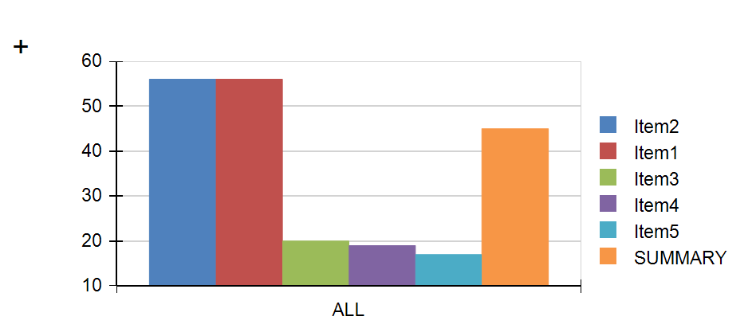
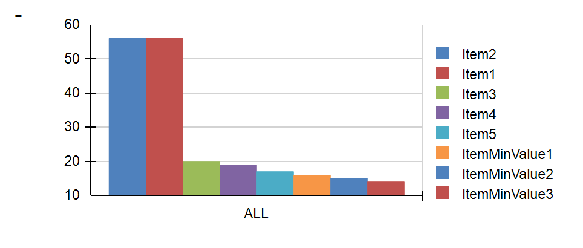

## Environment
<table>
    <tbody>
	    <tr>
	    	<td>Product Version</td>
	    	<td>12.2.18.912+</td>
	    </tr>
	    <tr>
	    	<td>Product</td>
	    	<td>Progress® Telerik® Reporting</td>
	    </tr>
    </tbody>
</table>


## Description
This KB article explains the steps to create a graph whose last column contains merged values. It can collapse and expand on click. 

## Solution

1. Add a [report parameter ]()from type _Boolean_. Set it as follows:
 -  **AutoRefresh** : True
 -  **Name** : *paramMerged*
 -  **Value** : *True*

1. Add the [Graph](). Click on the *barSeries* and from the **Property** grid -> **Layout** -> expand **MergedDataPoints**. Apply the setting below:
 - **MergeModel**: *SingleSlice* 
 -  **TresholdMode**: *Count* 
 -  **TresholdValue**:

````
	= IIf(Parameters.paramMerged.Value = "True", 5, 120)
````
In this [expression](), the value which will be set when the report parameter is *True* is 5 and stands for the number of Series (with highest values) that will be separately displayed - the rest will be merged. 120 stands for the value of the columns that will be shown when we would like to display all the Series in the Graph - it should be bigger than the total number of columns. 

1. Add a textbox and set its **Value** as follows:

```
= IIf(Parameters.paramMerged.Value = 'True', "+", "-")
```
In this way, **+** will be shown when the columns are merged and **-** when they are expanded.

1. Add a [Drillthrough Report Action]() to the textbox which will point to the same report (i.e. to itself):  **Action** -> **Navigate to Report** -> **Select a report source** -> **URL or file** -> fill the path to the report ->**Edit Parameters:**
 - **Parameter Name**: paramMerged
 - **Parameter Value**: = Parameters.paramMerged.Value = 'False'

The result will be:



