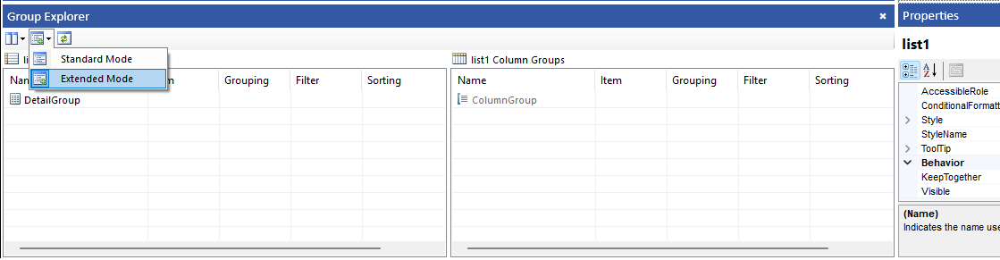

## Environment

<table>
	<tbody>
		<tr>
			<td>Product</td>
			<td>Progress® Telerik® Reporting</td>
		</tr>
	</tbody>
</table>

## Description

Out of the box, Telerik Reporting offers multi-column reports with data flow - down the page and then across. How to set up this report layout is elaborated in the help article [How to: Create a Multi-Column Report](). However, in some cases you may need a multi-column report layout with data flow across the page and then down.

Due to the data driven nature of Telerik Reporting this can be easily achieved with our [Table/Crosstab/List]() item and indexed data.

## Solution

1. Add a List to your report definition;
1. Set the List.DataSource according to your datasource. For more info see: [Connecting to Data]() help articles;
1. Open the [Group Explorer]() in extended mode;
	
1. Set the (Detail) row group Grouping expression to: `=Fields.MyDataIndex/3`, where the number (i.e. 3) should equal the number of expected columns;
1. Set the (Static) column group Grouping expression to: `=Fields.MyDataIndex%3`, where the number (i.e. 3) should equal the number of expected columns;
1. Add the necessary items to the List's Panel;
1. Preview the report.

> The `MyDataIndex` field should start at `0`.

## Additional Resources

Download a [Sample Report](https://github.com/telerik/reporting-samples/blob/master/Sample%20Reports/MultiColumnReport.trdp) from our GitHub Reporting-Samples repository.
