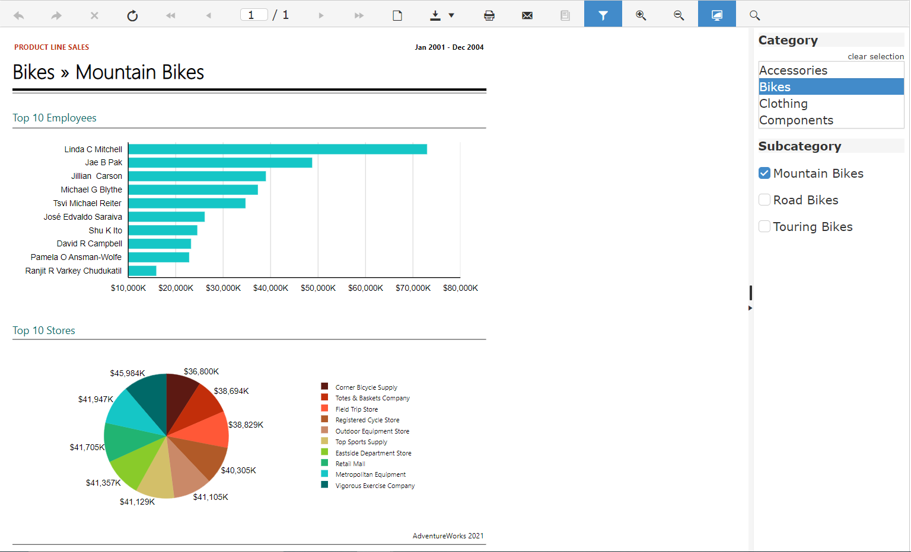

## Environment

<table>
	<tbody>
		<tr>
			<td>Report Viewer</td>
			<td>HTML5</td>
		</tr>
	</tbody>
</table>

## Description

The article elaborates on how to change the default editors for visible multivalue parameters in the HTML5 Viewer's Parameters Area.

Custom parameter editors are defined through the `parameterEditors` [(Report Viewer Initialization)]() array passed as an option when creating the report viewer widget. Each object represents a parameter editor factory for creating editors suitable to edit a specific report parameter configuration.

Each editor is an object which contains two methods: `match` and `createEditor`.

The `match` method accepts a report parameter to be edited as an argument and returns a boolean value which indicates whether the parameter editor is suitable for this parameter. The parameter variable exposes the properties of the report parameter like name, allowNull, availableValues, multiValue, type, etc.

The main work for creating and utilizing the parameter editor is done in the `createEditor` method. Its purpose is to create the parameter editor UI and wire it to the `parameterChanged` callback when a new value is selected. The return result is a new object containing the `beginEdit` method which is the entry point for creating the editor from the viewer.

The following example illustrates how to use the [Kendo CheckBoxGroup](https://docs.telerik.com/kendo-ui/controls/editors/checkboxgroup/overview) widget for a multi-parameter value parameter editor which also has available values.

## Solution

1. Add a reference to Kendo UI for jQuery version R1 2021 or newer

	````HTML
<script src="https://kendo.cdn.telerik.com/2021.1.119/js/kendo.all.min.js"></script>
````


1. Create a match and editor functions

	````JavaScript
function matchFunction(parameter) {
		return Boolean(parameter.availableValues) && parameter.multivalue;
	}

	function createEditorFunction(placeholder, options) {
		let checkboxGroupElement = $(placeholder).html("<ul></ul>");
		let valueChangedCallback = options.parameterChanged;
		let parameter;

		function onChange() {
			let val = checkboxList.value();
			valueChangedCallback(parameter, val);
		}

		return {
			beginEdit: function (param) {

				parameter = param;

				$(checkboxGroupElement).kendoCheckBoxGroup({
					layout: "vertical",
					items: parameter.availableValues.map((param) => ({ ...param, label: param.name })),
					change: onChange,
					value: parameter.value
				});

				checkboxList = $(checkboxGroupElement).data("kendoCheckBoxGroup");
			}
		};
	}
````


1. Edit the `parameterEditors` array:

	````JavaScript
$(document).ready(function () {
		$("#reportViewer1")
			.telerik_ReportViewer({
				serviceUrl: "api/reports/",
				reportSource: {
					report: "Product Line Sales.trdp",
					parameters: {}
				},
				parameterEditors: [{
					match: matchFunction,
					createEditor: createEditorFunction
				}],
				viewMode: telerikReportViewer.ViewModes.INTERACTIVE,
				scaleMode: telerikReportViewer.ScaleModes.FIT_PAGE,
				scale: 1.0,
				enableAccessibility: false,
				sendEmail: { enabled: true },
			});

	});
````

The following image shows how the multivalue parameter editor for the _Subcategory_ should look like:



## See Also

* [What's new in Kendo UI for jQuery](https://www.telerik.com/blogs/whats-new-kendo-ui-jquery-r1-2021)
* [How to Create a Custom Parameter Editor]()
