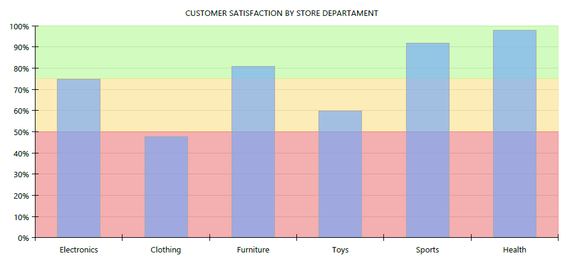

## Environment
<table>
	<tr>
		<td>Product</td>
		<td>Progress® Telerik® Reporting</td>
	</tr>
</table>

## Description
The following article demonstrates how to use the [Graph item](../graphoverview) to create a chart with plot bands that separate the plot area into regions, using additional AreaSeries

## Solution
We are assuming that the chart you're creating, needs to be divided horizontally into three areas, colored in red, yellow and green. 
These areas will help to visually distinguish each column and easily determine its relation to a particular area.
A sample image is shown below:

1. Create a column chart using the wizard. Creating such chart is a straightforward process, explained here: [How To: Create Column Chart](../graphhowtocreatecolumnchart) and we won't discuss it in details.
2. Create a second coordinate system, that will use the existing Y axis and have new X axis with Numerical scale.
3. Add an area series that uses the second coordinate system and the previously created category and series groups.
4. Set the new area series' X property to _=ColumnNumber('graph1')-1_. This would create a data point for each index of the graph's category grouping.
5. Set the new area series' Y property to 0 and Y0 property to 50. This will allow the area to span between 0 and 50 mark of the Y axis.
6. Add two more area series using the same approach and set their Y and Y0 properties respectively to 50, 75 and 75, 100.
7. Open the series editor and move the column series at the last position in the list, so it will be drawn on top of the area series.
8. Assign the desired colors to the graph series using the graph's [ColorPalette](../p-telerik-reporting-graph-colorpalette) property.

## See Also
You can download the sample .TRDX report definition from [here](https://www.telerik.com/docs/default-source/knowledgebasearticleattachments/reporting/customer-satisfaction-by-store-department.trdx?sfvrsn=e203b785_2&download=true).
