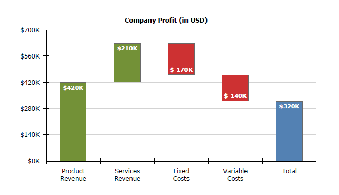

## Environment

<table>
	<tr>
		<td>Product</td>
		<td>Progress® Telerik® Reporting</td>
	</tr>
</table>

## Description

The following article explains how to use the Graph item to create a [waterfall chart](https://en.wikipedia.org/wiki/Waterfall_chart),
often used to demonstrate how an initial value is affected by a series of intermediate positive or negative values.



## Solution

Such chart can be easily created when the data source already has the values for Y and Y0 precalculated, but in case we have only the intermediate values, the scenario gets a bit more challenging.

The key is to use the **RunningValue()** and **Exec()** [data functions](), which provide aggregates calculation for a given scope.

In our scenario the data would look like this:

```TEXT
Item,Value
Product Revenue,420
Services Revenue,210
Fixed Costs,-170
Variable Costs,-140
Total,0
```

> The last column, _Total_ doesn't have an explicitly set value, because it should be calculated as an aggregate of all the previous intermediate values.

The steps, needed to produce a waterfall chart are listed below:

1. Start by creating a clustered column chart with the graph wizard , as explained here: [How To: Create Column Chart]().
2. When arranging the graph fields, drag the **Item** field for _Categories_ box and **Value** field for _Values_ box.
3. Remove the sorting from the category group to ensure the data will be ordered as it is in the data source.
4. Select a datapoint from the produced column series and set its Y property to

   `= RunningValue('graph1', Sum(Fields.Value))`

   and its Y0 property to

   ```TEXT
   = IIF(Fields.Item = Exec('graph1', First(Fields.Item)),
   0,
   IIF(Fields.Item = Exec('graph1', Last(Fields.Item)),
   0,
   RunningValue('graph1', Sum(Fields.Value))- Sum(Fields.Value)))
   ```

   The latter expression checks if the datapoint represents the first or the last item and then sets its Y0 property to 0, so the datapoint will span to the horizontal axis.

   Otherwise subtracts the current datapoint value from the accumulated sum to calculate the bottom coordinate of the datapoint.

5. Assign the desired colors to the graph series using [Conditional formatting]() rules.

## See Also

You can download the sample .trdx report definition from [here](https://www.telerik.com/docs/default-source/knowledgebasearticleattachments/reporting/waterfallchart.trdx?sfvrsn=d0eb9990_4&download=true).
