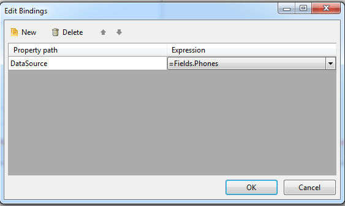

## Environment

<table>
	<tbody>
		<tr>
			<td>Product</td>
			<td>Progress® Telerik® Reporting</td>
		</tr>
	</tbody>
</table>

## Description

A common scenario is the need to set a [data item]()’s DataSource property to a custom Business object. Depending on the underlying data structure [ObjectDataSource](), [EntityDataSource](), etc. components can be used to expose the properties of the Business object to the report. However, if the data schema is not flat and some of the properties represent child data collections, you may need to bind a report to hierarchical data.

In order to be able to use hierarchical data, you can take advantage of the [Bindings](/api/Telerik.Reporting.ReportItemBase#Telerik_Reporting_ReportItemBase_Bindings) functionality. Using it, you can bind declaratively the data item's [DataSource](/api/Telerik.Reporting.DataItem#Telerik_Reporting_DataItem_DataSource) property to a given collection property from your business object and the data item will display all collection items.

## Solution

Consider the following scenario illustrating a custom business object `Contact` having as a property a collection of `Phone` objects.

````CSharp
public class Contact
{
	public string Name { get; set; }
	public List<Phone> Phones { get; set; }
}

public class Phone
{
	public string Number { get; set; }
}
````
````VB.NET
Public Class Contact
	Private m_Name As String
	Public Property Name() As String
		Get
			Return m_Name
		End Get
		Set(value As String)
			m_Name = value
		End Set
	End Property

	Private m_Phones As List(Of Phone)
	Public Property Phones() As List(Of Phone)
		Get
			Return m_Phones
		End Get
		Set(value As List(Of Phone))
			m_Phones = value
		End Set
	End Property

End Class

Public Class Phone
	Public Property Number() As String
		Get
			Return m_Number
		End Get
		Set(value As String)
			m_Number = value
		End Set
	End Property
	Private m_Number As String
End Class
````

The `Report.DataSource` property is set to a collection of `Contact` objects and we want to display a list of `Phone` objects for each `Contact` object. For this purpose, add a Table item and set its `DataSource` property to *=Fields.Phones* via binding as illustrated on the image below.



## Notes

The expressions are evaluated only during the report processing. Thus, the data schema for the nested data item (Table) will not be available in the data explorer and in the wizards. You can use additional data source components bound to the nested business objects to help yourself with creating the report layout. Finally, apply the required bindings and remove the helper object data source components.

## See Also

* [Bindings]()
* [Data Binding Problems]()
* [How to use the ReportItem.DataObject property in expressions]()
