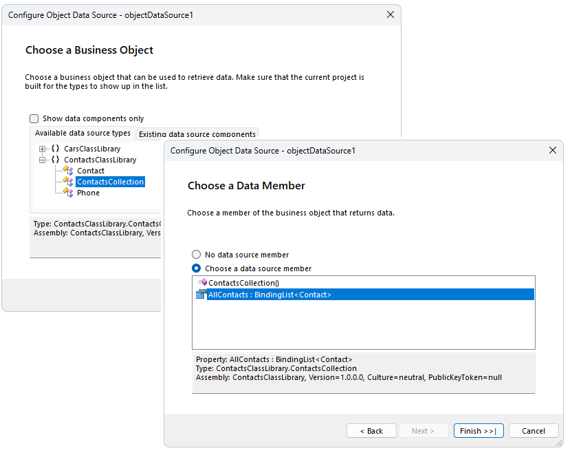
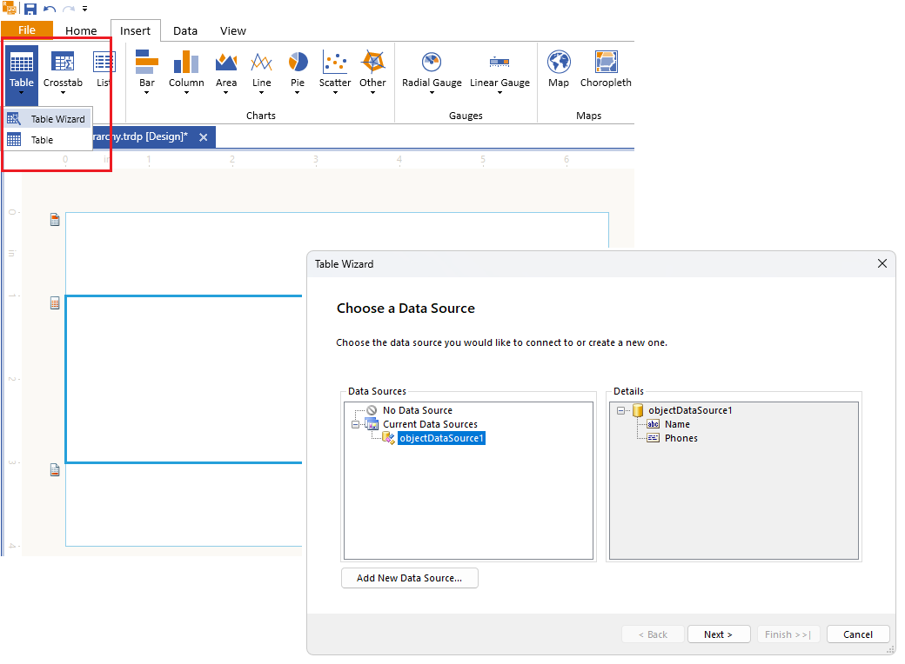
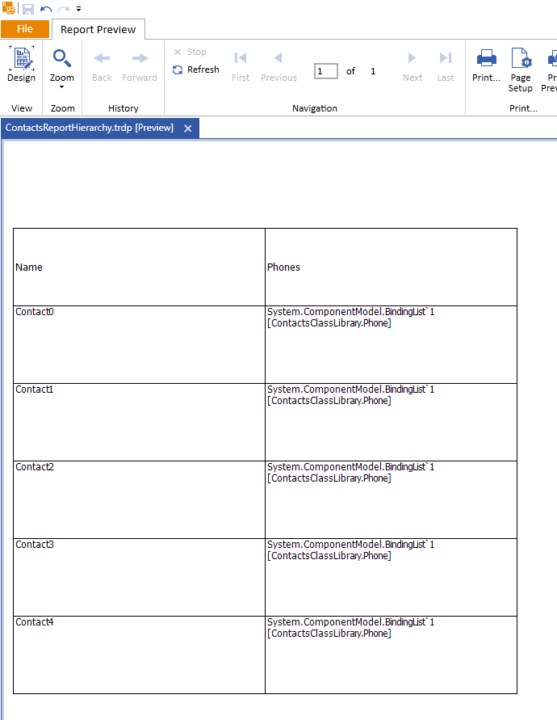
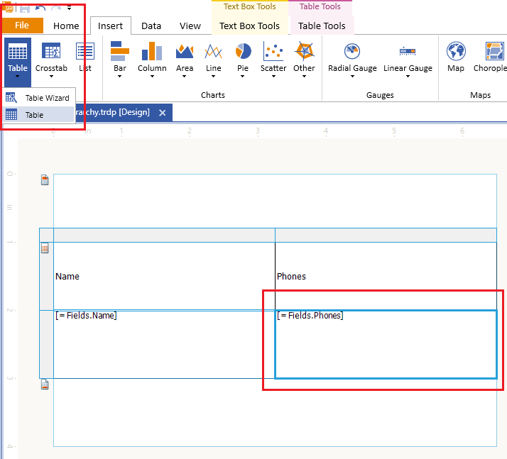
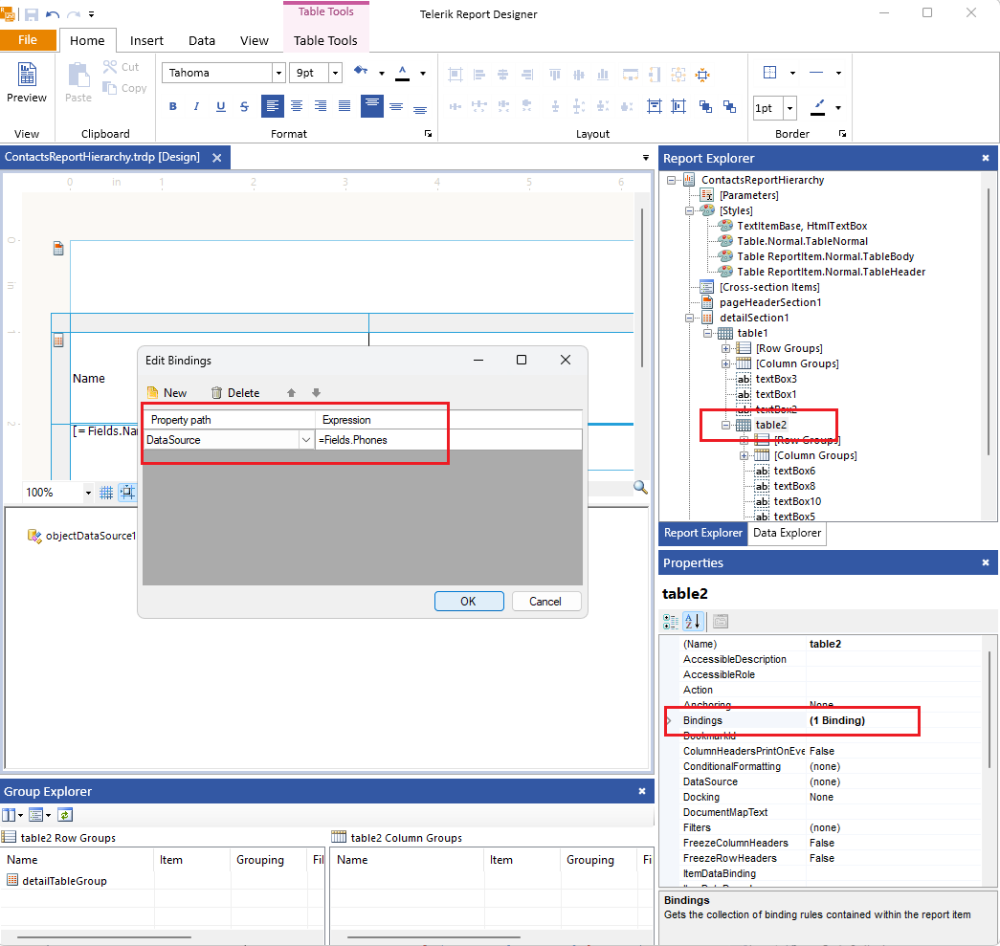
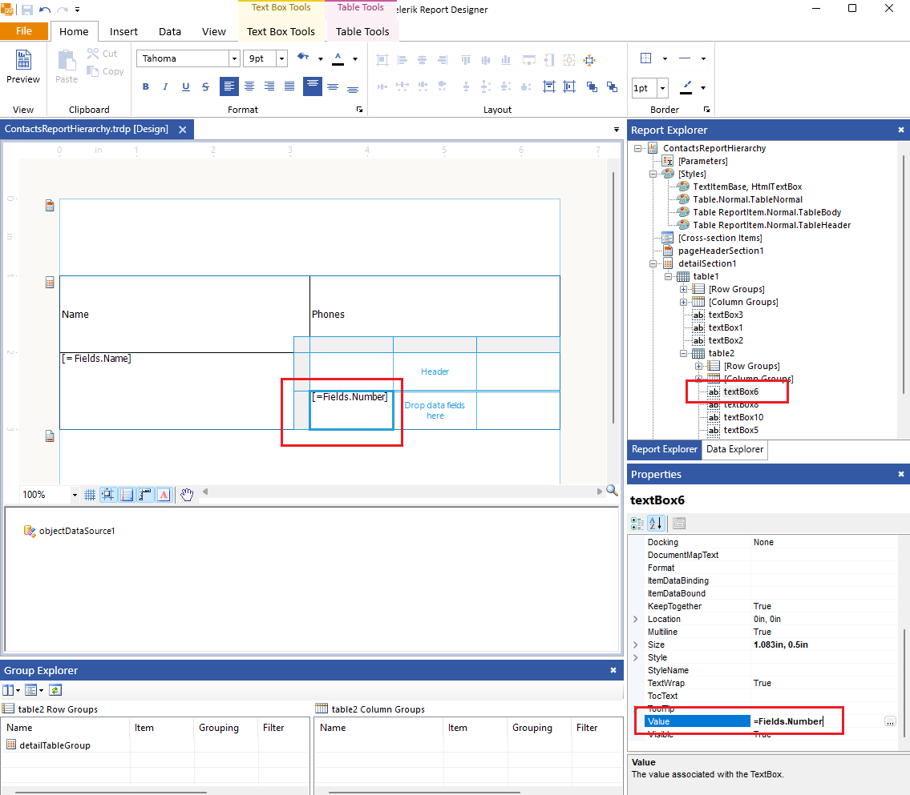

## Environment

| Version | Product | Author | 
| ---- | ---- | ---- | 
| 18.3.24.1112 | Telerik Reporting |[Desislava Yordanova](https://www.telerik.com/blogs/author/desislava-yordanova)| 

## Description

A common scenario is to set a [Data Item]()'s **DataSource** property to a custom Business object. Depending on the underlying data structure [ObjectDataSource](), [EntityDataSource](), etc. components can be used to expose the properties of the Business object to the report. However, if the data schema is **not flat** and some of the properties represent child (nested) data collections, you may need to bind a report to the hierarchical data.

In order to be able to use hierarchical data, you can take advantage of the [Bindings](/api/Telerik.Reporting.ReportItemBase#Telerik_Reporting_ReportItemBase_Bindings) functionality. Using it, you can bind declaratively the data item's [DataSource](/api/Telerik.Reporting.DataItem#Telerik_Reporting_DataItem_DataSource) property to a given collection property from your business object and the data item will display all collection items.

This tutorial shows a sample approach how to create a hierarchical Report Table using a collection of business objects  in which the business objects contains a collection property.

## Solution

Consider the scenario illustrating a custom business object `Contact` having as a property a collection of `Phone` objects.

1\. Create a **ClassLibrary** project with the following definition:

````CSharp
	using System.ComponentModel;

	namespace ContactsClassLibrary
	{
		public class ContactsCollection
		{

			BindingList<Contact> _contacts;
			public ContactsCollection()
			{

				_contacts = new BindingList<Contact>();
				for (int i = 0; i < 5; i++)
				{
					BindingList<Phone> phones = new BindingList<Phone>();
					for (int j = 0; j < 3; j++)
					{
						phones.Add(new Phone("Phone" + i + "." + j));
					}
					_contacts.Add(new Contact("Contact" + i, phones));
				}
			}
			public BindingList<Contact> AllContacts { get { return _contacts; } }

		}

		public class Contact
		{
			public Contact(string _name, BindingList<Phone> _phones)
			{
				this.Name = _name;
				this.Phones = _phones;
			}
			public string Name { get; set; }
			public BindingList<Phone> Phones { get; set; }
		}

		public class Phone
		{
			public Phone(string _number)
			{
				this.Number = _number;
			}
			public string Number { get; set; }
		}
	}
````

2\. Build the project to ensure that **ContactsClassLibrary.dll** is produced in the **bin** folder.

3\. [Extend the Report Designer to Recognize the Custom Assembly]()

4\. Create a brand new report and add an **ObjectDataSource** data item bound to the ContactsCollection.**AllContacts** property:

 

5\. Create a Table Report Item using the wizard and bind it to the defined **ObjectDataSource**:

  

6\. Previewing the report at this state is expected to produce the following result:

   

7\. Select the **=Fields.Phones** TextBox and replace it with an empty Table item:

    

8\. Adjust the empty Table's **DataSource** via Bindings:

   

9\. Select one of the generated TextBoxes in the empty Table and set its **Value** property to the desired property of the **Phone** class, e.g. "Number":

    

10\. Preview the report and see the phones for each contact:

    

## Notes

The expressions are evaluated only during the report processing. Thus, the data schema for the nested data item (Table) will not be available in the Data Explorer and in the wizards. You can use additional data source components bound to the nested business objects to help yourself with creating the report layout. Finally, apply the required bindings and remove the helper object data source components.

## See Also

* [Extending Report Designer to Recognize Custom Assemblies]()
* [Bind to a BusinessObject]()
* [Bindings]()
* [Data Binding Problems]()
* [How to use the ReportItem.DataObject property in expressions]()
