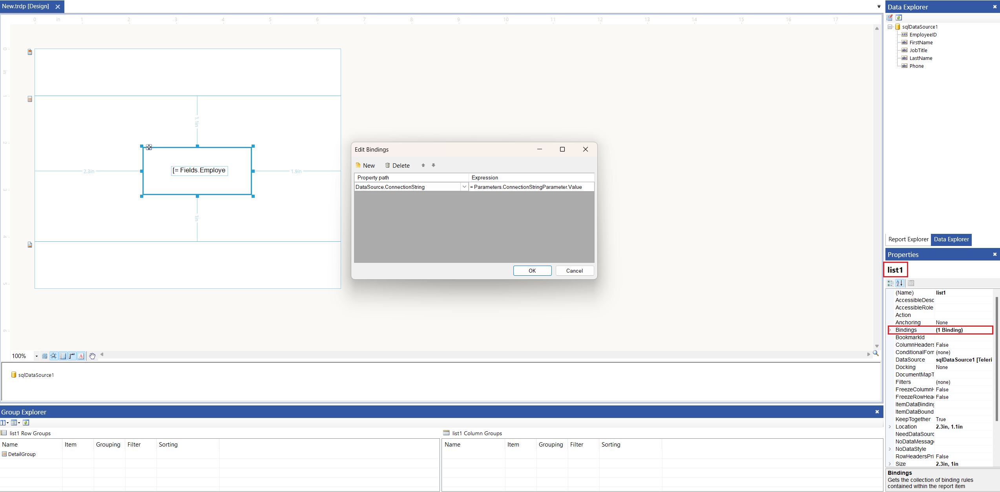

## Environment
<table>
	<tr>
		<td>Product</td>
		<td>Progress® Telerik® Reporting </td>
	</tr>
</table>


## Description
Sometimes it is necessary to change dynamically the connection string of a report and/or data item.

## Solution
The requirement can be achieved without writing additional code, **_directly in the report definition_** using dedicated report parameters. Here are the steps:

1. In the report definition [introduce a new Report Parameter]() (for example _ConnectionStringParameter_) - the connection string will be passed to the Report via this parameter.  
1. In the Report or another [Data Item]() (Table, List, etc.) where the connection string is supposed to be changed dynamically, introduce a new [Binding]() as shown below:  

	```XML
	Property path                   |   Expression

	DataSource.ConnectionString     |   = Parameters.ConnectionStringParameter.Value
	```
 


## Notes

The `DataSource.ConnectionString` property is not listed in the dropdown and must be typed manually.

The proposed approach *cannot* be used to modify the Connection String of Report Parameter -\> AvailableValues -\> DataSource as report parameters do not expose `Bindings`.

The same approach can be used to modify the `SelectCommand` Property of the SqlDataSource. The `DataSource.SelectCommand` should be set in the above code snippet in this case.

## See Also

* [Changing the connection string dynamically according to runtime data](https://www.telerik.com/support/kb/reporting/details/changing-the-connection-string-dynamically-according-to-runtime-data)
