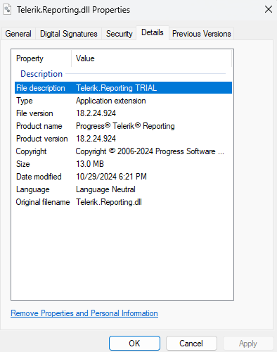

## Environment

| Version | Product |  
| ---- | ---- |
| Valid until Q2 2025 | Telerik Reporting | 

## Description

This tutorial explains in detail how to upgrade your Telerik [Trial]() to a Licensed version of [Telerik Reporting](https://www.telerik.com/account/product-download?product=REPORTING).

>caution This approach is valid for versions [before Q2 2025](). After launching the [new licensing mechanism](https://www.telerik.com/blogs/license-key-files-telerik-kendo-ui-products-2025-update), the activation is performed through a [license key]() (trial or commercial). Upgrading from a Trial to Developer (or commercial) version requires only updating the license key without the necessity of reinstalling the respective Telerik product.

Let's start with having a trial version installed on your machine and a project that uses the trial version. Access to the Trial version of product files in the Downloads section of your Telerik account: 

  

The difference between the developer and trial versions of the assemblies/ NuGet packages is that the trial version adds a copyright message to the produced reports:

  

## Solution

Once you purchase a Telerik license, you will have access to the **Purchase License** Type in your Telerik account:

   

## Upgrade the Trial Assemblies

1. Download the DEV .msi file for the Purchase version: [How to download Telerik Reporting installer](#msi-installation).
1. Uninstall the already installed Trial version, e.g. from the Windows Control Panel >> Programs and Features.
1. Install the downloaded .msi file in step 1.
1. Update the references in your project with the assemblies from the licensed installation. It is necessary to delete the old trial assemblies first:

	   

1. Then, add the licensed ones:

	    

	Right-clicking on the assembly to show its Properties allows you to check if it is a **TRIAL** assembly:

	    

1. Rebuild your project, close Visual Studio, and open it again to make sure that no references are kept in the memory by Visual Studio.

For additional details, you may also check the [Upgrading Trial to Purchase](#upgrading-from-trial-to-developer) article section.

## Upgrade the Trial NuGet packages

1. Open the **NuGet Package Manager**, e.g. select the Manage NuGet Packages... option

	 

1. Uninstall any Trial Telerik NuGet packages:

	 

1. Install the respective Purchase version of the NuGet packages, without the word "Trial" in its name:

	

## See Also

* [Telerik Reporting Licensing before 2025]()
