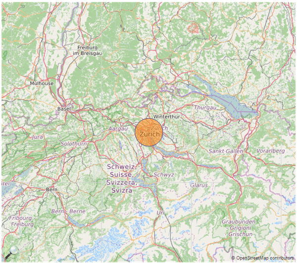

## Environment

<table>
	<tbody>
		<tr>
			<td>Product</td>
			<td>Progress® Telerik® Reporting</td>
		</tr>
		<tr>
			<td>Report Items</td>
			<td>Map, CSV DataSource, Expression</td>
		</tr>
	</tbody>
</table>


## Description

One of the most common problems that users encounter when working with the [Map]() item is how to set the map zoom level when there is only one data point displayed.

The Map item doesn’t provide a way to directly set the zoom level, because it depends on the used tile provider and the current map extent. The item automatically calculates its extent based on the displayed data points and it needs at least two points with different coordinates to determine this extent (hence the appropriate zoom level). In case there is only one data point present, the engine fallbacks to the default extent dimensions and shows the whole world. The Map item, being a part of a reporting product, is designed to show a couple of data points, visualizing ratios and measures using size, color, etc. – that’s why such a feature, which is more common for a mapping tool, is not supported out-of-the-box.

## Solution

One solution to the problem is to preprocess the data in the data source and make sure every [GeoLocation](/api/telerik.reporting.geolocationmapgroup) group would have at least two members (points) with different coordinates, which means that a virtual (non-existent) points have to be added to the data set. For better results these virtual points should be two – for each of both sides of the original point, so it will remain in the center of the viewport.

This approach can be easy to develop if your data is a collection of business objects, but it gets more complicated when your data is coming from a database, which is a more common scenario. This means that it will be more reasonable to setup the Map item so it can handle such a scenario. In short, this approach involves adding two more series, each one containing a virtual data point that is offset from the coordinates of the original data point. To create such a report, follow the steps described below:

1. Open the Standalone Report Designer, create a new blank report and add a new Map item.
1. When the Choose Data Source dialog appears, create new [CSV Data Source]() named **csvData** and enter the following sample data:

	````XML
Country,City,Lat,Long,Value
	France,Paris,48.8566,2.3522,5
	France,Toulouse,43.6047,1.4442,15
	France,Caen,49.1829,0.3707,25
	Germany,Munich,48.131,11.57,20
	Germany,Berlin,52.5272,13.3739,40
	Switzerland,Zurich,47.3798,8.5283,30
````


1. Finish the wizard, checking **The CSV has headers** and setting **Lat**, and **Long** column types to **Float**.
1. On the **Arrange Map Fields** page drag **City** field to **Categories** (location) box, **Lat** and **Long** fields to **Latitude** and **Longitude** boxes respectively and Value field to Size box.
1. When you click *Finish*, your report will display all the points from the data source onto the map, so we will create a report parameter that will help us to view the data for each country.
1. Add new report parameter called paramCountry and set its **AvailableValues** properties as follows:

	* `DataSource`: csvData
	* `DisplayMember`: =Fields.Country
	* `ValueMember`: =Fields.Country
	* `AutoRefresh`: True 
	* `Value` to France and `Visible` to True so it has some initial state.

1. Add new Filter in map’s **Filters** collection and set its **Expression** to `=Fields.Country`, **Operator** to `=` and **Value** to `=Parameters.paramCountry.Value`.

	If you preview the report, it should show the map and the parameter above. Changing the parameter values you will notice that the map extent changes accordingly. The extent is dynamically calculated for Germany and France but for Switzerland it defaults to "whole world", because in our data Switzerland has only one point.

1. Add two new [PointMapSeries](/api/telerik.reporting.pointmapseries) instances to the map’s Series collection. They will contain the virtual points that are positioned on the same parallel or meridian with the real point, ensuring a valid extent. Keep in mind that the meridians converge at the Poles so your extent won’t cover the same area everywhere on Earth. However, Mercator projection we use "stretches" the globe near the Poles so it’s up to you to determine the offset of the virtual points. In our case we will position the virtual points at `1 degree` east and west from the real point, so set the series properties as follows:  **Latitude**: `=Fields.Lat`, **Longitude**: `=Fields.Long-1` (respectively `=Fields.Long+1` for the second series).

	If you now preview the report, you will see that when selecting Switzerland, the map doesn’t show the whole world but an area around Zurich instead. However, it’s a good idea to add this extra offset only when there is a single member in the current group, so you can change the Longitude expressions of the virtual series to `=Fields.Long - (IF(Exec('map1', Count(Fields.City)) = 1, 1, 0))`.

Additionally you can make the virtual datapoints invisible and apply some additional styling to your report so finally it would look like this:



## See Also

* [Map]()
* [PointMapSeries Class](/api/telerik.reporting.pointmapseries)
* [GeoLocation](/api/telerik.reporting.geolocationmapgroup)
