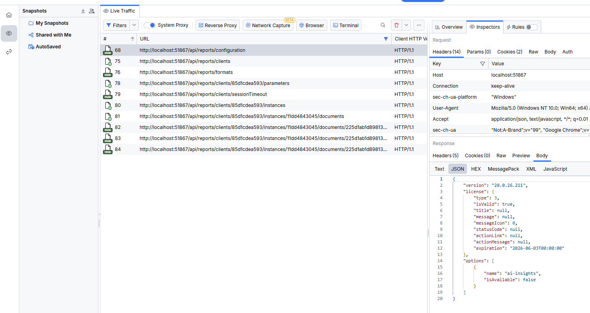

## Environment

<table>
	<tr>
		<td>Product</td>
		<td>Progress® Telerik® Reporting</td>
	</tr>
	<tr>
		<td>Project Type</td>
		<td>ASP.NET Core</td>
	</tr>
	<tr>
		<td>Target Framework</td>
		<td>.NET</td>
	</tr>
</table>

## Description

Consider the following steps when experiencing problems while working with Telerik Reporting. For example, if you receive [Errors in Reports, Report Viewers and Services](); error messages in the browser console; unexpected slow-down in performance; incorrect fonts; etc.

## Steps to Troubleshoot

- **Upgrade to the latest version** of the product in case the reason for the crash has been fixed. Check for the fixes in the corresponding version in the [Telerik Reporting Release History](https://www.telerik.com/support/whats-new/reporting/release-history).
- **Try reproducing the crash on another machine** to exclude machine-specific problems. For example:
	+ Corrupted Telerik Reporting installation on Windows;
	+ Missing basic functionality, for example, incomplete GDI+ or Skia graphics engines, or fonts on specific Windows Server or Linux distributions;
	+ Insufficient user permissions for machine resources, databases, etc.
- **Hard refresh the browser** to ensure there are no cached Report Viewer resources with older versions.
	This would be the first step if you see an error message like `The version of the Report Viewer '19.3.26.121' does not match the version of the Reporting REST Service '20.0.26.211'. Please make sure both are running same version.` In this particular case, you may have upgraded successfully the viewer and the service from `19.3.26.121` to `20.0.26.211`. However, the browser may have cached the viewer resources from the runs before the upgrade. Refreshing the browser should load the new resources and update the cache.
- **Record a server-side log** file containing detailed information about the error:
	To create the log file, go to the project that hosts the [Reporting REST Service](), add the below method, and then call it from the startup point of the application, for example, the `Program.cs` file:

	```C#
	static void EnableTracing()
	{
		System.Diagnostics.Trace.Listeners.Add(new System.Diagnostics.TextWriterTraceListener(File.CreateText("aspnetcoredemo.log")));
		System.Diagnostics.Trace.AutoFlush = true;
	}
	```

	Upon running the project and reproducing the error, it will generate an `aspnetcoredemo.log` file at the application root folder with the tracing information about the exceptions and performance. For example:
	+ Server-side failures with stack traces, including refused or timed-out database connection, insufficient permissions to access local paths or resources, etc;
	+ Time to process and render reports;
	+ Font substitutions.

	Here is a sample Trace Listener log from the Telerik Reporting REST Service that contains a warning about font substitution:

	```
	CSharp.Net10.Html5IntegrationDemo Information: 0 : Worker rendering threads count: 20
	CSharp.Net10.Html5IntegrationDemo Information: 0 : License check for assembly Telerik.Reporting, Version=20.0.26.211, Culture=neutral, PublicKeyToken=a9d7983dfcc261be: True
	CSharp.Net10.Html5IntegrationDemo Information: 0 : Cache Cleanup (2/18/2026 3:11:26 PM): 'Delete expired cache assets' should be performed as of 2/18/2026 1:11:25 PM, as it is not performed since 2/18/2026 12:49:29 PM and the check period is 00:05:00
	CSharp.Net10.Html5IntegrationDemo Information: 0 : Cache Cleanup (2/18/2026 3:11:26 PM): Starting to execute 'Delete expired cache assets'
	CSharp.Net10.Html5IntegrationDemo Information: 0 : Cache Cleanup (2/18/2026 3:11:26 PM): Starting to execute 'Delete expired clients'
	CSharp.Net10.Html5IntegrationDemo Information: 0 : Cache Cleanup (2/18/2026 3:11:26 PM): 2 clients survived expiration, namely: dd2716e7f63, 4eb029f2501
	CSharp.Net10.Html5IntegrationDemo Information: 0 : Cache Cleanup (2/18/2026 3:11:26 PM): Finished executing 'Delete expired clients'; elapsed: 00:00:00.0347776
	CSharp.Net10.Html5IntegrationDemo Information: 0 : Cache Cleanup (2/18/2026 3:11:26 PM): Starting to execute 'Delete expired refreshes & instances'
	CSharp.Net10.Html5IntegrationDemo Information: 0 : Cache Cleanup (2/18/2026 3:11:26 PM): Finished executing 'Delete expired refreshes & instances'; elapsed: 00:00:00.0022051
	CSharp.Net10.Html5IntegrationDemo Information: 0 : Cache Cleanup (2/18/2026 3:11:26 PM): Finished executing 'Delete expired cache assets'; elapsed: 00:00:00.0513262
	CSharp.Net10.Html5IntegrationDemo Information: 0 : Unit.DotsPerInch = 96
	CSharp.Net10.Html5IntegrationDemo Information: 0 : Telerik Reporting Assembly Information
	CSharp.Net10.Html5IntegrationDemo Information: 0 : ======================================
	CSharp.Net10.Html5IntegrationDemo Information: 0 : Name: Telerik.Reporting, Version=20.0.26.211, Culture=neutral, PublicKeyToken=a9d7983dfcc261be; Location: C:\Program Files (x86)\Progress\Telerik Reporting 2026 Q1\Examples\CSharp\.NET 10\Html5IntegrationDemo\bin\Debug\net10.0\Telerik.Reporting.dll; TargetFramework: .NETStandard,Version=v2.0
	CSharp.Net10.Html5IntegrationDemo Warning: 0 : No AssemblyLoadContext is passed! Using Assembly.Load!
	CSharp.Net10.Html5IntegrationDemo Information: 0 : Assembly reference successfully loaded: SpeakerObjects, Culture=neutral
	CSharp.Net10.Html5IntegrationDemo Information: 0 : Rendering thread 17 starts work.
	CSharp.Net10.Html5IntegrationDemo Information: 0 : *** Render Report #0 "BarcodesReport" STARTED ***
	CSharp.Net10.Html5IntegrationDemo Information: 0 : ReportName: BarcodesReport; DocumentName: BarcodesReport; Extension: HTML5Interactive
	CSharp.Net10.Html5IntegrationDemo Information: 0 : DeviceInfo Contents
	CSharp.Net10.Html5IntegrationDemo Information: 0 : ===================
	CSharp.Net10.Html5IntegrationDemo Information: 0 : BasePath: "api/reports"
	CSharp.Net10.Html5IntegrationDemo Information: 0 : ContentOnly: "True"
	CSharp.Net10.Html5IntegrationDemo Information: 0 : contentTabIndex: "0"
	CSharp.Net10.Html5IntegrationDemo Information: 0 : CurrentCulture: "en-US"
	CSharp.Net10.Html5IntegrationDemo Information: 0 : CurrentUICulture: "en-US"
	CSharp.Net10.Html5IntegrationDemo Information: 0 : DocumentID: "e85430016329ee48abe359"
	CSharp.Net10.Html5IntegrationDemo Information: 0 : enableAccessibility: "False"
	CSharp.Net10.Html5IntegrationDemo Information: 0 : enableSearch: "True"
	CSharp.Net10.Html5IntegrationDemo Information: 0 : EndPage: "0"
	CSharp.Net10.Html5IntegrationDemo Information: 0 : ImmediatePrint: "False"
	CSharp.Net10.Html5IntegrationDemo Information: 0 : internal_format: "HTML5Interactive"
	CSharp.Net10.Html5IntegrationDemo Information: 0 : key: "en-US"
	CSharp.Net10.Html5IntegrationDemo Information: 0 : ProcessItemActions: "True"
	CSharp.Net10.Html5IntegrationDemo Information: 0 : ResourceFormat: "api/reports/clients/ec5fe8265c2/instances/11dd4843045/documents/e85430016329ee48abe359/resources/{0}/"
	CSharp.Net10.Html5IntegrationDemo Information: 0 : StartPage: "0"
	CSharp.Net10.Html5IntegrationDemo Information: 0 : SupportsMargins: "False"
	CSharp.Net10.Html5IntegrationDemo Information: 0 : SupportsVerticalTextAlignment: "False"
	CSharp.Net10.Html5IntegrationDemo Information: 0 : UseSVG: "True"
	CSharp.Net10.Html5IntegrationDemo Warning: 0 : Font 'My Custom Font' is substituted with font 'Microsoft Sans Serif'.
	CSharp.Net10.Html5IntegrationDemo Information: 0 : *** Render Report #0 "BarcodesReport" DONE in 00:00:00.1395173 ***
	CSharp.Net10.Html5IntegrationDemo Information: 0 : 
	CSharp.Net10.Html5IntegrationDemo Information: 0 : Page generated: page1
	CSharp.Net10.Html5IntegrationDemo Information: 0 : Rendering thread 17 finishes work.
	```

- **Use [Fiddler Everywhere Reporter](https://www.telerik.com/fiddler/fiddler-everywhere-reporter) or another proxy tool to capture the web traffic** and check the requests, responses, and statuses.
	In the captured traffic, check the failing requests from the Reporting REST Service endpoint. Usually, the Reporting service requests start with `{mainServiceUrl}/api/reports/`. Here is a sample log of successfully passed requests between the HTML5 Report Viewer and the Service:
	
	
	
	If you need help, please, send us the generated SAZ file in case you use Fiddler; [HAR file](https://docs.cloud.google.com/support/docs/capture-browser-trace) if you capture the traffic in the Chrome browser, etc.

> After you generate the log files from the above steps, archive them and attach them to a support ticket. Include the steps to reproduce the issue, sample report with data, or runnable project.
