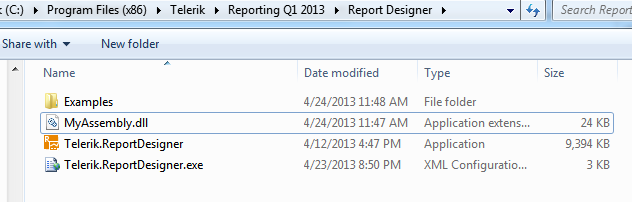
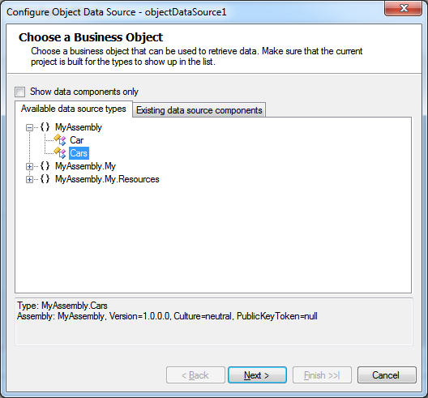

## Environment

<table>
	<tbody>
		<tr>
			<td>Product</td>
			<td>Progress® Telerik® Reporting</td>
		</tr>
		<tr>
			<td>Report Designer</td>
			<td>All</td>
		</tr>
	</tbody>
</table>

## Description

This article provides the required steps to use external assemblies with custom user functions in [Telerik Standalone Report Designer]().

It is a common requirement to add your own [User Functions]() or bind to custom CLR objects, data models (such as an OpenAccess ORM model), external assemblies with custom data source objects, data feeds (including OData) and web services.

## Solution

In order to expose your data, so it can be utilized by the Object/OpenAccess/Entity [data source components](), or extend the default behavior of the Telerik Reporting engine with custom user functions, you have to use the [AssemblyReferences Element]() of the Telerik.Reporting configuration section to reference your custom assembly.

### Create an Assembly with Custom User Functions

The steps below can be used as an example of how to create an assembly with custom user functions. We will use this assembly in the following sections of the current article.

1. Open Visual Studio and create a new Class Library project named MyAssembly.
1. Add a reference to `Telerik.Reporting.dll`. When the assembly is used in the Report Designer its version will be resolved according to the Report Designer version of Telerik Reporting assemblies.
1. Create your custom objects:

	````C#
namespace MyAssembly
	{
		using System.Collections;
		using System.Collections.Generic;

		public class Car
		{
			string model;
			int year;

			public Car(string model, int year)
			{
				this.model = model;
				this.year = year;
			}

			public string Model
			{
				get { return this.model; }
				set { this.model = value; }
			}
		
			public int Year
			{
				get { return this.year; }
				set { this.year = value; }
			}
		}

		public class Cars: List<Car>
		{
			public Cars()
			{
				Car car;
				car = new Car("Honda NSX GT", 2003);
				this.Add(car);
		
				car = new Car("Nissan Skyline R34 GT-R", 2005);
				this.Add(car);
			}
		}
	}
````
	````VB
Imports System.Collections
	Imports System.Collections.Generic

	Public Class Car
		Private m_model As String
		Private m_year As Integer

		Public Sub New(model As String, year As Integer)
			Me.m_model = model
			Me.m_year = year
		End Sub

		Public Property Model() As String
			Get
				Return Me.m_model
			End Get
			Set(value As String)
				Me.m_model = value
			End Set
		End Property

		Public Property Year() As Integer
			Get
				Return Me.m_year
			End Get
			Set(value As Integer)
				Me.m_year = value
			End Set
		End Property
	End Class

	Public Class Cars
		Inherits List(Of Car)
		Public Sub New()
			Dim car As Car
			car = New Car("Honda NSX GT", 2003)
			Me.Add(car)

			car = New Car("Nissan Skyline R34 GT-R", 2005)
			Me.Add(car)
		End Sub
	End Class
````


1. Build your project.

### Extend the Report Designer Configuration

Once the assembly with our custom logic is built, it should be placed in the folder or a subfolder of the Report Designer executable file. The default installation folder is `C:\Program Files (x86)\Telerik\Reporting RX XXXX\Report Designer` (`C:\Program Files\Telerik\Reporting RX XXXX\Report Designer` on 32-bit machines), where 'RX XXXX' stands for the release version and year, e.g R1 2021.

1. Locate the Telerik Report Designer executable and its configuration file on your machine (`Telerik.ReportDesigner.exe` and `Telerik.ReportDesigner.exe.config`)
1. Place `MyAssembly.dll` into the folder or a subfolder where `Telerik.ReportDesigner.exe` resides.

	

1. Open the Report Designer’s configuration file with a text editor and navigate to the `<AssemblyReferences>` element.
1. Uncomment the section and change the name attribute to MyAssembly. Notice that the assembly is referred only by its name without specifying the extension:

	````
<!-- Add assembly references -->

	<!--
	<Telerik.Reporting>
		<AssemblyReferences>
			<add name="MyAssembly" version="1.0.0.0" />
		</AssemblyReferences>
	</Telerik.Reporting>
	-->
````


	> Additionally you can add `culture` and `publicKeyToken` attributes to identify the assembly in the `<add>` element if necessary.

	Here is a possible configuration extending the Report Designer with the functionality in `MyAssembly.dll` assembly:

	````XML
<configuration>
		...
		<runtime>
			<assemblyBinding xmlns="urn:schemas-microsoft-com:asm.v1">
				<probing privatePath="MySubDir; MySubDir\SubDir"/>
			</assemblyBinding>
		</runtime>
		
		<Telerik.Reporting>
			<AssemblyReferences>
				<add name="MyAssembly" version="1.0.0.0"/>
			</AssemblyReferences>
		</Telerik.Reporting>
		...
	</configuration>
````

	The Standalone Report Designer will look for `MyAssembly.dll` in its own folder (where the `Telerik.ReportDesigner.exe` resides) and in `MySubDir` and `MySubDir\SubDir` (using the specified relative paths in the [.NET Framework `<probing>` element](https://learn.microsoft.com/en-us/previous-versions/dotnet/netframework-2.0/823z9h8w(v=vs.80))).

1. Reopen the Standalone Report Designer and explore the extended functionality.

	

### Use Assembly Located in non-Relative Path

Telerik.Reporting `AssemblyReferences` section is trying to load the assemblies according to the .NET Framework rules. Thus, in order to use a signed assembly located in a directory different from the application directory or GAC, you have to add a `dependentAssembly` section to point to the .NET Framework where to look for your assembly. For more information check out the [CodeBase Element](https://learn.microsoft.com/en-us/dotnet/framework/configure-apps/file-schema/runtime/codebase-element) Microsoft article.

## Notes

If the external assembly extending the Report Designer depends on other assemblies, all related assemblies have to be placed in the folder where the Report Designer is located.

In order to deploy a report that uses external assembly check out the KB article [Deploying trdx (XML report definition) that uses external assembly]().

## See Also

* [Standalone Report Designer]()
* [User Functions]()
* [AssemblyReferences Element]()
* [Deploying trdx (XML report definition) that uses external assembly]()
