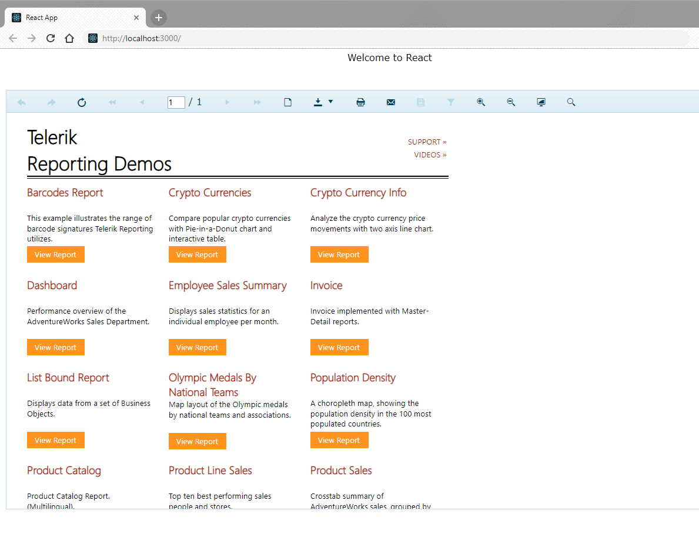

## Environment

<table>
	<tr>
		<td>Framework</td>
		<td>React</td>
	</tr>
	<tr>
		<td>Report Viewer</td>
		<td>HTML5</td>
	</tr>
</table>

## Description

>important Starting with [R1 2022 (16.0.22.119)](https://www.telerik.com/support/whats-new/reporting/release-history/progress-telerik-reporting-r1-2022-16-0-22-119) we introduced a dedicated [React Report Viewer]().

The [HTML5 Report Viewer]() is built upon HTML5, CSS, and JavaScript. This allows the viewer to be used in virtually any JavaScript framework.

[React](https://reactjs.org/) has been gaining a lot of traction and we would like to explore how the HTML5 Report Viewer could be implemented, together with its dependencies, in a React application. The solution we are about to demonstrate is a very basic approach to create a new React application, include the viewer's dependencies and lastly, display the report viewer.

## Solution

The following guide assumes previous knowledge of React:

1. Start by creating a new React application using following CLI commands:

	````
	npx create-react-app my-app
		cd my-app
		npm start
	````

	>note You’ll need to have **Node >= 6** and **npm >= 5.2** on your machine.

1. The viewer depends on **jQuery**. Add a CDN link to jQuery library in `public/index.html`:

	````HTML
	<script src="https://code.jquery.com/jquery-3.3.1.min.js"></script>
	````


1. Add the desired [Kendo UI Less-Based Theme](https://docs.telerik.com/kendo-ui/styles-and-layout/appearance-styling) to `index.html` in order to style the viewer:

	````HTML
	<head>
			<link href="http://kendo.cdn.telerik.com/{{kendosubsetversion}}/styles/kendo.common.min.css" rel="stylesheet" />
			<link href="http://kendo.cdn.telerik.com/{{kendosubsetversion}}/styles/kendo.default.min.css" rel="stylesheet" />
	````


1. Create new `assets` folder inside `public` and add the HTML5 Report Viewer JS library from the Telerik Reporting installation folder `C:\Program Files (x86)\Progress\Telerik Reporting {{site.suiteversion}}\Html5\ReportViewer\js`. Refer the path to the file in `index.html` as:

	````HTML
	<script src="/assets/telerikReportViewer-{{buildversion}}.min.js"></script>
	````


1. Add [Kendo UI for jQuery](https://www.telerik.com/kendo-ui) JS library. An alternative approach is to add only the subset of Kendo widgets required for the proper work of the HTML5 Report Viewer. The subset is available in the Telerik Reporting installation folder `C:\Program Files (x86)\Progress\Telerik Reporting {{site.suiteversion}}\Html5\ReportViewer\js\telerikReportViewer.kendo-{{site.buildversion}}.min.js` and can be copied to the React application's `public/assets` folder. Then reference it in `index.html`:

	````HTML
	<script src="/assets/telerikReportViewer.kendo-{{buildversion}}.min.js"></script>
	````


1. Create a new report viewer component (`components/ReportViewer.js`) and configure the routes accordingly. The new component would contain the following template, scripts, and styles:

	````TypeScript
import React, { Component } from 'react';

	export default class ReportViewer extends Component {
		// The componentDidMount() method runs after the component output has been rendered to the DOM.
		componentDidMount() {
			window.jQuery('#reportViewer1')
				.telerik_ReportViewer({
					serviceUrl: 'https://demos.telerik.com/reporting/api/reports/',
					reportSource: {
						report: 'ReportBook.trbp'
					},
					scale: 1.0,
					viewMode: 'INTERACTIVE',
					printMode: 'SPECIFIC',
					sendEmail: { enabled: true }
				});
		}

		render() {
			return <div id="reportViewer1"></div>
		}
	}
````


1. In the required page (for example `App.js`), render the React component:

	````TypeScript
import React, { Component } from 'react';
	import './App.css';
	import ReportViewer from './components/ReportViewer';

	class App extends Component {
		render() {
			return (
				<div className="App">
					Welcome to React App
					<ReportViewer />
				</div>
			);
		}
	}

	export default App;
````


1. Set the default styles of the report viewer to the corresponing page stylesheet file (for example `App.css`):

	````HTML
body {
		font-family: Verdana, Arial;
		margin: 5px;
	}

	#reportViewer1 {
		position: absolute;
		top: 70px;
		bottom: 10px;
		left: 10px;
		right: 10px;
		overflow: hidden;
		clear: both;
	}
````


1. Run

	````
	npm run start
	````




## Additional resources

[Download the final React application](resources/telerik-report-viewer-react-app.zip)

## See Also

* [React Report Viewer]()
* [Create a New React App](https://reactjs.org/docs/create-a-new-react-app.html)
