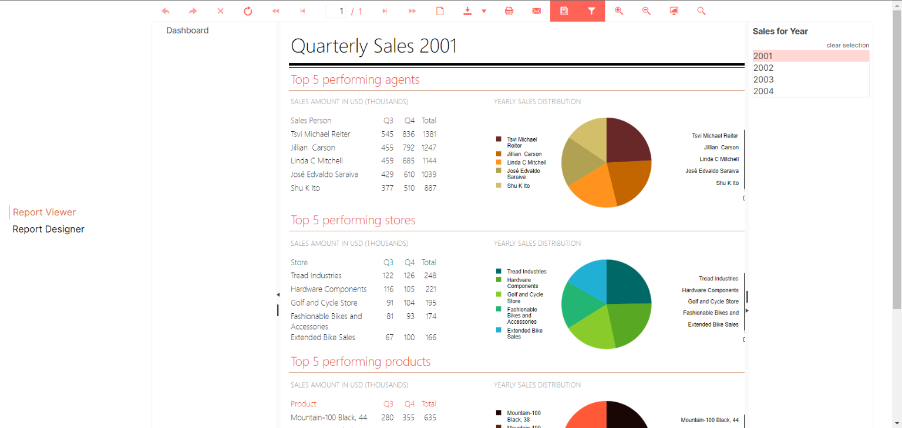

## Environment

<table>
	<tr>
		<td>Product</td>
		<td>Progress® Telerik® Reporting R2 2020</td>
	</tr>
	<tr>
		<td>Framework</td>
		<td>Vue.js</td>
	</tr>
	<tr>
		<td>Report Viewer</td>
		<td>HTML5</td>
	</tr>
</table>


## Description

The [HTML5 Report Viewer]() is built upon HTML5, CSS, and JavaScript. This allows the viewer to be used in virtually any JavaScript framework.

[Vue.js](https://vuejs.org/) has been gaining a lot of traction and we would like to explore how the HTML5 Report Viewer could be implemented, together with its dependencies, in a Vue application. The solution we are about to examine is a very basic approach to create a new Vue.js application, include the viewer's dependencies, and display the report viewer.

## Solution

The following guide assumes previous knowledge of Vue.js:

1. Start by creating a new Vue application using the following CLI command:

	````
vue init webpack hello-world
````


1. The viewer depends on **jQuery**. In the application folder run:

	````
npm install jquery --save
````


1. Open `build/webpack.base.conf.js` and add `plugins`:

	````TypeScript
const webpack = require('webpack')
	//...
````

	````TypeScript
module.exports = {
		plugins: [
			new webpack.ProvidePlugin({
			  $: 'jquery',
			  jquery: 'jquery',
			  'window.jQuery': 'jquery',
			  jQuery: 'jquery'
			})
		]
		//...
````


1. If you are using **ESLint**, open `.eslintrc.js` and add `globals`:

	````TypeScript
module.exports = {
		globals: {
			"$": true,
			"jQuery": true
		},
		//...
````


1. Add the desired [Kendo UI Less-Based Theme](https://docs.telerik.com/kendo-ui/styles-and-layout/appearance-styling) to `index.html` in order to style the viewer:

	````HTML
<head>
		<link href="https://kendo.cdn.telerik.com/{{kendosubsetversion}}/styles/kendo.common.min.css" rel="stylesheet" />
		<link href="https://kendo.cdn.telerik.com/{{kendosubsetversion}}/styles/kendo.default.min.css" rel="stylesheet" />
		//...
````


1. Add [Kendo UI for jQuery](https://www.telerik.com/kendo-ui) JS library. An alternative approach is to add only the subset of Kendo widgets required for the proper work of the HTML5 Report Viewer. The subset is available in the Telerik Reporting installation folder `C:\Program Files (x86)\Progress\Telerik Reporting {{site.suiteversion}}\Html5\ReportViewer\js\telerikReportViewer.kendo-{{site.buildversion}}.min.js` and can be copied to the Vue application's `assets` folder `src/assets/ReportViewer/js`. Then reference it in `App.vue`:

	````HTML
<script>
		import './assets/ReportViewer/js/telerikReportViewer.kendo-{{buildversion}}.min.js'
		//...
````

	To avoid getting errors from **ESLint** for any report viewer dependencies, add them to `.eslintignore`:

	````
src/assets/ReportViewer/
	src/components/ReportViewer.vue	
````


1. Add the HTML5 Report Viewer JS library from the Telerik Reporting installation folder `C:\Program Files (x86)\Progress\Telerik Reporting {{site.suiteversion}}\Html5\ReportViewer\js` to **assets** `src/assets/ReportViewer/js`.
1. Create a new report viewer component and configure the routes accordingly. The new component contains a `div` element to hold the report viewer object and applies CSS to this element. The component calls the `telerik_ReportViewer` method to create the report viewer with the specified configuration options. It is important that the `serviceUrl` option points to the URL of a working [Reporting REST Service](). How to implement this service is described in [Hosting the Telerik Reporting REST Service in ASP.NET Core in .NET 6 and .NET 7 with Top-Level Statements]().

	````HTML
<template>
		<div class="hello">
			<h1>{{ msg }}</h1>
			<div id="reportViewer1">loading...</div>
		</div>
	</template>

	<script>
		import '../assets/ReportViewer/js/telerikReportViewer-{{buildversion}}.min.js'

		export default {
			name: 'ReportViewer',
			data () {
				return {
					msg: 'Welcome to Your Vue.js App'
				}
			},
			mounted () {
				this.$nextTick(function () {
					$('#reportViewer1')
						.telerik_ReportViewer({
							serviceUrl: 'http://my.service.url/api/reports/',
							reportSource: {
								report: 'Telerik.Reporting.Examples.CSharp.ReportCatalog, CSharp.ReportLibrary'
							},
							viewMode: telerikReportViewer.ViewModes.INTERACTIVE,
							scaleMode: telerikReportViewer.ScaleModes.SPECIFIC,
							scale: 1.0,
							sendEmail: { enabled: true }
						})
				})
			}
		}
	</script>

	<!-- Add "scoped" attribute to limit CSS to this component only -->
	<style scoped>
		body {
			font-family: Verdana, Arial;
			margin: 5px;
		}

		#reportViewer1 {
			position: absolute;
			top: 70px;
			bottom: 10px;
			left: 10px;
			right: 10px;
			overflow: hidden;
			clear: both;
		}
	</style>
````


9. Run

	````
npm run dev
````




## Additional resources

[Download the final Vue.js application](resources/vuer-webpack.zip).
