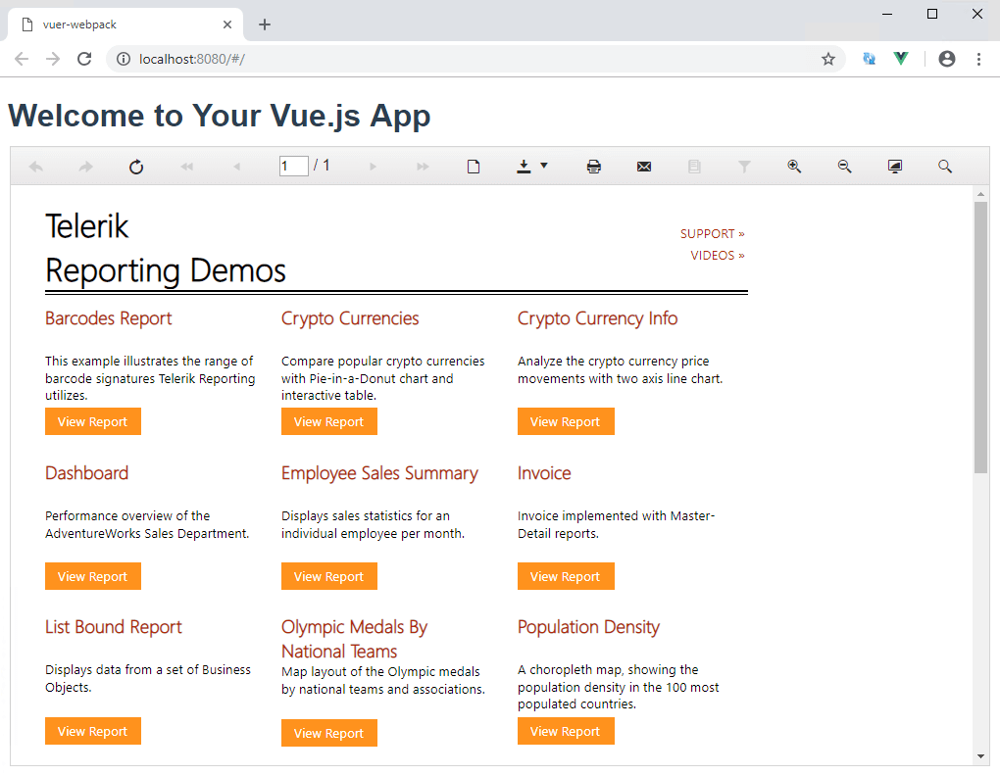

## Environment

<table>
	<tr>
		<td>Product</td>
		<td>Progress® Telerik® Reporting R3 2022+</td>
	</tr>
	<tr>
		<td>Framework</td>
		<td>Vue</td>
	</tr>
</table>


## Description

The [HTML5 Report Viewer]() and [Web Report Designer]() are built upon HTML5, CSS, and JavaScript. This allows using them in virtually any JavaScript framework including [Vue.js](https://vuejs.org/).

The solution we are about to examine is a very basic approach to create a new Vue application, include the viewer and designer dependencies, and display them in separate views.

## Solution

The following guide assumes previous knowledge of Vue:

1. Start by creating a new Vue application using the following CLI command:

	````PowerShell
npm init vue@latest
````

1. Next, include the necessary JS dependencies of the viewer and designer in `index.html`. This includes the [jQuery](https://jquery.com/) library, [Kendo](https://www.telerik.com/kendo-ui). For this example, we will be retrieving the Report Viewer and Report Designer JS resources from the [online demos](https://demos.telerik.com/reporting):

	````HTML
<body>
		<div id="app"></div>
		<script src="https://code.jquery.com/jquery-3.2.1.min.js"></script>
		<script src="https://kendo.cdn.telerik.com/{{kendosubsetversion}}/js/kendo.all.min.js"></script>
		<script src="https://demos.telerik.com/reporting/api/reports/resources/js/telerikReportViewer"></script>
		<script src="https://demos.telerik.com/reporting/api/reportdesigner/designerresources/js/webReportDesigner"></script>
		<script type="module" src="/src/main.js"></script>
	</body>
````


1. Then, add the default Kendo SASS theme again in `index.html`, inside the `head` element, to style the report viewer and designer:

	````HTML
<link rel="stylesheet" href="https://kendo.cdn.telerik.com/themes/5.9.0/default/default-main.css" />
````


1. Create a new report viewer component(e.g. `ReportViewer.vue`) and configure the routes accordingly. The new component contains a `div` element to hold the report viewer object and applies CSS to this element. The component calls the [`telerik_ReportViewer`]() method to create the report viewer with the specified configuration options. It is important that the `serviceUrl` option points to the URL of a working [Reporting REST Service]():

	````HTML
<template>
		<div class="hello">
			<h1></h1>
			<div id="reportViewer1">loading...</div>
		</div>
	</template>

	<script>
		export default {
			name: 'ReportViewer',
			data () {
			return {
				msg: 'Welcome to Your Vue.js App'
			}
		},
		mounted () {
			this.$nextTick(function () {
				$('#reportViewer1')
				.telerik_ReportViewer({
					serviceUrl: 'http://demos.telerik.com/reporting/api/reports/',
					reportSource: {
					report: 'Dashboard.trdx'
					},
					viewMode: telerikReportViewer.ViewModes.INTERACTIVE,
					scaleMode: telerikReportViewer.ScaleModes.SPECIFIC,
					scale: 1.0,
					sendEmail: { enabled: true }
					})
				})
			}
		}
	</script>

	<!-- Add "scoped" attribute to limit CSS to this component only -->
	<style scoped>
		#reportViewer1 {
			position: relative;
			width: 80vw;
			height: 1000px;
		}
	</style>
````


1. Create a new report designer component((e.g. `ReportDesigner.vue`)) and configure the routes accordingly. The new component contains a `div` element to hold the report designer object and applies CSS to this element. The component calls the [`telerik_WebReportDesigner`]() method to create the report viewer with the specified configuration options. It is important that the `serviceUrl` option points to the URL of a working [Report Designer REST Service](#setting-up-the-report-designer-rest-service).

	````HTML
<template>
		<div id="wrd1">...</div>
	</template>

	<script>
		export default {
		name: "WebReportDesigner",
		mounted() {
			this.$nextTick(function () {
			$("#wrd1")
				.telerik_WebReportDesigner({
				toolboxArea: {
					layout: "list", //Change to "grid" to display the contents of the Components area in a flow grid layout.
				},
				serviceUrl: "https://demos.telerik.com/reporting/api/reportdesigner/",
				report: "Barcodes Report.trdx",
				})
				.data("telerik_WebDesigner");
			});
		},
	};
	</script>

	<!-- Add "scoped" attribute to limit CSS to this component only -->
	<style scoped>
		#wrd1 {
		position: relative;
		width: 100%;
		height: 880px;
		}
	</style>
````


1. Run the `dev` script to start the application in development mode:

	````PowerShell
npm run dev
````


Here is how the starting page of the application should look like:



## Additional resources

Download the final Vue.js application from [Sample Vite + Vue3 Application](https://github.com/telerik/reporting-samples/tree/master/reporting-vue).


## See Also

* [HTML5 Report Viewer]()
* [Web Report Designer]()
* [Reporting REST Service]()
* [Telerik Reporting online demos](https://demos.telerik.com/reporting)
* [Vue.js](https://vuejs.org/)
