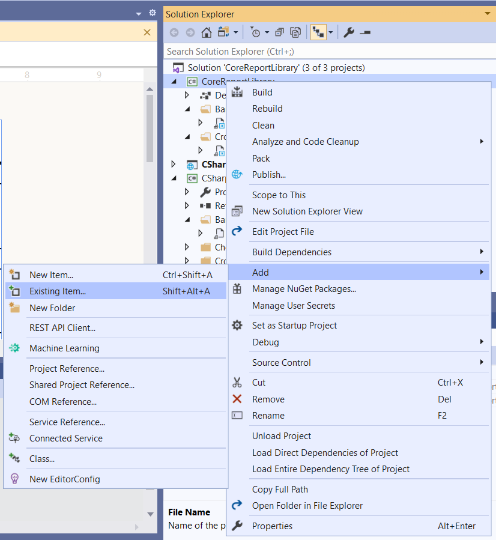
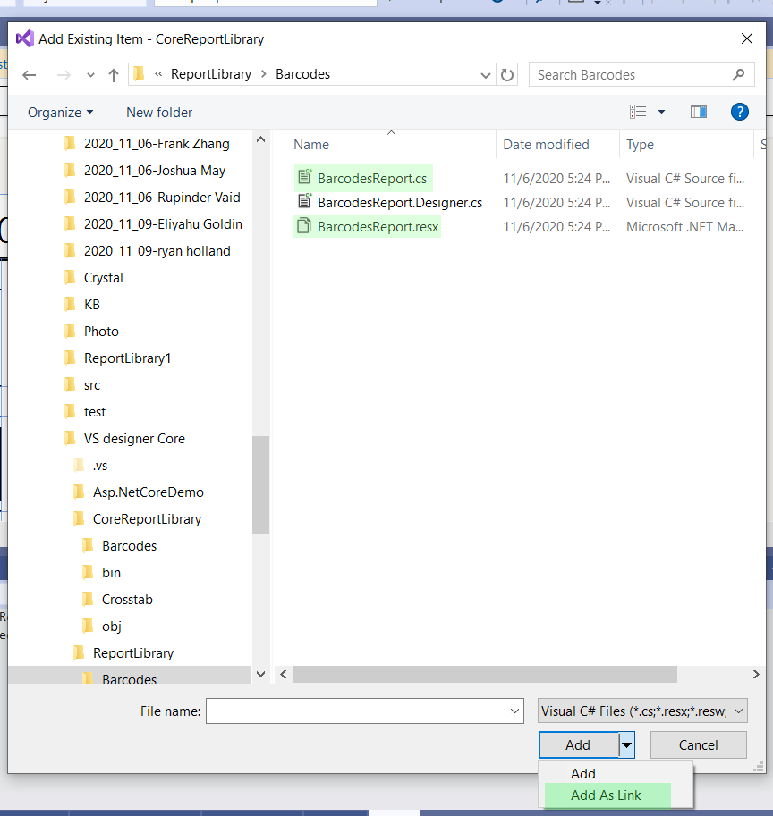

## Environment

<table>
	<tbody>
		<tr>
			<td>Product Version</td>
			<td>13.0.19.116+</td>
		</tr>
		<tr>
			<td>Product</td>
			<td>Progress® Telerik® Reporting</td>
		</tr>
		<tr>
			<td>Target Framework</td>
			<td>.NET</td>
		</tr>
	</tbody>
</table>

## Description

Currently, the .NET frameworks do not support the design time components we need for the [Visual Studio Report Designer](). Without these components we cannot provide a quality design-time experience. 

This KB article describes a workaround for using the Visual Studio Report Designer to edit C Sharp reports hosted in a .NET ClassLibrary project.

## Suggested Workaround

The CSharp code of a report definition is identical in the .NET Framework and .NET. For that reason, it is possible to link the report definition files hosted in a .NET ClassLibrary project to the corresponding files hosted in a .NET Framework ReportLibrary project. This way, all the changes made with the Visual Studio Report Designer to the report in the .NET Framework project will be automatically applied to the .NET project. 

Let's assume that we already have a ReportLibrary project in .NET Framework. Here are the necessary steps to link it to a .NET ClassLibrary project:

1. Create a new .NET ClassLibrary project. You may delete the default CS file usually named `Class1.cs`.
1. Add references to the following assemblies/NuGet packages in the project:

	* `Telerik.Reporting` - defines the needed report definition elements
	* `System.Resources.Extensions` - needed to resolve the resources from the `RESX` file

1. Add the corresponding `CS` report file from the .NET Framework project to the .NET project through the _Add_ -> _Existing Item..._ option of the project context menu.

	

	When selecting the CS file make sure to select __Add As Link__ from the _Add Existing Item_ wizard. The corresponding `DESIGNER.CS` file will be added automatically.

	

1. Add in the same way also the `RESX` file of the report definition.
1. Reference the .NET ClassLibrary project in your .NET project hosting the Telerik Reporting engine. Pass the [AssemblyQualifiedName](https://learn.microsoft.com/en-us/dotnet/api/system.type.assemblyqualifiedname) of the report class to the Reporting engine. Use [TypeReportSourceResolver](/api/Telerik.Reporting.Services.TypeReportSourceResolver) for resolving your reports in a Telerik Reporting REST Service.

A demo solution demonstrating the approach may be found in our GitHub repo - [VS Designer in .NET](https://github.com/telerik/reporting-samples/tree/master/VS%20designer%20Core)

> If you add [SubReport]() or [NavigatToReport Action]() to your CLR reports in Visual Studio Report Designer and select [TypeReportSource](/api/telerik.reporting.typereportsource) suggested by the Wizard, it will include a reference to the corresponding .NET Framework ReportLibrary Report Class. You need to make sure the AssemblyQualifiedName is identical when resolved from the .NET ClassLibrary project or correct it manually. Otherwise, you may receive an exception for `Invalid report type`.

## See Also

* [Make Visual Studio designer work with .NET](https://feedback.telerik.com/reporting/1383925-make-visual-studio-designer-work-with-net-core-a-k-a-sdk-style-projects)
