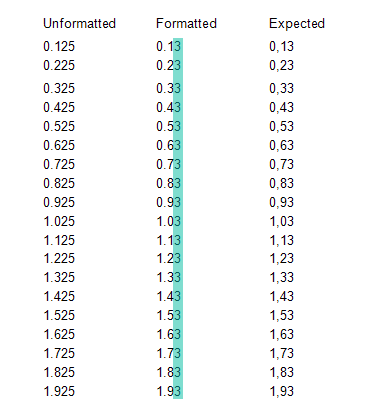
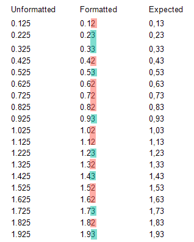

## Environment
<table>
	<tbody>
		<tr>
			<td>Product</td>
			<td>Progress® Telerik® Reporting</td>
		</tr>
		<tr>
			<td>.Net Framework</td>
			<td>.NET 6</td>
		</tr>
	</tbody>
</table>

## Description

When rendering report in .NET environment, including the [Standalone Report Designer for .NET 6](#starting-the-standalone-report-designer-for-net), the formatting and rounding of float values is not consistent with the ones in the .NET Framework, including the [Standalone Designer for .NET Framework](#starting-the-standalone-report-designer-for-net-framework-40). In the latter, the rounding and the formatting work as expected.

Here are some screenshots showing the difference when previewing the same report in the two designers:

>caption Formatting in the Standalone Designer for .NET Framework 4.0

>caption Formatting in the Standalone Designer for .NET 6

Our code utilizes the System methods for formatting that come from the corresponding framework. The reason for the problem is a breaking change introduced in .NET/.NET Core as explained in the following threads:

* [Double value to string conversion difference between netcore and netframework](https://github.com/dotnet/runtime/issues/31483)
* [Floating-Point Parsing and Formatting improvements in .NET Core 3.0](https://devblogs.microsoft.com/dotnet/floating-point-parsing-and-formatting-improvements-in-net-core-3-0/)

## Suggested Workarounds

You may create a [custom user function]() that takes as an argument the float value and returns the formatted string as desired. For example, you may use the workaround suggested in the [following comment from the above resource](https://devblogs.microsoft.com/dotnet/floating-point-parsing-and-formatting-improvements-in-net-core-3-0/#comment-1227).

## See Also

* [Floating-Point Parsing and Formatting improvements in .NET Core 3.0](https://devblogs.microsoft.com/dotnet/floating-point-parsing-and-formatting-improvements-in-net-core-3-0/)
* [Double value to string conversion difference between netcore and netframework](https://github.com/dotnet/runtime/issues/31483)
* [Custom User Function]()
