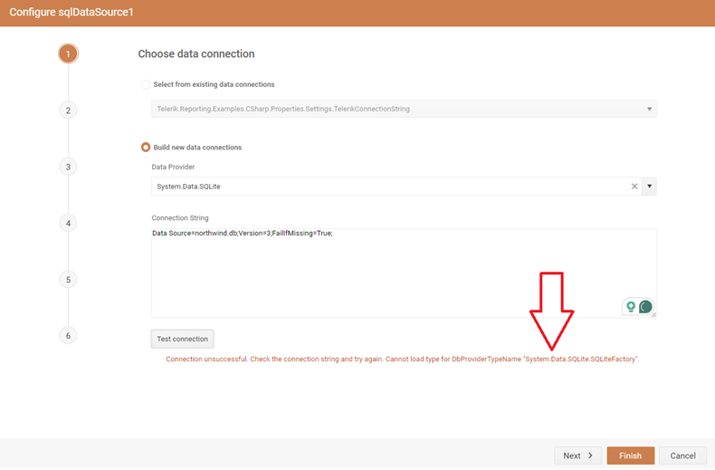
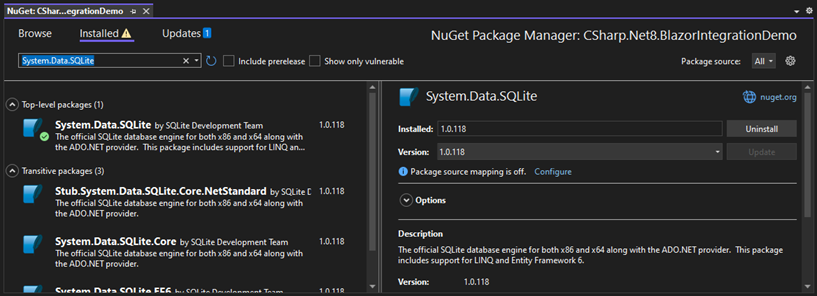
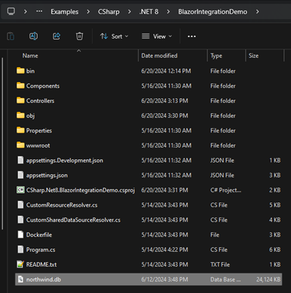
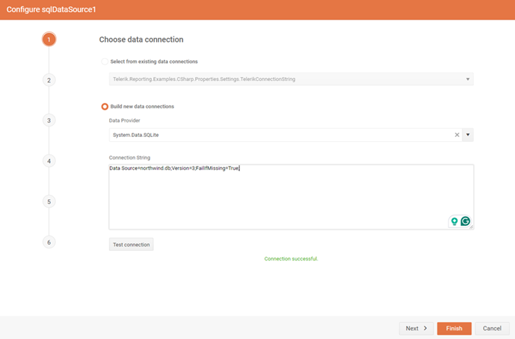

## Environment

| Version | Product | Author | 
| --- | --- | ---- | 
| 18.1.24.514| Telerik Web Report Designer |[Desislava Yordanova](https://www.telerik.com/blogs/author/desislava-yordanova)| 

## Description

When attempting to use the [Web Report Designer](https://docs.telerik.com/reporting/designing-reports/report-designer-tools/web-report-designer/overview) with an SQLite database in a Blazor project, the SQLite option is available in the SharedDataSource SQL dropdown list of providers. However, attempting to connect to a local SQLite database file results in an error: "Cannot load type for DbProviderTypeName `System.Data.SQLite.SQLiteFactory`."

   

This KB article also answers the following questions:
- How to connect the Telerik Web Report Designer to an SQLite database?
- What steps are needed to resolve the `System.Data.SQLite.SQLiteFactory` error in Telerik Reporting?
- How to set up SQLite as a data source in the Telerik Web Report Designer?

## Solution

To successfully integrate an SQLite database with the Telerik Web Report Designer in a Blazor project, follow these steps:

1. Ensure the System.Data.SQLite NuGet package is installed in your project. This package is necessary for the Telerik Reporting to interface with SQLite databases.


  

2. Place your SQLite database file (e.g., `northwind.db`) in the main folder of your project. This location makes it easier to reference the database in your connection strings.

  

3. Use a sample connection string formatted as follows to test the data connection:  
    ```
    Data Source=northwind.db;Version=3;FailIfMissing=True;
    ```
    This connection string assumes the database file is named `northwind.db` and is located in the root directory of your project.

Following these steps should allow the Web Report Designer to successfully connect to and use the SQLite database without encountering the `System.Data.SQLite.SQLiteFactory` error.

   

## Notes

- It's important to verify the version compatibility of the System.Data.SQLite package with your project's .NET version.
- Ensure the SQLite database file is accessible to the project, considering any necessary permissions or path adjustments.

## See Also

- [Introduction to Telerik Web Report Designer](https://docs.telerik.com/reporting/designing-reports/report-designer-tools/web-report-designer/overview)
- [System.Data.SQLite NuGet Package](https://www.nuget.org/packages/System.Data.SQLite/)
- [How to configure SQLite ADO.NET Provider for Stand-alone Report Designer](https://docs.telerik.com/reporting/knowledge-base/configure-the-stand-alone-report-designer-sqlite-data-provider#solution-for-the-new-net-standalone-report-designer)
