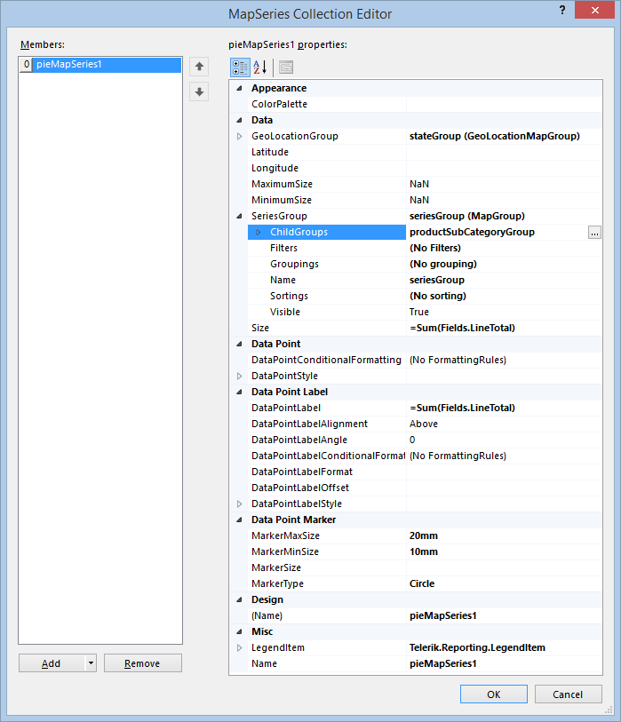

## Environment

<table>
	<tbody>
		<tr>
			<td>Product Version</td>
			<td>All</td>
		</tr>
		<tr>
			<td>Product</td>
			<td>Progress® Telerik® Reporting</td>
			<td>Map Report Item</td>
		</tr>
	</tbody>
</table>

## Description

How can I add a `LocationMapSeries` instance to the Map report item?

## Solution

The [`LocationMapSeries`](/reporting/api/Telerik.Reporting.LocationMapSeries) are used when the data points have a single coordinate pair, obtained directly from the data set or by using a [location provider](). 

To add new `PointMap`, `PieMap`, or a `ColumnMap` series to the Map: 

1. Open the __Series__ collection editor and __Add__ new [`PointMapSeries`](/reporting/api/Telerik.Reporting.PointMapSeries), [`PieMapSeries`](/reporting/api/Telerik.Reporting.PieMapSeries), or [`ColumnMapSeries`](/reporting/api/Telerik.Reporting.ColumnMapSeries) items. 
1. Set the [`GeoLocationGroup`](/reporting/api/Telerik.Reporting.LocationMapSeries#Telerik_Reporting_LocationMapSeries_GeoLocationGroup) to an existing [`GeoLocationMapGroup`](/reporting/api/Telerik.Reporting.GeoLocationMapGroup) instance or create a new one from scratch. 
1. Set the [`SeriesGroup`](/reporting/api/Telerik.Reporting.MapSeriesBase#Telerik_Reporting_MapSeriesBase_SeriesGroup) to an existing [`MapGroup`](/reporting/api/Telerik.Reporting.MapGroup) instance or create a new one from scratch. 
1. Group the data.

   + If you are creating a [`PointMapSeries`](/reporting/api/Telerik.Reporting.PointMapSeries), you can define a `SeriesGroup` by which your data will be grouped. This may come handy if you want to have a different color for every data point in your series. 
   + If you are creating a [`PieMapSeries`](/reporting/api/Telerik.Reporting.PieMapSeries) or a [`ColumnMapSeries`](/reporting/api/Telerik.Reporting.ColumnMapSeries), define an additional child group, which will be used to determine how the data will be grouped for every data point. The color and count of the pie sectors (or columns when creating a [`ColumnMapSeries`](/reporting/api/Telerik.Reporting.ColumnMapSeries)) will be determined by the last child group of defined `SeriesGroups`. Usially, you will create a single series group without grouping (which will result in a static group) and add a single child group, with [`Groupings`](/reporting/api/Telerik.Reporting.GroupBase#Telerik_Reporting_GroupBase_Groupings) set to the field by which you will group the data. 

1. Set the __Size__ to an expression that will be used to determine the pie sector or the column size. 

When all the properties are set, the `LocationMapSeries` instance will look similar to the following one in the __Property Grid__: 

