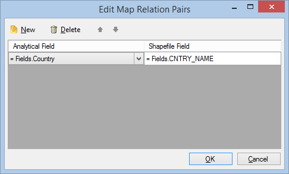
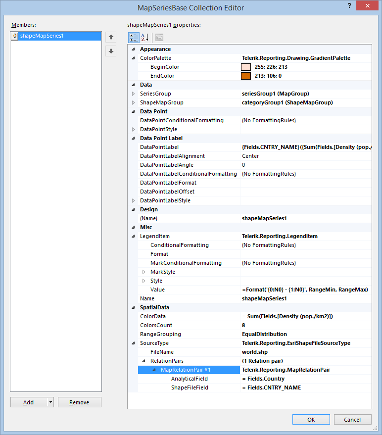

## Environment

<table>
	<tbody>
		<tr>
			<td>Product Version</td>
			<td>All</td>
		</tr>
		<tr>
			<td>Product</td>
			<td>Progress® Telerik® Reporting</td>
			<td>Map Report Item</td>
		</tr>
	</tbody>
</table>

## Description

How can I add a `ShapeMapSeries` instance to the Map report item?

## Solution

The [`ShapeMapSeries`](/reporting/api/Telerik.Reporting.ShapeMapSeries) uses its own source to obtain a set of coordinates which will determine the shape of the data points. These series do not use a `LocationProvider` or a `GeoLocationMapGroup`, because the data points are not determined by a single location on the map surface, as with the [`LocationMapSeries`](/reporting/api/Telerik.Reporting.LocationMapSeries). 

To add new `ShapeMapSeries` instance to the Map: 

1. Open the __Series__ collection editor and __Add__ a new [`ShapeMapSeries`](/reporting/api/Telerik.Reporting.ShapeMapSeries) item. 

   

1. Set the [`ShapeMapGroup`](/reporting/api/Telerik.Reporting.ShapeMapSeries#Telerik_Reporting_ShapeMapSeries_ShapeMapGroup) to an existing [`ShapeMapGroup`](/reporting/api/Telerik.Reporting.ShapeMapGroup) instance or create a new one from scratch. 
1. Set the [`SeriesGroup`](/reporting/api/Telerik.Reporting.MapSeriesBase#Telerik_Reporting_MapSeriesBase_SeriesGroup) to an existing [`MapGroup`](/reporting/api/Telerik.Reporting.MapGroup) instance or create a new one from scratch. 
1. Set an expression for the [`ColorData`](/reporting/api/Telerik.Reporting.ShapeMapSeries#Telerik_Reporting_ShapeMapSeries_ColorData) field to define the value that will be used to calculate the data point color. 
1. Set the [`RangeGrouping`](/reporting/api/Telerik.Reporting.ShapeMapSeries#Telerik_Reporting_ShapeMapSeries_RangeGrouping) property to any of the `None`, `EqualInterval`, or `EqualDistribution` available options. 

  * `None` means that no grouping will be used and every data point will be colored according to its respective color data value. 
  
    When the `RangeGrouping` property is set to `None`, the [`ColorsCount`](/reporting/api/Telerik.Reporting.ShapeMapSeries#Telerik_Reporting_ShapeMapSeries_ColorsCount) value is not respected.  
  
  * `EqualInterval` will split the interval between the minimum and maximum values by the colors count, assigning a separate color to each interval.
  * `EqualDistribution` will try to distribute the data evenly among the groups defined by the `ColorsCount` property, assigning a separate color to each group. 

1. Set the [`ColorsCount`](/reporting/api/Telerik.Reporting.ShapeMapSeries#Telerik_Reporting_ShapeMapSeries_ColorsCount) property depending on the number of groups in which you want to split the data values. When the `RangeGrouping` is set to `None`, the legend will contain only two items, showing the minimum and maximum data values. However, if the data set contains less records than the desired colors count, the legend will display items only for the available data records. 
1. Set up the `LegendItem.Value` expression by using the specific `RangeMin` and `RangeMax` references that determine the minimum and maximum values of the respective data range. 
1. Set up the [`ColorPalette`](/reporting/api/Telerik.Reporting.GraphSeriesBase#Telerik_Reporting_GraphSeriesBase_ColorPalette) property to define a range of colors that will be used when displaying the data points. [`GradientPalette`](/reporting/api/Telerik.Reporting.Drawing.GradientPalette) is recommended. 
1. Define the source for the shapes.

   + To use a Well-known text (WKT) or its binary representation (WKB) as a source for your shapes, select the __SourceType__ property and choose __WellKnownText__ from the drop-down list. In the __SpatialField__ property, write an expression or select the data set field that will provide the WKT or WKB data. __SpatialField__ is mandatory and it will be used by the processing engine to evaluate the contents of the field against the current data record and parse it as a __Well-known text__ or __Well-known binary__. 
   
   Since the `ShapeMapSeries` displays polygons as its data points, the WKT or WKB contents will be used only if they contain valid __POLYGON__ or __MULTIPOLYGON__ definitions. The parsing of the points data will be done by using __InvariantCulture__, so make sure your WKT definition uses a period [`.`] as a decimal symbol. 

     >The nested (interior) polygon rings will be displayed as polygons with no color fill. 

   + To use an __ESRI Shapefile__ as a shapes source, select the __SourceType__ property and choose __EsriShapeFile__ from the drop-down list. Set the path to the Shapefile as a value of the __FileName__ property. The processing engine will resolve absolute and relative file paths, and also will try to download synchronously the file contents if it detects a valid URL. It is not necessary to provide the `.shp` file extension. Using the __Map Relation Pairs__ dialog, set up the __RelationPairs__ property, pairing the fields from the analytical data set with fields from the spatial data set, produced by the DBF file that is contained in the Shapefile bundle. 

     

     >The engine will join the analytical data set with the spatial data set, preserving all the records from the spatial data set. In terms of SQL, if the spatial data set is `left` and the analytical data set is `right`, the processing engine will produce a [left outer join](http://en.wikipedia.org/wiki/Join_(SQL)#Left_outer_join). 

1. To make the boundaries of the data points more distinctive from each other, apply additional styling. 

When all the properties are set, the `ShapeMapSeries` instance will look similar to the following one in the __Property Grid__: 

