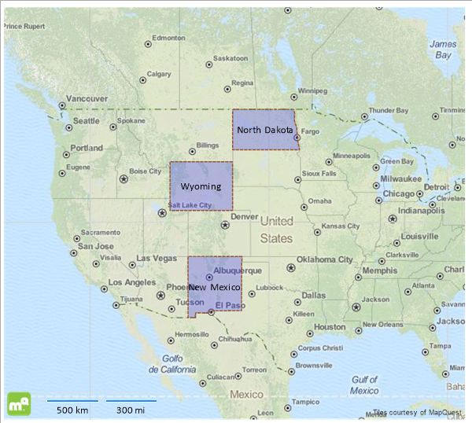

## Environment

<table>
	<tbody>
		<tr>
			<td>Product Version</td>
			<td>All</td>
		</tr>
		<tr>
			<td>Product</td>
			<td>Progress® Telerik® Reporting</td>
			<td>Map Report Item</td>
		</tr>
	</tbody>
</table>

## Description

How can I create a Map report item with custom-defined shapes?

## Solution

The Map item processes and renders polygon primitives by using the [`ShapeMapSeries`](/reporting/api/Telerik.Reporting.ShapeMapSeries) property, which accepts [Well-known text and Well-known binary](https://en.wikipedia.org/wiki/Well-known_text_representation_of_geometry), or [ESRI Shapefile](https://en.wikipedia.org/wiki/Shapefile) as a source. Since creating **ESRI Shapefiles** requires additional tools, the suggested implementation will use the WKT polygon representation. The resulting report will display three American states whose coordinates will be obtained from a CSV data source.

1. You will use the Choropleth wizard that will create the ShapeMap series instance. Start it either by selecting the **Choropleth Wizard** icon from the **Data Presentation Templates** section or from the **Insert** menu in the [Standalone Report Designer]().
1. Add a new [CSV data source]() and name it **statesData**. This data source will hold the information about the state name and their WKT-coordinates. Click **OK** to continue with the data source wizard.
1. On the **Choose a CSV Source** page, paste the following text in the **Enter CSV as text** tab:

   ```TEXT
   State;WKT
   	North Dakota;POLYGON((-104.064281 49.004828,-104.064281 45.945270,-96.557949 45.945270,-96.796902 46.641745,-96.763943 46.935113,-96.840847 47.006332,-96.879299 47.620830,-97.151211 48.176931,-97.105495 48.689066,-97.	231838 49.004828,-104.064281 49.004828))
   	Wyoming;POLYGON((-111.064309 45.005438,-111.064309 41.006683,-104.066018 41.006683,-104.066018 45.005438,-111.064309 45.005438))
   	New Mexico;POLYGON((-109.065510 37.006785,-109.051777 31.332360,-108.208414 31.333407,-108.208493 31.783783,-106.528509 31.783783,-106.645607 31.896072,-106.614021 31.921719,-106.621574 31.971244,-106.638054 31.	982311,-106.618623 32.000556,-103.064750 32.000519,-103.041428 36.500404,-103.002656 36.500529,-103.002220 36.999981,-109.065510 37.006785))
   ```

   > The WKT consists of closed polygons, that is, the last point coincides with the first one, which are enumerated in a counter-clockwise order. For more information, refer to the [OGC 10-032r8](https://portal.opengeospatial.org/files/?artifact_id=56866) specification.

   Click **Next** when ready.

1. On the **Configure the separators** page, check only the **Semicolon** option and click **Next**.
1. Skip the **Escape Format** page by clicking **Next**.
1. On the **CSV Headers** page, tick the **The CSV has headers** option. Click **Next**.
1. On the **Map columns to type** page, you will see the `State` and `WKT` columns that have the `string` type. The **Data preview** box will be displaying the formatted output of the CSV data. If everything is correct, close the wizard by clicking **Finish**.
1. The data source wizard closes and the **Choropleth Wizard** activates, displaying the `statesData` data source you just created. Click **Next**.
1. On the **Choose a spatial data source** page, select the `Well-Known-Text or Well-Known-Binary field from the data source` option and choose the `WKT` field in the combo-box. Click **Next**.
1. The **Choropleth setup** expects to configure the fields required to create a Choropleth. Since the data source doesn't include any analytical information that can be used, drag one of the two available fields in the **Color data field** box. Click **Finish**.
1. When the wizard closes, the Map item will display the three polygons that roughly represent the state borders of North Dakota, Wyoming, and New Mexico. Depending on your scenario, you can set up a [`TileProvider`](/reporting/api/Telerik.Reporting.TileProvider) and add some additional styling to the data points and the Map:

Here is how the final Map should look like:


