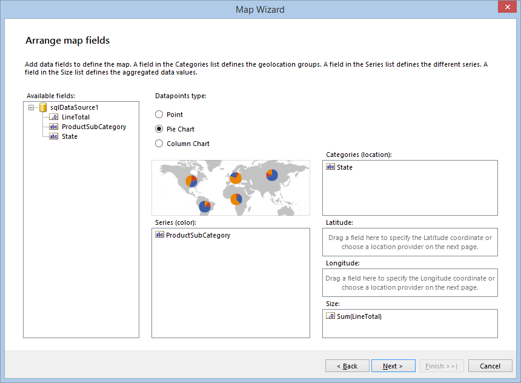

## Environment

<table>
	<tbody>
		<tr>
			<td>Product Version</td>
			<td>All</td>
		</tr>
		<tr>
			<td>Product</td>
			<td>Progress® Telerik® Reporting</td>
			<td>Map Report Item</td>
		</tr>
	</tbody>
</table>

## Description

How can I create a Map report item by using the Map Wizard?

## Solution

The suggested implementation demonstrates how to create a Map which will present the sales distribution by products among several states using the __Adventure Works__ sample database and the [Standalone Report Designer](). The steps are valid for the [Visual Studio Report Designer]() as well and can be reproduced with code too.

### Prerequisites 

* Obtain a valid Location Provider key to authenticate your geocoding requests. 
* If you don't want to use a location provider, provide the geographical coordinates of your points yourself and set up the `MapSeries` accordingly. For more information, refer to the article on [location providers]().

### 1. Start the Map Wizard 

+ (For new reports) Select the __Map Wizard__ icon from the __Available Templates__ page. 

 

+ (For existing reports) Select the __Map__ item from the __Insert__ menu. This will start the __Map Wizard__ which will guide you through the creation process. 

  

### 2. Add the Data Source

On the __Choose Data Source__ page, add a new [SqlDataSource](). 

1. Set the connection string to the demo AdventureWorks database.
1. Paste the following query in the **Select Statement** box: 

	````SQL
SELECT
	PS.Name AS ProductSubCategory,
	SP.Name + ', ' + CR.Name AS State,
	SOD.LineTotal as LineTotal
	FROM

	Production.Product AS P
	INNER JOIN Production.ProductSubcategory AS PS ON P.ProductSubcategoryID = PS.ProductSubcategoryID
	INNER JOIN Production.ProductCategory AS PC ON PS.ProductCategoryID = PC.ProductCategoryID
	INNER JOIN Sales.SalesOrderDetail AS SOD ON P.ProductID = SOD.ProductID
	INNER JOIN Sales.SalesOrderHeader AS SOH ON SOD.SalesOrderID = SOH.SalesOrderID
	INNER JOIN Person.Address AS ADDR ON ADDR.AddressID = SOH.ShipToAddressID
	INNER JOIN Person.StateProvince AS SP ON SP.StateProvinceID = ADDR.StateProvinceID
	INNER JOIN Person.CountryRegion AS CR ON CR.CountryRegionCode = SP.CountryRegionCode

	WHERE
	CR.Name IN ('Australia')
	AND DATEPART(YEAR, SOH.OrderDate) IN (2003, 2004)
	AND PC.Name = 'Bikes'
````


1. Click __Execute Query...__ to check if everything is OK with the database connection. 
1. Click __Finish__ when you are ready. 

### 3. Build the Map Charts 

1. In the **Available data sources** list you will see the data source you've already created. Select it and click __Next__. 
1. On the next page, select the fields which will be used to build the Map charts. Since the map will use a location provider, you don't have to provide the  __Latitude__ and  __Longitude__ coordinates by yourself and you can leave these boxes empty. Define a location group which will set the geocoding string. 
1. From the **Datapoints type** box, select the __Pie Chart__ radio button. 
1. Select the __ProductSubCategory__ field and drag it to the **Series (color)** box. 
1. Select the __State__ field and drag it to the **Categories (location)** box. 
1. Select the __LineTotal__ field and drag it to the **Size** box where it will be transformed to __Sum(LineTotal)__.

	Your __Arrange map fields__ page will look similar to one in the following image: 

	 

1. Once the mandatory fields are set up, the __Next__ button will get enabled. Click it to go to the next page. 

### 4. Define the Location Provider 

1. On the __Choose a location provider__ page, select the location provider that will be used to geocode the __State__ field that was dragged in the **Categories (location)** box on the previous page. Currently, the supported providers are [`MapQuestOpenAPILocationProvider`](/reporting/api/Telerik.Reporting.MapQuestOpenAPILocationProvider), [`MapQuestLocationProvider`](/reporting/api/Telerik.Reporting.MapQuestLocationProvider), and [`BingLocationProvider`](/reporting/api/Telerik.Reporting.BingLocationProvider). They both require a valid client token (key) to authenticate the geocoding requests that will be sent from the Map item. 

	Once you obtain the key, paste it in the **Client token** box: 

	

1. When you click __Finish__, the Wizard will create the definition of the Map item, show it in the designer, and start requesting the geocode and tiles information from the providers asynchronously. Initially, it will take a few seconds to fetch all the data from the geocoding service, but the following requests will be executed faster. The tiles, needed to prepare the Map background, will be displayed as they arrive, but the Map will stay responsive and you can examine and change its definition. When finished, your Map will look similar to the one in the following image: 

	
