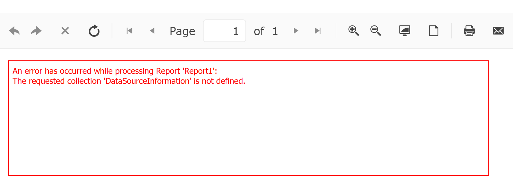

## Environment
<table>
<tbody>
<tr>
<td> Product </td>
<td> Reporting </td>
</tr>
</tbody>
</table>

## Description

Telerik Reporting can use SQLite as a DataSource for reports: [Using SQLite in Reporting](slug:telerikreporting/designing-reports/connecting-to-data/data-source-components/sqldatasource-component/using-data-providers/using-sqlite-data-provider).

Issues may arise depending on the SQLite ADO.NET provider used. For example, when using the `Microsoft.Data.Sqlite` provider, errors such as "The requested collection 'DataSourceInformation' is not defined" may occur. This issue arises because `Microsoft.Data.Sqlite` is a lightweight provider that omits the `GetSchema` metadata collections required by the Telerik Reporting SqlDataSource for parameter and command parsing.

Here is the stack trace of the server-side error:

```exception
CSharp.Net8.Html5IntegrationDemo Error: 0 : An exception has occurred while processing 'Report1' item:
System.ArgumentException: The requested collection 'DataSourceInformation' is not defined.
   at Microsoft.Data.Sqlite.SqliteConnection.GetSchema(String collectionName, String[] restrictionValues)
   at Microsoft.Data.Sqlite.SqliteConnection.GetSchema(String collectionName)
   at Telerik.Reporting.Processing.Data.SqlProviderFactory.LoadSettings(IDbConnection connection, SqlCommandParser parser)
   at Telerik.Reporting.Processing.Data.SqlProviderFactory.CreateParser(IDbConnection connection)
   at Telerik.Reporting.Processing.Data.SqlProviderFactory.CreateResolver(IDbConnection connection)
   at Telerik.Reporting.Processing.Data.SqlCommandProvider.ResolveStatement(IDbCommand command, SqlDataSourceParameterCollection parameters)
   at Telerik.Reporting.Processing.Data.SqlCommandProvider.CreateParameters(IDbCommand command, SqlDataSourceParameterCollection parameters)
   at Telerik.Reporting.Processing.Data.SqlQueryProvider.CreateCommandCore(IDbConnection connection, Boolean evaluateParameters)
   at Telerik.Reporting.Processing.Data.SqlQueryProvider.CreateCommand(IDbConnection connection, Boolean evaluateParameters)
   at Telerik.Reporting.Processing.Data.SqlQueryProvider.CreateCommand(IDbConnection connection)
   at Telerik.Reporting.Processing.Data.SqlDataEnumerable.GetEnumerator()+MoveNext()
   at Telerik.Reporting.Processing.Data.LazyList`1.LazyListEnumerator.MoveNext()
   at System.Collections.Generic.LargeArrayBuilder`1.AddRange(IEnumerable`1 items)
   at System.Collections.Generic.EnumerableHelpers.ToArray[T](IEnumerable`1 source)
   at Telerik.Reporting.Processing.Data.SeedDataAdapter.Execute(IEnumerable`1 data)
   at Telerik.Reporting.Processing.Data.ResultSetAdapter.Execute(IEnumerable`1 data)
   at Telerik.Reporting.Processing.Data.MultidimentionalDataProvider.Execute(MultidimensionalQuery query)
   at Telerik.Reporting.Processing.DataItemResolveDataAlgorithm.GetDataCore(IDataSource dataSource, MultidimensionalQuery query, IServiceProvider serviceProvider, EvalObject expressionContext, IProcessingContext processingContext)
   at Telerik.Reporting.Processing.Report.GetDataCore(IDataSource dataSource, MultidimensionalQuery query)
   at Telerik.Reporting.Processing.Report.<>c__DisplayClass125_0.<ResolveData>b__0()
   at Telerik.Reporting.Processing.DataItemResolveDataAlgorithm.ResolveData(String processingId, InMemoryState inMemoryState, MultidimensionalQuery query, Func`1 getDataCore, EvalObject expressionContext)
   at Telerik.Reporting.Processing.Report.ResolveData()
   at Telerik.Reporting.Processing.Report.ProcessItemCore()
   at Telerik.Reporting.Processing.Report.ProcessItem()
   at Telerik.Reporting.Processing.ReportItemBase.ProcessElement()
   at Telerik.Reporting.Processing.Report.ProcessElement()
   at Telerik.Reporting.Processing.ProcessingElement.Process(IDataMember dataContext)
```

To avoid this issue, a provider with full ADO.NET implementation, such as `System.Data.SQLite`, must be used.

This knowledge base article also answers the following questions:
- How to use SQLite with Telerik Reporting?
- Why does Microsoft.Data.Sqlite not work with SqlDataSource?
- What are the steps to configure SQLite for Telerik Reporting?

## Solution

To configure SQLite as a DataSource in Telerik Reporting, follow these steps:

1. Use the `System.Data.SQLite` provider as it includes the full ADO.NET implementation required for SqlDataSource.
1. Install the [`System.Data.SQLite` NuGet package](https://www.nuget.org/packages/system.data.sqlite). Version 2.0.3 or later is recommended.
1. Configure the connection string for your SQLite database. For example:
   
   ```ConnectionString
   Data Source=your-database-file.db;Version=3;
   ```
   
1. Use the connection string in the SqlDataSource component of your Telerik report.
1. If you encounter errors during runtime, enable tracing in the Reporting Engine to capture detailed logs. Refer to [Troubleshooting Reporting Implementation in ASP.NET Core Application](slug:how-to-troubleshoot-errors-in-asp-net-core-applications) for guidance.

### Additional Notes

- The `Microsoft.Data.Sqlite` provider is not recommended for use with Telerik Reporting due to its lack of support for schema metadata.
- The `System.Data.SQLite` provider is automatically registered by Telerik Reporting and does not require manual registration unless overridden.

## See Also

- [Using SQLite in Reporting](slug:telerikreporting/designing-reports/connecting-to-data/data-source-components/sqldatasource-component/using-data-providers/using-sqlite-data-provider)
- [How to Register a DbProviderFactory in a .NET Core Project](slug:how-to-register-db-provider-factory-in-net-core-project)
- [Troubleshooting Reporting Implementation in ASP.NET Core Application](slug:how-to-troubleshoot-errors-in-asp-net-core-applications)
- [System.Data.SQLite on NuGet](https://www.nuget.org/packages/system.data.sqlite)
