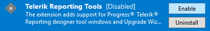

## Environment

<table>
	<tr>
		<td>Product</td>
		<td>Progress® Telerik® Reporting</td>
	</tr>
</table>

## Description

The Telerik Menu cannot be found in Visual Studio. This may be due to Telerik Visual Studio Extensions being disabled.

## Solution

1. Open Visual Studio.
2. Go to menu **Tools** - > **Extensions and Updates...** / for Visual Studio 2019 **Extensions** - > **Manage Extensions**
3. Open the Installed tab on the left
4. Search for Telerik Reporting Tools and make sure they are Enabled



If the above does not help solving your problem, please follow these steps to generate Visual Studio **ActivityLog** file before contacting our support:

1. Open **Developer Command prompt** for Visual Studio 20xx under **Administrative rights**.
2. Execute the following command that will start Visual Studio and create logs on your Desktop:

   ```powershell
   devenv /log %userprofile%\desktop\ActivityLog.xml
   ```

3. Reproduce the problem
4. Attach the **Activitylog** files to the support ticket.
