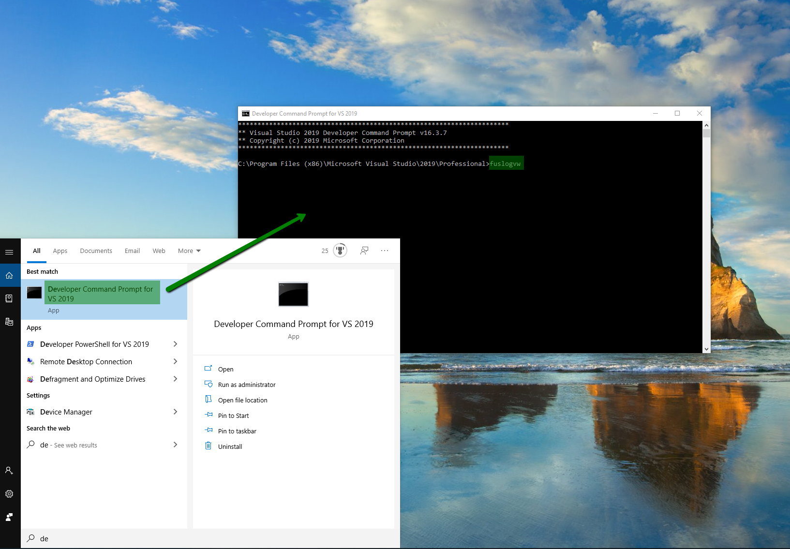
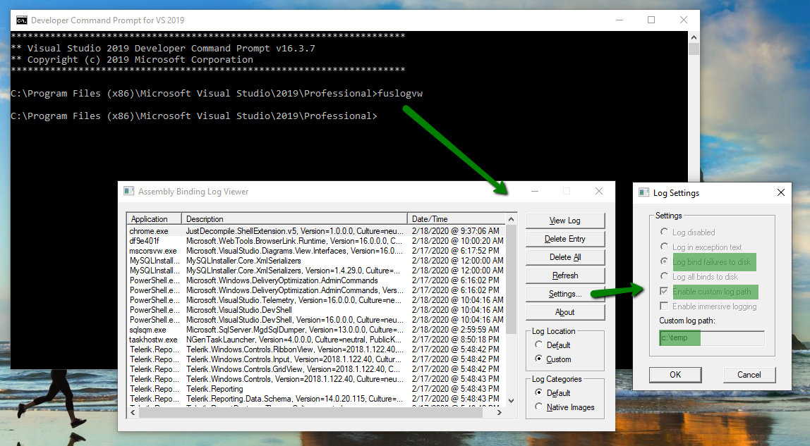
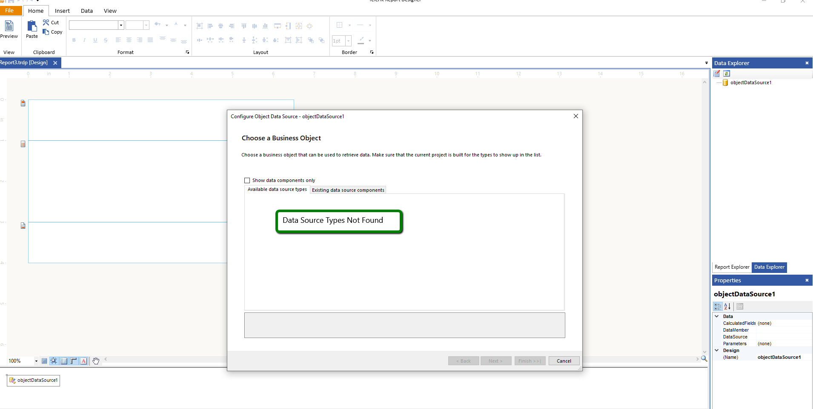
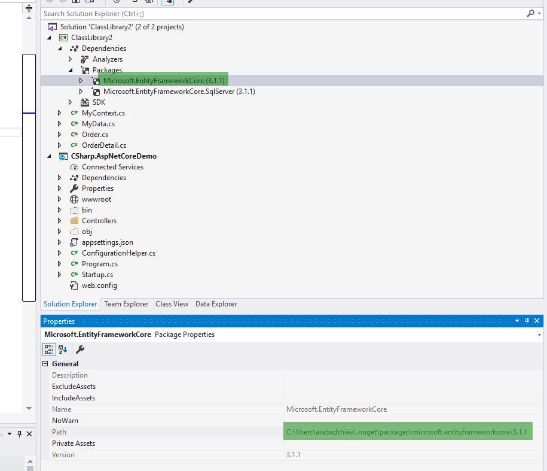
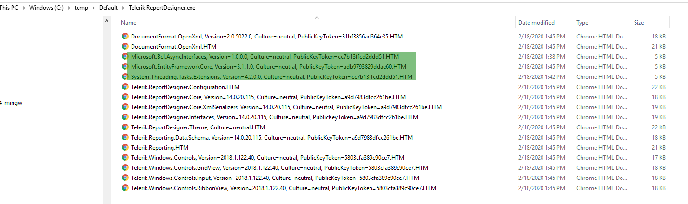

## Environment

<table>
	<tbody>
		<tr>
			<td>Product</td>
			<td>Progress® Telerik® Reporting</td>
		</tr>
		<tr>
			<td>Target Framework</td>
			<td>.NET Framework</td>
		</tr>
	</tbody>
</table>

> The article is related to the Standalone Report Designer for the .NET Framework.
> For the Standalone Designer targeting the .NET 6 consider [Loading .NET 7 assemblies in the Standalone Report Designer for .NET]()

## Description

The [Standalone Report Designer]() for the .NET Framework may not recognize the main ObjectDataSource assembly even though the assembly is properly added to the designer folder and registered in its configuration file when this assembly depends on other assemblies.

## Cause\Possible Cause(s)

The reason is that the Standalone Report Designer cannot find the external assemblies when trying to get the data source schema.

## Solution

You may use [Fuslogvw](https://learn.microsoft.com/en-us/dotnet/framework/tools/fuslogvw-exe-assembly-binding-log-viewer) to investigate the issue. The idea is to see which dependencies the designer tries to load and eventually which ones cannot be found.

Here we demonstrate the approach step-by-step with an [ObjectDataSource]() that utilizes EntityFrameworkCore version 3.1.1.

1. Start [Fuslogvw](https://techcommunity.microsoft.com/t5/iis-support-blog/fusion-log-viewer-fuslogvw-exe/ba-p/784396) in [Developer Command Prompt for Visual Studio](https://learn.microsoft.com/en-us/visualstudio/ide/reference/command-prompt-powershell?view=vs-2022):

	

1. Setup Fuslogvw to record the failures in a custom folder, for example, `c:\temp`:

	

1. Add the assembly (e.g. `ClassLibrary2`) with the DataSource/DataMember of the ObjectDataSource in the Standalone Report Designer folder and register it in the designer configuration file - [Extending Report Designer]()
1. Open the Standalone Report Designer and start the [ObjectDataSource Wizard]() to configure it. If `ClassLibrary2` is not discovered by the wizard, as shown below:

	

	the Fuslogvw should have logged a failure in the `{specified folder}\Default\Telerik.ReportDesigner.exe`, in our case `C:\temp\Default\Telerik.ReportDesigner.exe`. The particular log file is `Microsoft.EntityFrameworkCore, Version=3.1.1.0, Culture=neutral, PublicKeyToken=adb9793829ddae60.HTM` and indicates that this assembly was not found.

1. Add the above assembly to the designer folder. You may check where to find the assembly in the assembly properties in the Visual Studio:

	

	or in the folder where NuGet packages for the user are generally stored - `C:\Users\{username}\.nuget\packages\{packagename}\{version}\lib\{framework}`, for example, `C:\Users\arabadzhiev\.nuget\packages\microsoft.entityframeworkcore\3.1.1\lib\netstandard2.0`.

	Some packages can be used globally on the machine and are stored in `C:\Program Files\dotnet\sdk\NuGetFallbackFolder\{packagename}\{version}\lib\{framework}`, for example `C:\Program Files\dotnet\sdk\NuGetFallbackFolder\microsoft.entityframeworkcore\3.1.1\lib\netstandard2.0`.

1. Close the designer and repeat steps 4-6 until the assembly is discovered by the designer.

Note that there may be other failures to discover assemblies logged by Fuslogvw. Those assemblies are used internally by the designer - you don't need to add them.

The [FuslogvwLogs.zip](resources/fuslogvwlogs.zip) file contains the ObjectDataSource-relevant logs for the example.

A screenshot of the entire log folder can be seen below:

## See Also

* [ObjectDataSource]()
* [Fuslogvw](https://learn.microsoft.com/en-us/dotnet/framework/tools/fuslogvw-exe-assembly-binding-log-viewer)
* [Loading .NET 7 assemblies in the Standalone Report Designer for .NET]()
