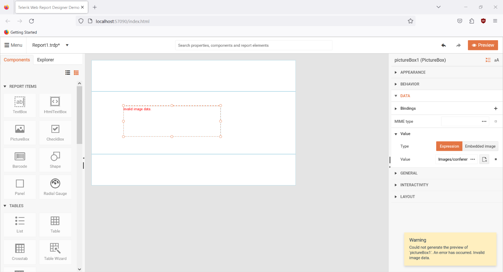

## Environment
<table>
	<tbody>
		<tr>
			<td>Product</td>
			<td>Progress® Telerik® Reporting</td>
		</tr>
		<tr>
			<td>Report Item</td>
			<td>PictureBox</td>
		</tr>
	</tbody>
</table>

## Description

I have embedded an image within the [PictureBox]() report item, however, in place of the image there is an error message about the parameter not being valid.

## Steps to Reproduce

Try to embed an image whose type is not supported by the [PictureBox]() report item, for example, a [`.webp`](https://en.wikipedia.org/wiki/WebP) image.

## Error Message

`
An exception has occurred while processing 'pictureBox1' item:
System.InvalidOperationException: Invalid image data.
---> System.ArgumentException: Parameter is not valid.
	at System.Drawing.Image.FromStream(Stream stream, Boolean useEmbeddedColorManagement, Boolean validateImageData)
	at System.Drawing.Image.FromStream(Stream stream)
	at Telerik.Reporting.Processing.Imaging.ImageUtils.LoadImage(Stream stream)
	at Telerik.Reporting.Processing.Imaging.ImageUtils.CreateImageFromBytes(Byte[] data)
	at Telerik.Reporting.Processing.Imaging.ByteImageItem.CreateImageCore(CreateImageContext context)
	at Telerik.Reporting.Processing.Imaging.ImageItemBase.CreateImage(CreateImageContext context)
	--- End of inner exception stack trace ---
	at Telerik.Reporting.Processing.Imaging.ImageItemBase.CreateImage(CreateImageContext context)
	at Telerik.Reporting.Processing.Imaging.ImageItemBase.CreateImageInfo()74
	at Telerik.Reporting.Processing.Imaging.IImageInfoMapExtensions.StoreImageData(IImageInfoMap imageInfoMap, IImageItem imageItem, ICache cache)
	at Telerik.Reporting.Processing.PictureBox.ResolveImage(Object value)4
	at Telerik.Reporting.Processing.PictureBox.ProcessItem()102
	at Telerik.Reporting.Processing.ReportItemBase.ProcessElement()
	at Telerik.Reporting.Processing.ProcessingElement.Process(IDataMember dataContext)`

## Cause

Telerik Reporting utilizes the [GDI+](https://learn.microsoft.com/en-us/windows/win32/gdiplus/-gdiplus-gdi-start) graphics library which does not support the `.webp` image format, thus the exception - [Using Image Encoders and Decoders in Managed GDI+](https://learn.microsoft.com/en-us/dotnet/desktop/winforms/advanced/using-image-encoders-and-decoders-in-managed-gdi?view=netframeworkdesktop-4.8).

## Suggested Workarounds

The images will have to be converted to one of the supported formats before using them or a [custom User Function]() that will handle the conversion of the `.webp` images to the supported formats at runtime can be implemented.

## See Also

* [PictureBox]()
* [Using Image Encoders and Decoders in Managed GDI+](https://learn.microsoft.com/en-us/dotnet/desktop/winforms/advanced/using-image-encoders-and-decoders-in-managed-gdi?view=netframeworkdesktop-4.8)
* [User Functions]().
