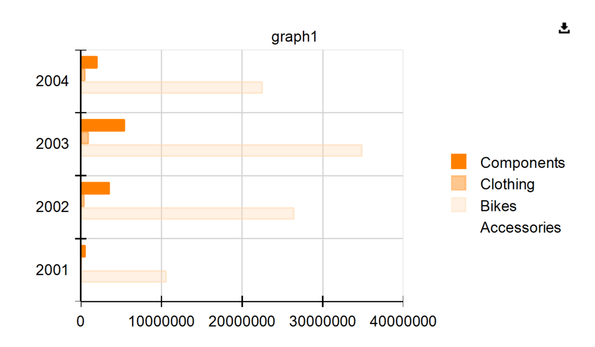
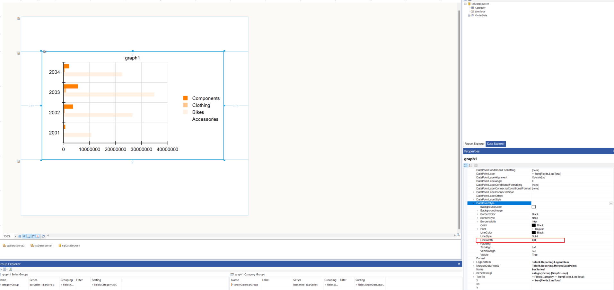

## Environment

<table>
  <tbody>
    <tr>
      <td>Product</td>
      <td>Reporting</td>
    </tr>
    <tr>
      <td>Version</td>
      <td>18.3.24.1112</td>
    </tr>
  </tbody>
</table>

## Description

I want to remove the darker, solid border around bars in a graph with a bar series. The border is more visible in the HTML viewer and overlaps the grid lines. The bars use a semi-transparent yellow color palette which allows grid lines to show through. The goal is to eliminate the darker border while maintaining the semi-transparent fill effect.

## Solution

To remove the darker border around the bars:

1. Select the graph in the Telerik Reporting designer.
1. Expand the 'Series' property.
1. Locate and expand the 'DataPointStyle' property.
1. Set the 'LineWidth' property to `0pt`.

This removes the darker border around the bars, ensuring they appear without overlapping grid lines.

## See Also

* [Bar Chart]()
* [Getting Started with the Graph Report Item]()
* [Series of the Graph]()
