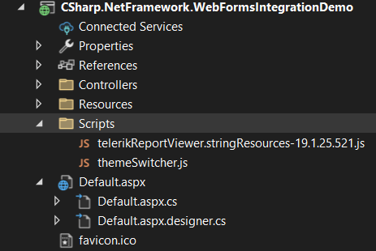

## Environment

<table>
    <tbody>
        <tr>
            <td> Product </td>
            <td> Progress® Telerik® Reporting </td>
        </tr>
        <tr>
            <td> Viewer </td>
            <td> HTML5-based Report Viewers </td>
        </tr>
    </tbody>
</table>

## Description

I want to rename the **Preview** button in the HTML5 Report Viewer or one of its wrappers to match my custom requirements. Additionally, I want to reposition the **Preview** button to the top of the parameters area instead of its default position at the bottom.

## Solution

### Renaming the Preview Button

1. Locate the `telerikReportViewer.stringResources-{{site.buildversion}}.js` file in the installation folder - `C:\Program Files (x86)\Progress\Telerik Reporting {{site.suiteversion}}\Html5\ReportViewer\js`.
1. Open the file and replace the `parametersAreaPreviewButton: "Preview"` value with your desired button name.
1. Copy the updated `telerikReportViewer.stringResources-{{site.buildversion}}.js`  file to your project's `Scripts` folder(*or any folder that you provide local files from such as __wwwroot__*).

    

1. Reference the updated script file on the page with the HTML5-based Report Viewer before the `telerikReportViewer` script. For example:
   
    ````HTML
<script src="/Scripts/telerikReportViewer.stringResources-19.1.25.521.js"></script>
<script src="/api/reports/resources/js/telerikReportViewer"></script>
````


1. Compile and run your project to verify the updated button name.

### Moving the Preview Button to the Top

Use the followig CSS to move the **Preview** button to the top of the parameters area:

````CSS
        .trv-parameters-area.preview .trv-parameters-area-footer {
            top: 0;
        }

        .trv-report-viewer .trv-parameters-area.preview .trv-parameters-area-content {
            top: 3em;
            bottom: 0;
        }
````


## See Also

* [Localization of the HTML5 Report Viewers]()
* [Move Preview Button at the Top of Parameters Area]()
