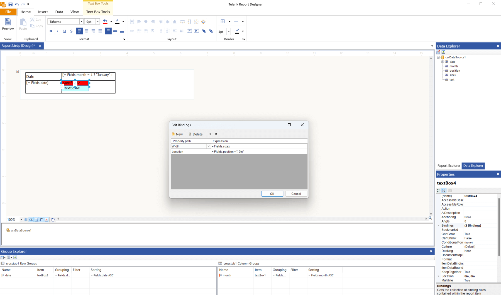

## Environment

<table>
    <tbody>
        <tr>
            <td> Product </td>
            <td> Reporting </td>
        </tr>
    </tbody>
</table>

## Description

I need to display overlapping date ranges inside a [Crosstab/Table/List]() report item. Each row represents a unit, and each monthly cell should visually depict three date ranges with distinct background colors. 

The ranges overlap, and their rendering should follow a layered approach, with the outermost range appearing behind the inner ones. I need guidance on calculating pixel positions dynamically and rendering layered backgrounds within each cell.

## Solution

To achieve layered background rendering for overlapping date ranges:

1. Use a [Crosstab]() item to represent the data in a tabular format.
1. Place a [Panel]() inside the crosstab cells where you need to display the date ranges. The panel will occupy the entire cell and act as a *container* for other elements, such as **TextBox** items. This approach allows you to configure the textboxes as needed, since a single textbox alone would otherwise fill the entire cell.
1. Add multiple [TextBox]() items inside the panel to represent the date ranges. Each TextBox should correspond to a single date range color.
1. Bind the [Location](/api/telerik.reporting.reportitem#Telerik_Reporting_ReportItem_Location) and [Width](/api/telerik.reporting.reportitem#Telerik_Reporting_ReportItem_Width) of each TextBox dynamically using [Bindings](). This ensures the rectangles are rendered proportionally based on the date range extracted from the data.

### Example

Below is an example dataset and binding configuration:

**Sample Data:**

```csv
text,date,month,sizex,position
1,01/01/2025,1,0.5in,1.5in
1,01/01/2025,2,0.3in,0in
```

>note Ensure that the data includes the X and Y positions, and the sizes of the range bars. These values determine the length of the colored textbox that is being used to represent the range bar.



## Sample Report

Download the [rendering-layered-date-range-backgrounds.trdp](https://github.com/telerik/reporting-samples/blob/master/Sample%20Reports/RenderingLayeredDateRangeBackgrounds/rendering-layered-date-range-backgrounds.trdp) report definition.

## See Also

* [Telerik Reporting Crosstab Overview]()
* [Telerik Reporting Panel Overview]()
* [Telerik Reporting TextBox Overview]()
* [Using Expressions in Telerik Reporting]()
* [How to Display Reports with Alternating Style Rows]()
