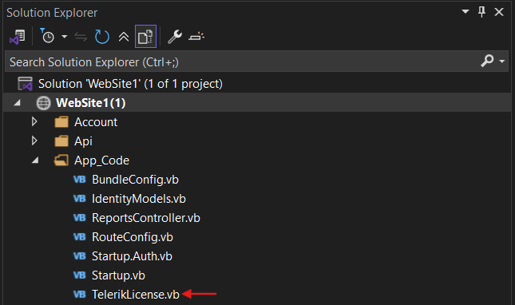

## Environment

<table>
  <tbody>
    <tr>
      <td> Product </td>
      <td>
        Licensing/Reporting
      </td>
    </tr>
    <tr>
      <td> Version </td>
      <td> 
        19.3.25.1111
      </td>
    </tr>
  </tbody>
</table>

## Description

I have an older ASP.NET Website project that uses Telerik Reporting to generate reports. Despite following all licensing documentation downloading the license key, using NuGet packages, and VB script files—the reports display an invalid license watermark. Other Telerik controls, such as grids, work without issues. Re-running the Reporting Upgrade Wizard completes without errors, and all files in the bin directory are updated to the latest versions.

## Solution

To resolve the invalid license watermark issue:

1. Ensure the Telerik Reporting license is correctly embedded in the backend/server project during build time. Refer to the [Adding a License Key to Projects without NuGet References]() section.

1. Add a `TelerikLicense.vb`/`TelerikLicense.cs` file to your project. For Website projects, place the `TelerikLicense.vb`/`TelerikLicense.cs` file in the `App_Code` folder.

> The image shows where the TelerikLicense file (TelerikLicense.vb or TelerikLicense.cs) is located in the Website project

1. Use the `EvidenceAttribute` for each Telerik product requiring licensing. Add the Reporting script key downloaded from your [Telerik account's License Keys page](https://www.telerik.com/account/your-licenses/license-keys).

1. Verify that the script key includes all purchased Telerik licenses. This solution relies on using the script key instead of the license key. Use the Telerik.Licensing NuGet package and provide the script key either through an environmental variable or the `telerik-license.txt` file.

1. Rebuild the project and test generating a report to confirm the license watermark is removed.

## See Also

* [Fixing License Errors in Telerik Reporting Runtime]()
* [Adding a License Key to Projects without NuGet References]()
* [Telerik Reporting Overview]()
