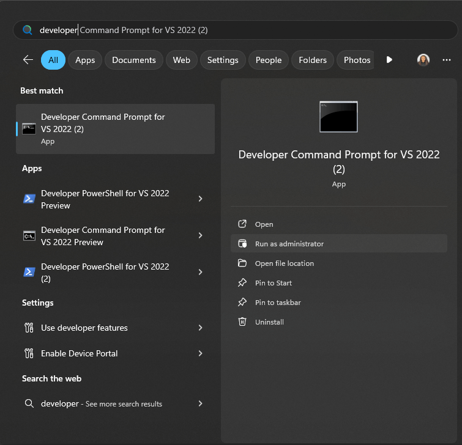

## Environment

<table>
    <tbody>
        <tr>
            <td>Product</td>
            <td>Progress® Telerik® Reporting</td>
        </tr>
    </tbody>
</table>

## Description

I encounter the `Could not load file or assembly Microsoft.mshtml` error when working with Telerik Report Designer. This happens consistently while updating or designing reports, particularly when adding a subreport and using an [HTMLTextBox]() for a different SQL query. The error forces the system to shut down, requiring a restart.

## Solution

To resolve the "Could not load file or assembly Microsoft.mshtml" error, follow these steps:

### Step 1: Copy the Assembly to the Designer Folder

1. Locate the `microsoft.mshtml.dll` assembly file on your system.
1. Copy the file to the Telerik Report Designer folder.

    

1. Open the report file (for example, `SampleReport.trdp`) and select the HTMLTextBox to check if the error is resolved.

### Step 2: Add Assembly Reference to the Configuration Files

1. Open the `Telerik.ReportDesigner.exe.config` or `Telerik.ReportDesigner.x86.exe.config` file.
1. Add the following assembly reference. Ensure the `<Telerik.Reporting>` section is properly registered:

	````XML
<configuration>
		<configSections>
			<section name="Telerik.Reporting" type="Telerik.Reporting.Configuration.ReportingConfigurationSection, Telerik.Reporting"
					allowLocation="true" allowDefinition="Everywhere"/>
		</configSections>
		// ...
		<Telerik.Reporting>
			<AssemblyReferences>
				<add name="Microsoft.mshtml" version="7.0.3300.0" />
			</AssemblyReferences>
		</Telerik.Reporting>
		// ...
````


1. Save the changes and relaunch Telerik Report Designer.

### Step 3: Install Microsoft.mshtml in the Global Assembly Cache (GAC)

1. Open the Developer Command Prompt for Visual Studio.

	

1. Run the command `gacutil /l microsoft.mshtml` to check if the assembly exists in the GAC. It should display `Number of items = 0` if missing.
1. Navigate to the directory containing the `microsoft.mshtml.dll` file.
1. Execute the following command to install the assembly: `gacutil /i microsoft.mshtml.dll`.
1. Verify installation with `gacutil /l microsoft.mshtml`.

## See Also

*[Global Assembly Cache (GAC)](https://learn.microsoft.com/en-us/dotnet/framework/app-domains/gac)
*[Install an assembly into the global assembly cache](https://learn.microsoft.com/en-us/dotnet/framework/app-domains/install-assembly-into-gac)
