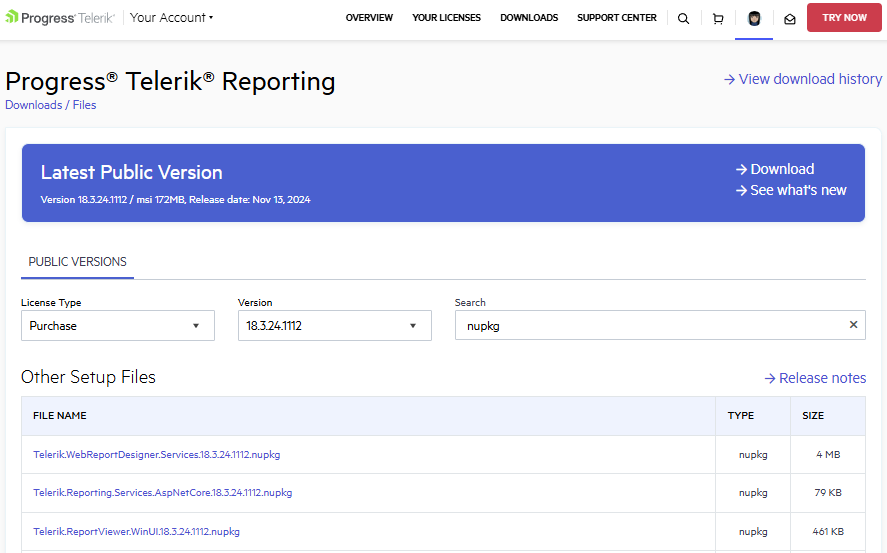
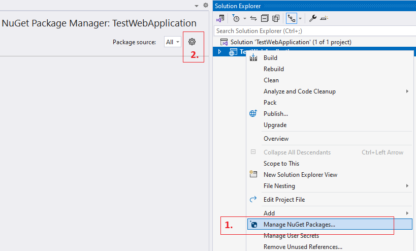
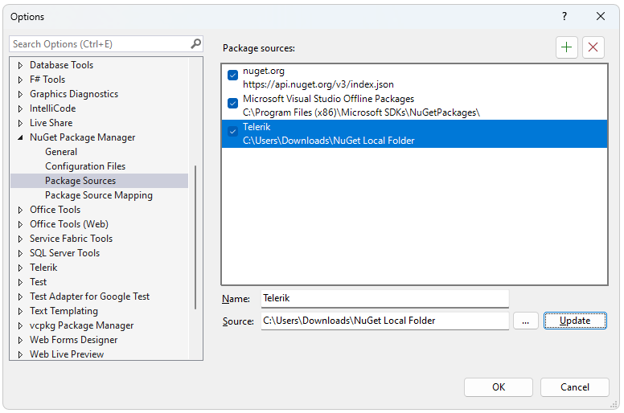
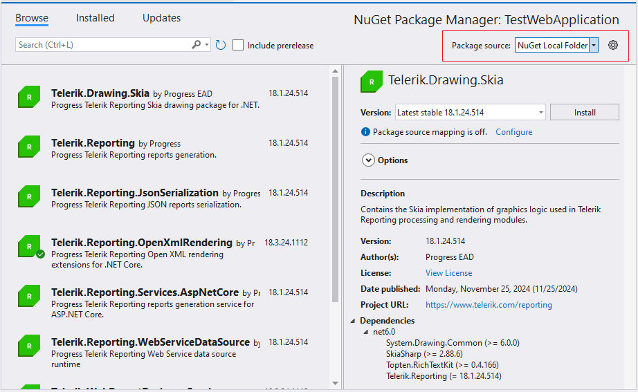

## Environment

| Version | Product | Author |  

| --- | --- | ---- |  

|N/A| Telerik Reporting|[Desislava Yordanova](https://www.telerik.com/blogs/author/desislava-yordanova)| 

## Description

In some environments, particularly corporate settings, direct access to **nuget.org** or the **Telerik NuGet Feed** may be restricted, hindering the addition of necessary NuGet packages required by Telerik Reporting. 
This knowledge base article shows how to add an external NuGet package to a Telerik Reporting project in a restricted environment. It also shows the process for including dependencies from local NuGet sources.

## Solution

In order to setup a Local NuGet package feed, follow these steps:

1. First, you need to log in using your [Telerik licensed account](https://www.telerik.com/account/) and navigate to the Downloads section of the Telerik Reporting product. This way you will be able to download the packages: 
 
        

1. Prepare a Local Folder for NuGet Packages: Create a local folder to store the downloaded `.nupkg` files along with any other dependencies you need. This folder will act as your local NuGet repository.

1. Configure NuGet Package Sources: Add your local folder as a NuGet package source. This allows your project to use the local repository for package restoration and installation.

   - Open your NuGet package manager settings.
   - Click on the **Options** button to manage package sources.
         
   - Add a new package source by pointing the Source to your local folder containing the `.nupkg` files.
         

1. Install the Packages: Now, you can select and install the desired packages from your local folder through the NuGet package manager.

     

Alternatively, you can update the `NuGet.Config` file ensuring that the file includes the local folder as a package source. Here is an example configuration:

    ```xml
    <packageSources>
      <add key="nuget.org" value="https://api.nuget.org/v3/index.json" />
      <add key="_TELERIK" value="https://nuget.telerik.com/v3/index.json" />
      <add key="NuGet Local Folder" value="/var/myofflinepackages/" />
    </packageSources>
    ```
Remember to place all necessary dependencies in your local NuGet folder, avoiding the local NuGet cache to prevent accidental deletion.

## See Also
- [Restoring NuGet Packages in Your CI Workflow]()
- [Adding the Private Telerik NuGet Feed]()
