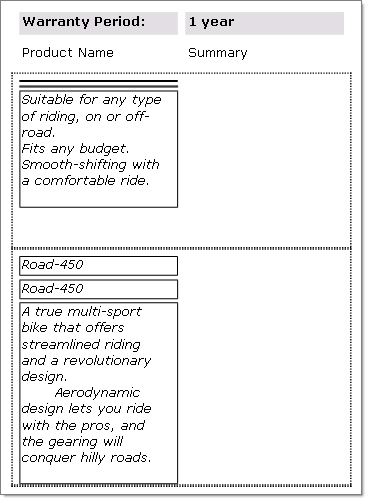

## Environment

<table>
	<tr>
		<td>Product</td>
		<td>Progress® Telerik® Reporting </td>
	</tr>
</table>

## Description

I have three textboxes (a textbox on each "row" below each other) and have been testing the `CanShrink` property. Let's say the first textbox is empty but the other two are not, is it possible that the other two textboxes 'move up', the second textbox takes the first textbox place etc?

## Solution

Yes, the following shows how `CanShrink` and `CanGrow` properties change the layout of a report.

The figure below shows TextBox items for `Name` and `Summary` fields, the detail section is surrounded by a dotted line. The Name and Summary TextBox items are surrounded by a solid line. This topic will show the report layout when setting and unsetting the `CanShrink` and `CanGrow` properties.


* `CanShrink` and `CanGrow` properties for both Name and Summary are set to `false`. Both TextBox items stay at the same dimensions as designed even though the Name TextBox has less data than needed and Summary may have more text than needed to fill the area.

	**CanShrink and CanGrow set to false**

	

* The `CanShrink` property for the Name TextBox is set to `true` and the `CanGrow` property for the Summary TextBox is set to `true`. Here you can see that the Name and Summary TextBoxes are sized to fit the data exactly.

	**CanGrow and CanShrink set true**

	

* In this last example the TextBoxes are arranged vertically into a single column, with the Name TextBox appearing twice. The layout is roughly:

	````
	Name
		Name
		Summary
	````

	The data for the first row Name field is blanked out. The output with `CanShrink = true` for Name and `CanGrow = true` for Summary shows the Name property TextBox has shrunk and the Summary information takes its place:

	**CanShrink and CanGrow true with fields arranged vertically**

	
