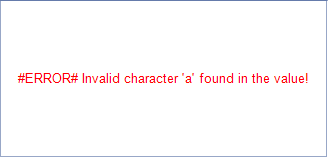

## Environment

<table>
	<tr>
		<td>Product</td>
		<td>Progress® Telerik® Reporting</td>
	</tr>
	<tr>
		<td>Report Items</td>
		<td>Barcode</td>
	</tr>
</table>

## Description

Some of the barcode types (symbologies) restrict the characters which can be used in the encoded data.

## Cause 

If during the encoding an invalid character for the symbology is encountered, instead of the actual barcode, an error message will be shown. 

## Solution 

Make sure that you provide a value that conforms with the symbology character set. 

