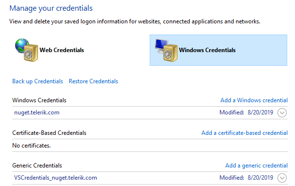

# Troubleshooting Issues with Telerik NuGet Packages

This article provides solutions to common issues that you may observe when working with the Telerik NuGet server and the NuGet packages that it provides.

## Networking Problems

One common problem is that your machine (PC or DevOps agent) is behind a proxy. To check if you're experiencing a networking issue, open the following URL in your web browser:

https://nuget.telerik.com/v3/search?q=reporting

After you enter your telerik.com `username` and `password`, you should see a JSON search result containing a list of all the __Telerik Reporting__ packages available with your license.

## Issue: The NuGet Package Takes Too Long to Install or Update on Visual Studio

The NuGet package takes too long to install or update on Visual Studio. How to improve the installation and update times?

### Solution

You can disconnect the project from the source control before running the **Update Wizard**.

## Issue: Telerik NuGet Returns 401 Logon Failed after Password Change

After changing your Telerik password, you get `[Telerik Nuget] The V2 feed at '...' returned an unexpected status code '401 Logon failed.'` error in the NuGet Package Manager.

### Solution

After changing your Telerik password, you must reset your credentials in the `NuGet.config` file. To do this, run the `NuGet Sources Update -Name "telerik.com" -Source "https://nuget.telerik.com/v3/index.json" -UserName "your login email" -Password "your new password"` command.

The password must contain only ASCII characters.

As an alternative, you can [reset your Telerik NuGet Feed credentials from the Windows Credentials Manager](#solution-2-windows-credentials-manager)

## Issue: Unable to load the service index for source https://nuget.telerik.com/v3/index.json

The error may occur if the `nuget.telerik.com server` is down.

Test for [Networking Problems](#networking-problems).

If you hit that error, make sure that the Telerik NuGet Feed is live at [https://status.telerik.com/](https://status.telerik.com/).

## Issue: Resetting Telerik Nuget Credentials

On Windows, if you enter and save wrong credentials for the Telerik NuGet or if you change your Telerik credentials, you won't have access to the desired NuGet packages. Before you can enter the correct user name and password, you must clear the saved credentials.

### Solution 1: Resetting The Credentials in NuGet.config

Try resetting your credentials by using the approach suggested in the [Telerik NuGet returns 401 Logon failed after password change](#issue-telerik-nuget-returns-401-logon-failed-after-password-change). If the credentials are not updated, continue with [Solution 2 below](#solution-2-windows-credentials-manager).

### Solution 2: Windows Credentials Manager

Alternatively, use Windows Credentials Manager to remove the saved credentials:

1. In Visual Studio navigate to **Tools** > **NuGet Package Manager** > **Package Manager Settings**. Select **NuGet Package Manager**, click **Package Sources**, and remove the listed Telerik NuGet package source.
1. Close all open Visual Studio instances (this is so that all NuGet package manager tasks are stopped).
1. Open the Windows Credentials Manager. To access it, navigate to **Control Panel** > **User Accounts** > **Credential Manager**.
1. Click **Windows Credentials**.
1. Scroll through all the entries until you find any that are for `nuget.telerik.com` and remove them. Usually, these should be the following:

	* `nuget.telerik.com`
	* `VSCredentials_nuget.telerik.com`

	

1. [Add the Telerik NuGet Feed]() again, and then enter the correct credentials. For more details, see the [Installing with Nuget](#installing-with-nuget) article section.
1. If desired, verify the NuGet credentials by inspecting the `NuGet.config` file located in `%AppData%\NuGet\NuGet.config`.
1. Reopen Visual Studio and access the Telerik NuGet server.

## See Also

* [Adding the Telerik Private NuGet Feed to VS]()
* [Restoring NuGet Packages in Your CI Workflow]()
* [Installing with NuGet](#installing-with-nuget)
