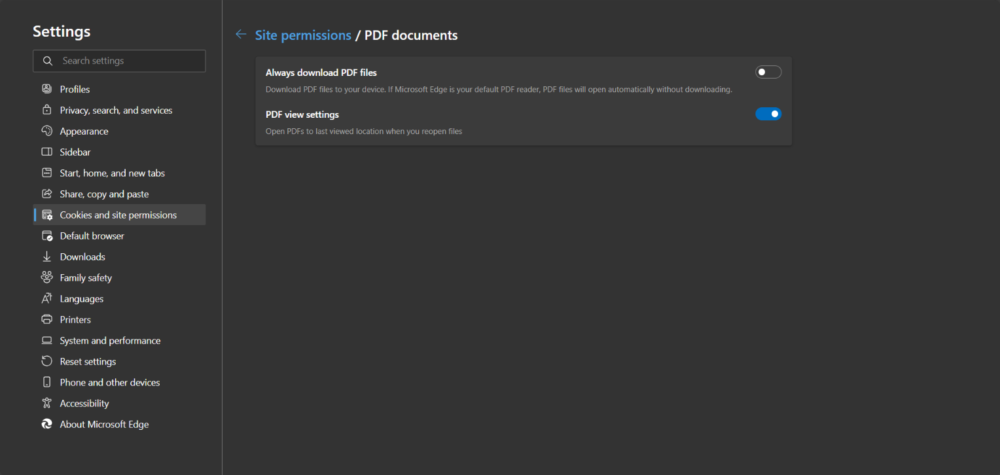

## Environment

| Product                    | Report Viewer        |
| -------------------------- | -------------------- |
| Progress Telerik Reporting | HTML5 Report Viewers |

## Description

When I try to print a report using any of the [HTML5-based Report Viewers](), the print dialog does not open and instead, errors are displayed in the browser console.

## Error Message

`TypeError: Cannot read properties of null (reading 'execCommand')`

## Solution

### For a Browser

- For the Edge browser, navigate to `edge://settings/content/pdfDocuments`
- For the Google Chrome browser, navigate to `chrome://settings/content/pdfDocuments`

Then, disable the `Download PDFs` setting so that the PDF documents are not automatically downloaded. This is required since the printing functionality of the web viewers is based on rendering the report in PDF format with special settings so when the PDF file opens in a browser, the PDF plug-in's `Print dialog` is directly invoked.



### By Creating an Endpoint

Use the [printBegin(e, args)]() event to manually handle scenarios where the user has configured their PDF document settings to Download PDFs.

There is no direct JavaScript API to check this setting. However, the [navigator.pdfViewerEnabled](https://developer.mozilla.org/en-US/docs/Web/API/Navigator/pdfViewerEnabled) property toggles between true and false when the setting changes. To handle scenarios where the PDF viewer is disabled, you can create a custom endpoint for rendering reports as PDFs, following the approach described in the [Exporting a report to PDF Programmatically]() article in Telerik Reporting. This endpoint is invoked manually whenever the PDF viewer is disabled.

````C#

public class ExportReportRequest
    {
        public string ReportName { get; set; }
        public Dictionary<string, object> Parameters { get; set; }
    }


        [HttpPost]
        [Route("exportreport")]
        public IActionResult GenerateReportPDF([FromBody]ExportReportRequest request)
        {
            var reportsPath = "C:\\Program Files (x86)\\Progress\\Telerik Reporting 2025 Q4\\Report Designer\\Examples";
            ReportProcessor reportProcessor = new ReportProcessor();

            Telerik.Reporting.UriReportSource uriReportSource = new Telerik.Reporting.UriReportSource();
            uriReportSource.Uri = Path.Combine(reportsPath, request.ReportName);

            if (request.Parameters != null)
            {
                foreach (var parameter in request.Parameters)
                {
                    uriReportSource.Parameters.Add(parameter.Key, parameter.Value);
                }
            }

            RenderingResult result = reportProcessor.RenderReport("PDF", uriReportSource, null);
            return File(result.DocumentBytes, result.MimeType);
        }

````

On the client side, use the `printBegin(e, args)` event to handle this scenario. In the event handler, return the PDF as an attachment because the print dialog cannot be opened when the setting is configured to download PDFs.

````C#

  // Helper function to convert parameter objects with valueMember to simple values
        function normalizeParameters(params) {
            if (!params || typeof params !== 'object') {
                return params;
            }

            const normalized = {};
            
            for (const key in params) {
                if (params.hasOwnProperty(key)) {
                    const value = params[key];
                    
                    // Check if the value is an object with a valueMember property
                    if (value && typeof value === 'object' && 'valueMember' in value) {
                        normalized[key] = value.valueMember;
                    }
                    // Otherwise keep the value as is (strings, numbers, booleans, etc.)
                    else {
                        normalized[key] = value;
                    }
                }
            }
            
            return normalized;
        }

$("#reportViewer1")
    .telerik_ReportViewer({
        serviceUrl: "api/reports/",
        printBegin: function (e, args) {

           const reportParameters = e.data.sender.getReportParameters();
           const reportSource = e.data.sender.reportSource();

           if (!navigator.pdfViewerEnabled) {

            // Get the current report source from the viewer
            const reportViewer = e.data.sender;
            
            // Normalize parameters - convert objects with valueMember to simple values
            const normalizedParameters = normalizeParameters(reportParameters);
            
            console.log("Normalized parameters:", normalizedParameters);
            
            // Prepare the request payload
            const requestData = {
                reportName: reportSource.report,
                parameters: normalizedParameters
            };
            
            console.log("Request data:", requestData);
            
            // Make fetch request to export the report
            fetch('/api/reportdesigner/exportreport', {
                method: 'POST',
                headers: {
                    'Content-Type': 'application/json'
                },
                body: JSON.stringify(requestData)
            })
            .then(response => {
                if (response.ok) {
                    return response.blob();
                }
                throw new Error('Failed to export report: ' + response.statusText);
            })
            .then(blob => {
                // Create a download link
                var url = window.URL.createObjectURL(blob);
                var link = document.createElement('a');
                link.href = url;
                link.download = 'report.pdf';
                document.body.appendChild(link);
                link.click();
                document.body.removeChild(link);
                window.URL.revokeObjectURL(url);
                
                console.log('PDF exported successfully');

                args.handled = true;
            })
            .catch(error => {
                console.error('Error exporting PDF:', error);
            });
           }
        },
        reportSource: {
            report: "Dashboard.trdp",
        }
      });

````

## See Also

* [Printing Reports from the HTML5 Report Viewer]()

