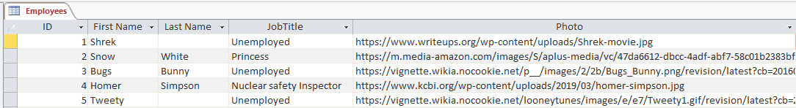
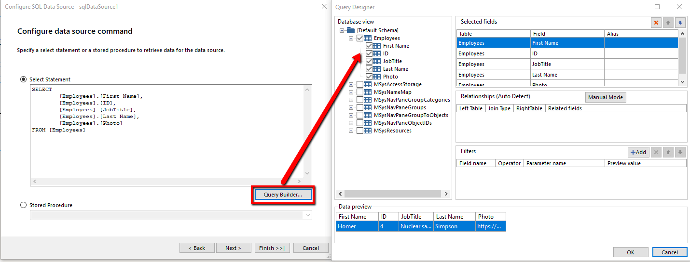

## Environment
<table>
	<tbody>
		<tr>
			<td>Product Version</td>
			<td>13.1.19.618 and above</td>
		</tr>
		<tr>
			<td>Product</td>
			<td>Telerik Reporting</td>
		</tr>
	</tbody>
</table>

## Description

Since version [13.1.19.618](https://www.telerik.com/support/whats-new/reporting/release-history/progress-telerik-reporting-r2-2019-sp1-13-1-19-618) we provide support for MS Access.
This article lists the required steps for setting MS Access Database and using it in the report.

## Solution

1. Create a sample database in **Access**:

	

2. [Create a new report]() and insert **SQL Data Source**.
3. Click on **Build new data connection** and select **OleDB Data Provider** from the dropdown.
4. The data source has to be a **Microsoft Access Database File (OLE DB)**.
5. Browse to the file’s location.
6. Click **OK** and finish the Wizard with the default settings.
7. In the **Configure data source command dialog**, click on **Query Builder** and mark the desired fields:

	
