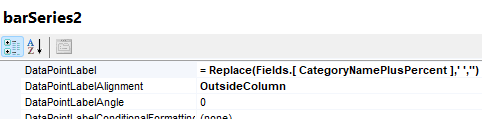

## Environment

| Version | Product | Author |  
| --- | --- | ---- |  
| 18.1.24.514+| Standalone Report Designer |[Desislava Yordanova](https://www.telerik.com/blogs/author/desislava-yordanova)| 

## Description

When using the [Graph Report Item]() with the [Column chart]() type, sometimes the text in data labels is too long, and it exceeds the column's width. This KB article demonstrates how to wrap text in data labels for a Graph Report Item or how to format long text in data labels to fit within a column in a graph report.

## Solution

To wrap text in data labels for a Column chart in the Graph Report Item, use the [built-in text functions]() to insert a new line character in the `DataPointLabels` text. 

1. Select the `BarSeries`.
1. Set the `DataPointLabel` with the appropriate `Replace` function to insert a new line character where needed. For example:

  ````
= Replace(Fields.CategoryNamePlusPercent, ' ', '
')
````


      

    

  This function replaces spaces with a new line character, effectively wrapping the text.

Additionally, consider extending expressions for more complex formatting needs. For more details, refer to the [Extending Expressions]() section in the documentation.

An alternative approach is to **rotate** the labels and center the text to fit the data labels within the column's width.

     

     

## Suggested Workarounds

- **Rotate the labels**: Apply rotation to the labels to make more space for the text. This can be done from the properties of the `Graph Report Item`.
- **Custom functions**: For more advanced scenarios, create custom functions to format the data labels' text.

>note Experiment with text wrapping and rotation to find the best presentation for your specific case. Adjustments might be needed based on the actual data and chart size.

## See Also

* [Graph Report Item]() 
* [Column Chart Type]()
* [Text Functions in Expressions]() 
* [Extending Expressions Overview]()
