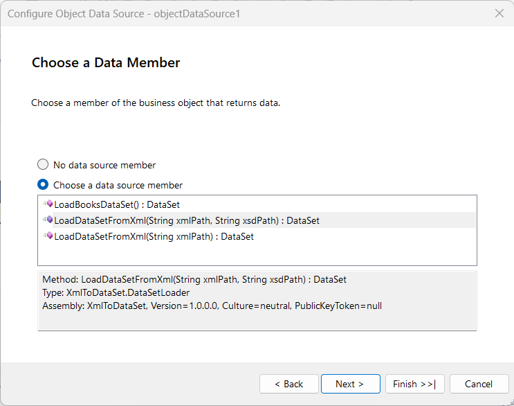
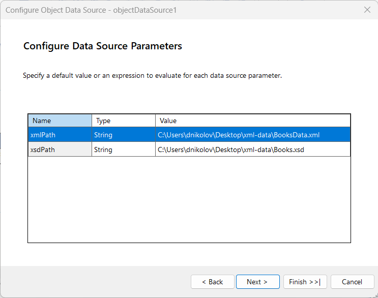

## Environment
<table>
	<tr>
		<td>Product</td>
		<td>Progress® Telerik® Reporting </td>
	</tr>
</table>

## Description

I have XML data, which I am trying to use in a report, but there appears to be no **XmlDataSource** component that can handle this type of data. 

Are there any alternatives for using XML data in the reports?

## Solution

Let's imagine that you have a **BooksData.xml** file with the following content:

````xml
<BooksDataSet xmlns="http://tempuri.org/BooksDataSet.xsd">
    <Book>
        <BookID>1</BookID>
        <Title>The Great Gatsby</Title>
        <Author>F. Scott Fitzgerald</Author>
        <Year>1925</Year>
        <Price>12.99</Price>
    </Book>
    <Book>
        <BookID>2</BookID>
        <Title>1984</Title>
        <Author>George Orwell</Author>
        <Year>1949</Year>
        <Price>14.99</Price>
    </Book>
    <Book>
        <BookID>3</BookID>
        <Title>To Kill a Mockingbird</Title>
        <Author>Harper Lee</Author>
        <Year>1960</Year>
        <Price>13.99</Price>
    </Book>
    <Book>
        <BookID>4</BookID>
        <Title>Pride and Prejudice</Title>
        <Author>Jane Austen</Author>
        <Year>1813</Year>
        <Price>11.99</Price>
    </Book>
</BooksDataSet>
````

The XML data above can be integrated in the report by programmatically reading it and creating a [DataSet](https://learn.microsoft.com/en-us/dotnet/api/system.data.dataset) object from it, which can be used via the ObjectDataSource Component](). To implement such a solution, you may follow the steps below:

1. (Recommended) Create a *typed DataSet*(in other wods -  `.xsd` file) from your XML. This is recommended to do because, otherwise, all of the fields in the data will be treated as **strings**, and conversion functions would need to be used in the report(s). For example, the following `Books.xsd` file can be created for the XML data above:

	````xml
<xs:schema id="BooksDataSet"
    targetNamespace="http://tempuri.org/BooksDataSet.xsd"
    xmlns:mstns="http://tempuri.org/BooksDataSet.xsd"
    xmlns="http://tempuri.org/BooksDataSet.xsd"
    xmlns:xs="http://www.w3.org/2001/XMLSchema"
    xmlns:msdata="urn:schemas-microsoft-com:xml-msdata"
    attributeFormDefault="qualified"
    elementFormDefault="qualified">
    <xs:element name="BooksDataSet" msdata:IsDataSet="true" msdata:UseCurrentLocale="true">
        <xs:complexType>
            <xs:choice minOccurs="0" maxOccurs="unbounded">
                <xs:element name="Book">
                    <xs:complexType>
                        <xs:sequence>
                            <xs:element name="BookID" type="xs:int" />
                            <xs:element name="Title" type="xs:string" />
                            <xs:element name="Author" type="xs:string" />
                            <xs:element name="Year" type="xs:int" />
                            <xs:element name="Price" type="xs:decimal" />
                        </xs:sequence>
                    </xs:complexType>
                </xs:element>
            </xs:choice>
        </xs:complexType>
    </xs:element>
</xs:schema>
````


1. [Create a .NET 10 Class Library](https://learn.microsoft.com/en-us/dotnet/core/tutorials/library-with-visual-studio) where the XML data is read programmatically with the [DataSet.ReadXml](https://docs.microsoft.com/en-us/dotnet/api/system.data.dataset.readxml) method. The method that reads the data and returns a `DataSet` from it should be `public`, so that it can be invoked from within the reporting engine.

	For example, the following class contains methods that will read the XML and XSD files from a given path and return a `DataSet` object.

	````C#
using System;
using System.Data;
using System.Diagnostics.CodeAnalysis;
using System.IO;

namespace XmlToDataSet
{
    public static class DataSetLoader
    {
        /// <summary>
        /// Loads a DataSet from an XML file with an optional schema file
        /// </summary>
        /// <param name="xmlPath">Path to the XML data file</param>
        /// <param name="xsdPath">Optional path to the XSD schema file</param>
        /// <returns>DataSet populated with data from the XML file</returns>
        [RequiresUnreferencedCode("DataSet.ReadXml uses dynamic code generation and may trim required types")]
        [RequiresDynamicCode("DataSet.ReadXml uses dynamic code generation")]
        public static DataSet LoadDataSetFromXml(string xmlPath, string xsdPath = null)
        {
            // Create a new DataSet
            DataSet dataSet = new DataSet();

            try
            {
                // Read the XML Schema if provided
                if (!string.IsNullOrEmpty(xsdPath))
                {
                    if (File.Exists(xsdPath))
                    {
                        dataSet.ReadXmlSchema(xsdPath);
                        Console.WriteLine($"Schema loaded successfully from: {xsdPath}");
                    }
                    else
                    {
                        Console.WriteLine($"Warning: Schema file not found at '{xsdPath}'. Loading XML without schema.");
                    }
                }

                // Read the XML data
                if (File.Exists(xmlPath))
                {
                    dataSet.ReadXml(xmlPath);
                    Console.WriteLine($"Data loaded successfully from: {xmlPath}");
                }
                else
                {
                    throw new FileNotFoundException($"XML data file not found at: {xmlPath}");
                }

                return dataSet;
            }
            catch (Exception ex)
            {
                Console.WriteLine($"Error loading DataSet: {ex.Message}");
                throw;
            }
        }

        /// <summary>
        /// Loads a DataSet from an XML file with schema inference
        /// </summary>
        /// <param name="xmlPath">Path to the XML data file</param>
        /// <returns>DataSet populated with data from the XML file</returns>
        [RequiresUnreferencedCode("DataSet.ReadXml uses dynamic code generation and may trim required types")]
        [RequiresDynamicCode("DataSet.ReadXml uses dynamic code generation")]
        [UnconditionalSuppressMessage("Trimming", "IL2026", Justification = "Warning propagated to callers via RequiresUnreferencedCode")]
        [UnconditionalSuppressMessage("AOT", "IL3050", Justification = "Warning propagated to callers via RequiresDynamicCode")]
        public static DataSet LoadDataSetFromXml(string xmlPath)
        {
            return LoadDataSetFromXml(xmlPath, null);
        }

        /// <summary>
        /// Loads the Books DataSet with the default Books.xsd schema and BooksData.xml data
        /// </summary>
        /// <returns>DataSet containing Books data</returns>
        [RequiresUnreferencedCode("DataSet.ReadXml uses dynamic code generation and may trim required types")]
        [RequiresDynamicCode("DataSet.ReadXml uses dynamic code generation")]
        [UnconditionalSuppressMessage("Trimming", "IL2026", Justification = "Warning propagated to callers via RequiresUnreferencedCode")]
        [UnconditionalSuppressMessage("AOT", "IL3050", Justification = "Warning propagated to callers via RequiresDynamicCode")]
        public static DataSet LoadBooksDataSet()
        {
            string xsdPath = "Books.xsd";
            string xmlPath = "BooksData.xml";
            return LoadDataSetFromXml(xmlPath, xsdPath);
        }
    }
}
````


1. Build the project, and then reference its assembly in the [Standalone Report Designer for .NET](#starting-the-standalone-report-designer-for-net). Follow [Update the Designer Configuration File through the UI](#update-the-designer-configuration-file-through-the-ui) for instructions on how to reference the assembly.
1. Start the [ObjectDataSource Wizard]() and select one of three methods to invoke and pull the data. If the wizard finishes successfully, you will be able to continue designing the report with the XML data being parsed programmatically.

	

 	


## See Also

* [Update the Designer Configuration File through the UI](#update-the-designer-configuration-file-through-the-ui)
* [ObjectDataSource Wizard]()
