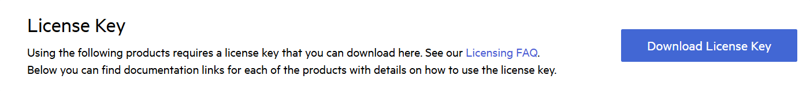

# Setting Up Your Telerik Reporting License Key

Starting with the Q1 2025 release, Telerik Reporting requires activation through a license key (trial or commercial). This article describes how to download or update your personal license key and use it to activate the Telerik Reporting product.

An invalid license results in [errors and warnings](LINK TO ARTICLE) during build and run-time indicators such as watermarks and banners.

The implementation of the 2025 licensing requirements will occur in two phases:

>important Please install **&lt;PackageReference Include="Telerik.Licensing" Version="1.*" /&gt;**.

- Phase 1 - Starting with the 2025 Q1 release, a missing or invalid license causes [warnings during build](#license-activation-errors-and-warnings). The commercial distributions of the libraries do not exhibit any functional restrictions.
- Phase 2 - Starting with the 2025 Q2 release, a missing or invalid license will result in [build errors and run-time indicators](#license-activation-errors-and-warnings), such as watermarks and banners.

Note that future updates of the product may restrict or disable some features when no valid license is present. You can send us feedback through the _Contact Us_ form or by [opening a support ticket](https://www.telerik.com/account/support-center/contact-us?utm_source=licensing&utm_medium=console&utm_campaign=no_references).

## Downloading the License Key

To download a license key for Telerik Reporting, you must have either a developer license or a trial license. If you are new, you can sign up for a [free trial](https://www.telerik.com/account/trials) first, and then follow the steps below.

1. Go to the [License Keys](https://www.telerik.com/account/your-licenses/license-keys) page in your Telerik account.
1. Click the **Download License Key** button.

	

	The [Progress Control Panel](https://www.telerik.com/download-trial-file/v2/control-panel), automated MSI installer, and the Visual Studio Extensions (if available) of each product will automatically download and store your license key in your home directory. This makes it available for all projects that you develop on your local machine.

## Activating Telerik Reporting

To activate Telerik Reporting:

* Copy the [downloaded](#downloading-the-license-key) `telerik-license.txt` license key file to your home directory. This makes the license key available to all projects that you develop on your computer.

	+ For Windows: `%AppData%\Telerik\telerik.license.txt`
	+ For Mac/Linux: `~/.telerik/telerik.license.txt`

* Alternatively, copy the `telerik-license.txt` license key file to the root folder of your project. This makes the license key available only to this project. Do not commit the file to source control as this is your personal license key.

When you build the project, the `Telerik.Licensing` NuGet package automatically locates the license file and uses it to activate Telerik Reporting.

> If your project doesn’t use NuGet packages, see [Adding a License Key to Projects without NuGet References](#adding-a-license-key-to-projects-without-nuget-references).

### Adding a License Key to Projects without NuGet References

Telerik strongly recommends the use of NuGet packages whenever possible. Only include the license key as a code snippet when NuGet packages are not an option.

If you cannot use NuGet packages in your project, add the license as a code snippet:

1. Go to the [License Keys](https://www.telerik.com/account/your-licenses/license-keys) page in your Telerik account.
1. On the Telerik Reporting row, click the __View key__ link in the __SCRIPT KEY__ column. 

	[ADD IMAGE HERE]

1. Copy the C# code snippet into a new file, for example, `TelerikLicense.cs`.
1. Add the `TelerikLicense.cs` file to your project.

> Do not publish the license key code snippet in publicly accessible repositories. This is your personal license key.

## Updating Your License Key

Whenever you purchase a new license or renew an existing one, always [download](#downloading-the-license-key) and install a new license key. The new license key includes information about all previous license purchases. This process is referred to as a license key update. Once you have the new license key, use it to [activate Telerik Report](#activating-telerik-reporting).

# See Also

* [License Activation Errors and Warnings]()
* [Adding the License Key to CI Services]())
* [Frequently Asked Questions about Your Telerik Reporting License Key]()
