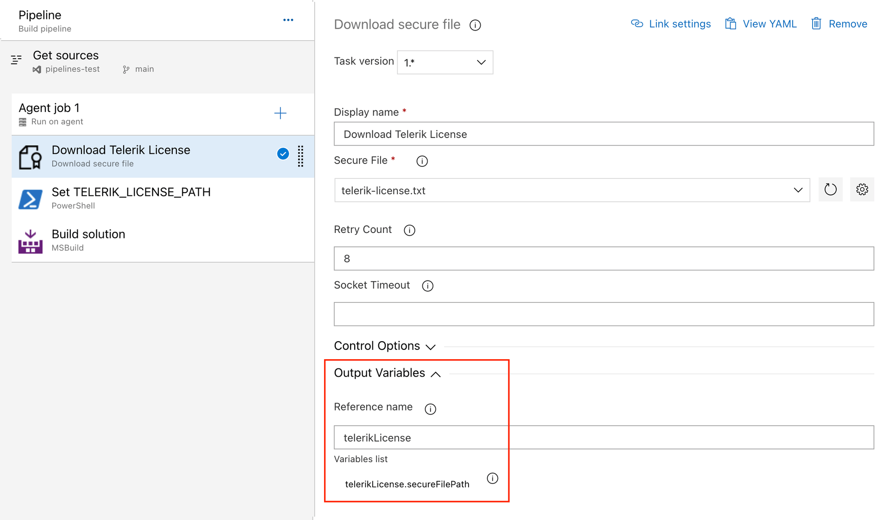
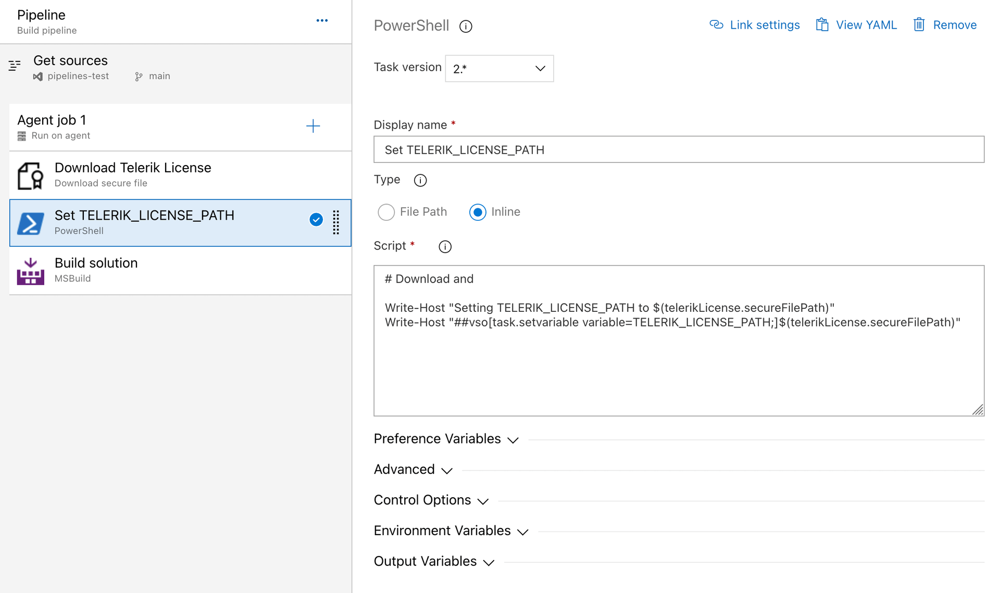

# Adding the License Key to CI/CD Services

This article describes how to set up and activate your Telerik Reporting [license key](https://www.telerik.com/account/your-licenses/license-keys) across a few popular CI services by using environment variables.

When working with CI/CD platforms, always add the `Telerik.Licensing` NuGet package as a project dependency. This package activates Telerik Reporting at build time by using the provided license key.

The license activation process in a CI/CD environment involves the following steps:

1. [Download](#downloading-the-license-key) a license key from [your Telerik account](https://www.telerik.com/account/your-licenses/license-keys).
1. [Create an environment variable](#creating-an-environment-variable) named `TELERIK_LICENSE` and add your Telerik Reporting license key as a value. Alternatively, use the [Azure Secure files approach](#using-secure-files-on-azure-devops).

## Creating an Environment Variable

The recommended approach for providing your license key to the `Telerik.Licensing` NuGet package is to use environment variables. Each CI/CD platform has a different process for setting environment variables, and this article lists only some of the most popular examples.

> If your CI/CD service is not listed in this article, don’t hesitate to contact the Telerik technical support.

### GitHub Actions

1. Create a new [Repository Secret](https://docs.github.com/en/actions/reference/encrypted-secrets#creating-encrypted-secrets-for-a-repository) or an [Organization Secret](https://docs.github.com/en/actions/reference/encrypted-secrets#creating-encrypted-secrets-for-an-organization).
1. Set the name of the secret to `TELERIK_LICENSE` and paste the contents of the license file as a value.
1. After running `npm install` or `yarn`, add a build step to activate the license:

	````yaml
env:
		TELERIK_LICENSE: ${{ secrets.TELERIK_LICENSE }}
````


### Azure Pipelines (YAML)

1. Create a new [secret variable](https://learn.microsoft.com/en-us/azure/devops/pipelines/process/variables?view=azure-devops&tabs=yaml%2Cbatch#secret-variables) named `TELERIK_LICENSE`.
1. Paste the contents of the license key file as a value.

>note Always consider the _Variable size limit_—if you are using a [Variable Group](https://learn.microsoft.com/en-us/azure/devops/pipelines/library/variable-groups?view=azure-devops&tabs=azure-pipelines-ui%2Cyaml), the license key will typically exceed the character limit for the variable values. The only way to have a long value in the Variable Group is to [link it from Azure Key Vault](https://learn.microsoft.com/en-us/azure/devops/pipelines/library/link-variable-groups-to-key-vaults?view=azure-devops). If you cannot use a Key Vault, then use a normal pipeline variable instead (see above) or the [Secure files approach](#using-secure-files-on-azure-devops).

## Using Secure Files on Azure DevOps

[Secure files](https://learn.microsoft.com/en-us/azure/devops/pipelines/library/secure-files?view=azure-devops) are an alternative approach for sharing the license key file in Azure Pipelines that does not have the size limitations of environment variables.

You have two options for the file-based approach. Set the `TELERIK_LICENSE_PATH` variable or add a file named `telerik-license.txt` to the project directory or parent directory.

>note Make sure you’re referencing `Telerik.Licensing v1.4.10` or later.

### YAML Pipeline

With a YAML pipeline, you can use the [DownloadSecureFile@1](https://learn.microsoft.com/en-us/azure/devops/pipelines/tasks/reference/download-secure-file-v1?view=azure-pipelines) task, then use `$(name.secureFilePath)` to reference it. For example:

````yaml
- task: DownloadSecureFile@1
  name: DownloadTelerikLicenseFile # defining the 'name' is important
  displayName: 'Download Telerik License Key File'
  inputs:
    secureFile: 'telerik-license.txt'

- task: MSBuild@1
  displayName: 'Build Project'
  inputs:
    solution: 'myapp.csproj'
    platform: Any CPU
    configuration: Release
    msbuildArguments: '/p:RestorePackages=false'
  env:
    # use the name.secureFilePath value to set TELERIK_LICENSE_PATH
    TELERIK_LICENSE_PATH: $(DownloadTelerikLicenseFile.secureFilePath)
````

### Classic Pipeline

With a classic pipeline, use the “Download secure file” task and a PowerShell script to set `TELERIK_LICENSE_PATH` to the secure file path.

1. Add a "Download secure file" task and set the output variable's name to `telerikLicense`.

	

1. Add a PowerShell task and set the `TELERIK_LICENSE_PATH` variable to the `secureFilePath` property of the output variable:

	

The script to set the environment variable is quoted below:

````powershell
Write-Host "Setting TELERIK_LICENSE_PATH to $(telerikLicense.secureFilePath)"
Write-Host "##vso[task.setvariable variable=TELERIK_LICENSE_PATH;]$(telerikLicense.secureFilePath)"
````

Alternatively, copy the file into the repository directory:

````powershell
echo "Copying $(telerikLicense.secureFilePath) to $(Build.Repository.LocalPath)/telerik-license.txt"
Copy-Item -Path $(telerikLicense.secureFilePath) -Destination "$(Build.Repository.LocalPath)/telerik-license.txt" -Force
````

### Using TelerikLicensing.Register method

As of version **1.6.7**, [Telerik.Licensing](https://www.nuget.org/packages/Telerik.Licensing) offers the parameterless `TelerikLicensing.Register()` method and the `TelerikLicensing.Register(…script key…)`  method allowing the developers to validate the Telerik license when running in [AWS Lambda](https://docs.aws.amazon.com/lambda/latest/dg/welcome.html) functions, plugins, or a class library that uses Telerik Reporting consumed by any third-party software. It is necessary to upgrade the [Telerik.Licensing](https://www.nuget.org/packages/Telerik.Licensing/1.6.7) NuGet package to **1.6.7 or newer** version and call the `Register` method in the body of the function. Thus, the Telerik license will be validated, and the watermark should not be printed (for licensed users) in the generated document:

````C#
namespace LicensingInLambda;
 
public class Function
{
    public string FunctionHandler(string input, ILambdaContext context)
    {
        // Lambda function entry point
 
        // This requires Telerik.Licensing to be added to the function project
        TelerikLicensing.Register();
 
        // TODO: Reporting - generate PDF here
 
        var entryAssembly = Assembly.GetEntryAssembly();
        var name = entryAssembly?.GetName();
 
        return $"Entry assembly: {entryAssembly?.GetName()} ... {Class1.DoYourMagic()}";
    }
}
````


## See Also

* [License Activation Errors and Warnings]()
* [Setting Up Your License Key]()
* [Frequently Asked Questions about Your Telerik Reporting License Key]()
